# 🪟 Sliding Window Pattern

## 📖 What is it? (The "Paper Roll" Analogy)

Imagine you have a long strip of paper with numbers on it. You take a **hollow toilet paper roll** and put it over the strip. 
- You can only see the numbers **inside the roll**.
- To see the next set of numbers, you don't pick up the roll and jump. You **slide** it one step to the right.
- As you slide:
    - One number **leaves** from the left (it's gone).
    - One new number **enters** from the right (hello!).
    - Everything in the middle **stays the same**!

**Why do this?** Because it's way faster than recalculating everything. If you're summing numbers, you just subtract the one that left and add the one that arrived.

### 🏠 Real-World Examples
1. **Music Playlist**: You're listening to a "Top 5" hits playlist. Every week, the #1 song might stay, but the #6 song moves into #5, and the old #10 drops out. The "window" of the top 5 just slides.
2. **Security Camera**: A camera stores the "last 24 hours" of footage. At midnight, it doesn't delete everything. It just deletes the oldest hour and adds the newest hour.
3. **Typing Predictions**: As you type "HELLO", your phone looks at the last 3 letters "LLO" to guess the next one. When you type "W", it slides to look at "LOW".

---

## 🎯 Where can this be used?

Use this whenever you need to find something in a **contiguous** (no gaps!) part of an array or string.

- ✅ **Calculations**: "Find the average temperature of every 7-day period this year."
- ✅ **Searching**: "Find the shortest piece of text that contains the word 'Apple'."
- ✅ **Unique Items**: "What is the longest time a user stayed on a page without repeating the same action?"

---

## 🧠 Core Concept


**Key Insight**: 
- **Red Card (Left)**: The element leaving. We subtract its value.
- **Green Card (Right)**: The element entering. We add its value.
- **White Cards (Middle)**: The elements that stay. We don't touch them!

**Key Insight**: Instead of recalculating sum for each window (O(n×k)), we:
- Subtract the element leaving the window
- Add the element entering the window
- Time complexity: O(n) ✨

---

## 📐 Template Code

### Fixed-Size Window Template

#### Python
```python
def sliding_window_fixed(arr, k):
    """
    Fixed-size sliding window template
    
    Args:
        arr: Input array
        k: Window size
    
    Returns:
        Result based on problem requirement
    """
    if not arr or k <= 0 or k > len(arr):
        return 0
    
    # Initialize window
    window_sum = 0
    window_start = 0
    result = float('-inf')  # or 0, or [], depending on problem
    
    for window_end in range(len(arr)):
        # Add element entering the window
        window_sum += arr[window_end]
        
        # Window is complete when we've seen k elements
        if window_end >= k - 1:
            # Update result
            result = max(result, window_sum)
            
            # Remove element leaving the window
            window_sum -= arr[window_start]
            window_start += 1
    
    return result


# Example usage
arr = [2, 1, 5, 1, 3, 2]
k = 3
print(sliding_window_fixed(arr, k))  # Output: 9 (5+1+3)
```

#### JavaScript
```javascript
/**
 * Fixed-size sliding window template
 * @param {number[]} arr - Input array
 * @param {number} k - Window size
 * @returns {number} Result based on problem requirement
 */
function slidingWindowFixed(arr, k) {
    if (!arr || k <= 0 || k > arr.length) {
        return 0;
    }
    
    let windowSum = 0;
    let windowStart = 0;
    let result = -Infinity;
    
    for (let windowEnd = 0; windowEnd < arr.length; windowEnd++) {
        // Add element entering the window
        windowSum += arr[windowEnd];
        
        // Window is complete when we've seen k elements
        if (windowEnd >= k - 1) {
            // Update result
            result = Math.max(result, windowSum);
            
            // Remove element leaving the window
            windowSum -= arr[windowStart];
            windowStart++;
        }
    }
    
    return result;
}

// Example usage
const arr = [2, 1, 5, 1, 3, 2];
const k = 3;
console.log(slidingWindowFixed(arr, k));  // Output: 9
```

#### Go
```go
package main

import (
    "fmt"
    "math"
)

// slidingWindowFixed implements fixed-size sliding window template
func slidingWindowFixed(arr []int, k int) int {
    if len(arr) == 0 || k <= 0 || k > len(arr) {
        return 0
    }
    
    windowSum := 0
    windowStart := 0
    result := math.MinInt32
    
    for windowEnd := 0; windowEnd < len(arr); windowEnd++ {
        // Add element entering the window
        windowSum += arr[windowEnd]
        
        // Window is complete when we've seen k elements
        if windowEnd >= k-1 {
            // Update result
            if windowSum > result {
                result = windowSum
            }
            
            // Remove element leaving the window
            windowSum -= arr[windowStart]
            windowStart++
        }
    }
    
    return result
}

func main() {
    arr := []int{2, 1, 5, 1, 3, 2}
    k := 3
    fmt.Println(slidingWindowFixed(arr, k))  // Output: 9
}
```

---

### Dynamic-Size Window Template

#### Python
```python
def sliding_window_dynamic(arr, target):
    """
    Dynamic-size sliding window template
    Window grows and shrinks based on condition
    
    Args:
        arr: Input array
        target: Target condition (varies by problem)
    
    Returns:
        Result based on problem requirement
    """
    window_start = 0
    window_sum = 0
    result = float('inf')  # or 0, depending on problem
    
    for window_end in range(len(arr)):
        # Expand window by adding current element
        window_sum += arr[window_end]
        
        # Shrink window while condition is met
        while window_sum >= target:
            # Update result
            result = min(result, window_end - window_start + 1)
            
            # Remove element from the left
            window_sum -= arr[window_start]
            window_start += 1
    
    return result if result != float('inf') else 0


# Example: Smallest subarray with sum >= target
arr = [2, 1, 5, 2, 3, 2]
target = 7
print(sliding_window_dynamic(arr, target))  # Output: 2 (5+2)
```

#### JavaScript
```javascript
/**
 * Dynamic-size sliding window template
 * @param {number[]} arr - Input array
 * @param {number} target - Target condition
 * @returns {number} Result based on problem requirement
 */
function slidingWindowDynamic(arr, target) {
    let windowStart = 0;
    let windowSum = 0;
    let result = Infinity;
    
    for (let windowEnd = 0; windowEnd < arr.length; windowEnd++) {
        // Expand window by adding current element
        windowSum += arr[windowEnd];
        
        // Shrink window while condition is met
        while (windowSum >= target) {
            // Update result
            result = Math.min(result, windowEnd - windowStart + 1);
            
            // Remove element from the left
            windowSum -= arr[windowStart];
            windowStart++;
        }
    }
    
    return result === Infinity ? 0 : result;
}

// Example usage
const arr = [2, 1, 5, 2, 3, 2];
const target = 7;
console.log(slidingWindowDynamic(arr, target));  // Output: 2
```

#### Go
```go
package main

import (
    "fmt"
    "math"
)

// slidingWindowDynamic implements dynamic-size sliding window
func slidingWindowDynamic(arr []int, target int) int {
    windowStart := 0
    windowSum := 0
    result := math.MaxInt32
    
    for windowEnd := 0; windowEnd < len(arr); windowEnd++ {
        // Expand window by adding current element
        windowSum += arr[windowEnd]
        
        // Shrink window while condition is met
        for windowSum >= target {
            // Update result
            currentLen := windowEnd - windowStart + 1
            if currentLen < result {
                result = currentLen
            }
            
            // Remove element from the left
            windowSum -= arr[windowStart]
            windowStart++
        }
    }
    
    if result == math.MaxInt32 {
        return 0
    }
    return result
}

func main() {
    arr := []int{2, 1, 5, 2, 3, 2}
    target := 7
    fmt.Println(slidingWindowDynamic(arr, target))  // Output: 2
}
```

---

## 🎨 Visual Explanation

### Fixed Window Example: Maximum Sum of K Elements

```mermaid
flowchart TD
    A[Start: Array = 2,1,5,1,3,2 k=3] --> B[Window: 2,1,5<br/>Sum=8]
    B --> C[Slide Right]
    C --> D[Remove 2, Add 1<br/>Window: 1,5,1<br/>Sum=7]
    D --> E[Slide Right]
    E --> F[Remove 1, Add 3<br/>Window: 5,1,3<br/>Sum=9 ✓ Max!]
    F --> G[Slide Right]
    G --> H[Remove 5, Add 2<br/>Window: 1,3,2<br/>Sum=6]
    H --> I[Result: 9]
    
    style F fill:#FFD700
```



### Dynamic Window Example: Smallest Subarray with Sum ≥ 7

```mermaid
stateDiagram-v2
    [*] --> Window1: arr=[2,1,5,2,3,2]
    Window1: [2,1,5] sum=8 ≥ 7 ✓
    Window1 --> Window2: Shrink left
    Window2: [1,5] sum=6 < 7 ✗
    Window2 --> Window3: Expand right
    Window3: [1,5,2] sum=8 ≥ 7 ✓
    Window3 --> Window4: Shrink left
    Window4: [5,2] sum=7 ✓ length=2 🎯
    Window4 --> [*]: Best answer
```



---

## 🏆 Famous FAANG Problems

### Problem 1: Maximum Sum Subarray of Size K (Easy)
**Asked by**: Amazon, Google, Microsoft

**Problem**: Given an array, find the maximum sum of any contiguous subarray of size K.

```
Input: [2, 1, 5, 1, 3, 2], k = 3
Output: 9
Explanation: Subarray [5, 1, 3] has maximum sum 9
```

#### Python Solution
```python
def max_sum_subarray(arr, k):
    """
    Find maximum sum of K consecutive elements
    
    Time Complexity: O(n)
    Space Complexity: O(1)
    """
    max_sum = float('-inf')
    window_sum = 0
    window_start = 0
    
    for window_end in range(len(arr)):
        window_sum += arr[window_end]
        
        if window_end >= k - 1:
            max_sum = max(max_sum, window_sum)
            window_sum -= arr[window_start]
            window_start += 1
    
    return max_sum
```

#### JavaScript Solution
```javascript
function maxSumSubarray(arr, k) {
    let maxSum = -Infinity;
    let windowSum = 0;
    let windowStart = 0;
    
    for (let windowEnd = 0; windowEnd < arr.length; windowEnd++) {
        windowSum += arr[windowEnd];
        
        if (windowEnd >= k - 1) {
            maxSum = Math.max(maxSum, windowSum);
            windowSum -= arr[windowStart];
            windowStart++;
        }
    }
    
    return maxSum;
}
```

#### Go Solution
```go
func maxSumSubarray(arr []int, k int) int {
    maxSum := math.MinInt32
    windowSum := 0
    windowStart := 0
    
    for windowEnd := 0; windowEnd < len(arr); windowEnd++ {
        windowSum += arr[windowEnd]
        
        if windowEnd >= k-1 {
            if windowSum > maxSum {
                maxSum = windowSum
            }
            windowSum -= arr[windowStart]
            windowStart++
        }
    }
    
    return maxSum
}
```

---

### Problem 2: Longest Substring with K Distinct Characters (Medium)
**Asked by**: Amazon, Google, Facebook

**Problem**: Find the length of the longest substring with at most K distinct characters.

```
Input: "araaci", k = 2
Output: 4
Explanation: "araa" has 2 distinct characters
```

#### Python Solution
```python
def longest_substring_k_distinct(s, k):
    """
    Find longest substring with at most K distinct characters
    
    Time Complexity: O(n)
    Space Complexity: O(k) for the hashmap
    """
    window_start = 0
    max_length = 0
    char_frequency = {}
    
    for window_end in range(len(s)):
        right_char = s[window_end]
        char_frequency[right_char] = char_frequency.get(right_char, 0) + 1
        
        # Shrink window if we have more than k distinct characters
        while len(char_frequency) > k:
            left_char = s[window_start]
            char_frequency[left_char] -= 1
            if char_frequency[left_char] == 0:
                del char_frequency[left_char]
            window_start += 1
        
        # Update max length
        max_length = max(max_length, window_end - window_start + 1)
    
    return max_length


# Test
print(longest_substring_k_distinct("araaci", 2))  # Output: 4
print(longest_substring_k_distinct("araaci", 1))  # Output: 2
print(longest_substring_k_distinct("cbbebi", 3))  # Output: 5
```

#### JavaScript Solution
```javascript
function longestSubstringKDistinct(s, k) {
    let windowStart = 0;
    let maxLength = 0;
    const charFrequency = new Map();
    
    for (let windowEnd = 0; windowEnd < s.length; windowEnd++) {
        const rightChar = s[windowEnd];
        charFrequency.set(rightChar, (charFrequency.get(rightChar) || 0) + 1);
        
        // Shrink window if we have more than k distinct characters
        while (charFrequency.size > k) {
            const leftChar = s[windowStart];
            charFrequency.set(leftChar, charFrequency.get(leftChar) - 1);
            if (charFrequency.get(leftChar) === 0) {
                charFrequency.delete(leftChar);
            }
            windowStart++;
        }
        
        maxLength = Math.max(maxLength, windowEnd - windowStart + 1);
    }
    
    return maxLength;
}
```

#### Go Solution
```go
func longestSubstringKDistinct(s string, k int) int {
    windowStart := 0
    maxLength := 0
    charFreq := make(map[byte]int)
    
    for windowEnd := 0; windowEnd < len(s); windowEnd++ {
        rightChar := s[windowEnd]
        charFreq[rightChar]++
        
        // Shrink window if we have more than k distinct characters
        for len(charFreq) > k {
            leftChar := s[windowStart]
            charFreq[leftChar]--
            if charFreq[leftChar] == 0 {
                delete(charFreq, leftChar)
            }
            windowStart++
        }
        
        currentLen := windowEnd - windowStart + 1
        if currentLen > maxLength {
            maxLength = currentLen
        }
    }
    
    return maxLength
}
```

---

### Problem 3: Minimum Window Substring (Hard)
**Asked by**: Facebook, Amazon, Google, Microsoft, Uber

**LeetCode #76** - One of the most popular FAANG questions!

**Problem**: Given strings S and T, find the minimum window in S which contains all characters of T.

```
Input: S = "ADOBECODEBANC", T = "ABC"
Output: "BANC"
```

#### Python Solution
```python
from collections import Counter

def min_window_substring(s, t):
    """
    Find minimum window in s containing all characters of t
    
    Time Complexity: O(|s| + |t|)
    Space Complexity: O(|s| + |t|)
    """
    if not s or not t:
        return ""
    
    # Count characters in t
    dict_t = Counter(t)
    required = len(dict_t)
    
    # Sliding window counters
    window_counts = {}
    formed = 0
    
    # Result: (window length, left, right)
    ans = float("inf"), None, None
    
    left = 0
    for right in range(len(s)):
        # Add character from the right
        char = s[right]
        window_counts[char] = window_counts.get(char, 0) + 1
        
        # Check if frequency matches
        if char in dict_t and window_counts[char] == dict_t[char]:
            formed += 1
        
        # Try to shrink the window
        while left <= right and formed == required:
            char = s[left]
            
            # Update result if this window is smaller
            if right - left + 1 < ans[0]:
                ans = (right - left + 1, left, right)
            
            # Remove from left
            window_counts[char] -= 1
            if char in dict_t and window_counts[char] < dict_t[char]:
                formed -= 1
            
            left += 1
    
    return "" if ans[0] == float("inf") else s[ans[1]:ans[2] + 1]


# Test
print(min_window_substring("ADOBECODEBANC", "ABC"))  # "BANC"
```

#### Explanation with Diagram

```mermaid
graph TD
    A["S = ADOBECODEBANC<br/>T = ABC"] --> B["Expand window until all chars found"]
    B --> C["Window: ADOBEC<br/>Contains A,B,C ✓"]
    C --> D["Shrink from left"]
    D --> E["Try: DOBEC (no A) ✗"]
    E --> F["Continue expanding..."]
    F --> G["Window: ODEBANC<br/>Contains A,B,C ✓"]
    G --> H["Shrink to: BANC<br/>Minimum found! ✓"]
    
    style H fill:#90EE90
```



---

### Problem 4: Longest Substring Without Repeating Characters (Medium)
**Asked by**: Amazon, Google, Facebook, Microsoft, Apple - **MOST ASKED!**

**LeetCode #3** - Top 10 most interview question ever!

**Problem**: Find length of longest substring without repeating characters.

```
Input: s = "abcabcbb"
Output: 3
Explanation: "abc" is the longest

Input: s = "bbbbb"
Output: 1

Input: s = "pwwkew"
Output: 3
Explanation: "wke" is the longest
```

#### Python Solution
```python
def lengthOfLongestSubstring(s):
    """
    Sliding window with hash set
    
    Keep expanding window until we see a duplicate.
    When duplicate found, shrink from left until duplicate removed.
    
    Time: O(n), Space: O(min(n, m)) where m is charset size
    """
    char_set = set()
    left = 0
    max_length = 0
    
    for right in range(len(s)):
        # If character already in window, shrink from left
        while s[right] in char_set:
            char_set.remove(s[left])
            left += 1
        
        # Add current character
        char_set.add(s[right])
        
        # Update max length
        max_length = max(max_length, right - left + 1)
    
    return max_length


# Optimized version using hashmap (stores indices)
def lengthOfLongestSubstring_v2(s):
    """
    Store character positions to jump directly
    
    Instead of shrinking one by one, jump left pointer!
    Time: O(n), Space: O(min(n, m))
    """
    char_index = {}
    left = 0
    max_length = 0
    
    for right in range(len(s)):
        # If char seen before AND in current window
        if s[right] in char_index and char_index[s[right]] >= left:
            # Jump left pointer to after the duplicate
            left = char_index[s[right]] + 1
        
        # Update character position
        char_index[s[right]] = right
        
        # Update max length
        max_length = max(max_length, right - left + 1)
    
    return max_length


# Test
print(lengthOfLongestSubstring("abcabcbb"))  # 3
print(lengthOfLongestSubstring("bbbbb"))     # 1
print(lengthOfLongestSubstring("pwwkew"))    # 3
```

#### JavaScript Solution
```javascript
function lengthOfLongestSubstring(s) {
    const charSet = new Set();
    let left = 0;
    let maxLength = 0;
    
    for (let right = 0; right < s.length; right++) {
        while (charSet.has(s[right])) {
            charSet.delete(s[left]);
            left++;
        }
        
        charSet.add(s[right]);
        maxLength = Math.max(maxLength, right - left + 1);
    }
    
    return maxLength;
}

// Optimized with Map
function lengthOfLongestSubstring_v2(s) {
    const charIndex = new Map();
    let left = 0;
    let maxLength = 0;
    
    for (let right = 0; right < s.length; right++) {
        if (charIndex.has(s[right]) && charIndex.get(s[right]) >= left) {
            left = charIndex.get(s[right]) + 1;
        }
        
        charIndex.set(s[right], right);
        maxLength = Math.max(maxLength, right - left + 1);
    }
    
    return maxLength;
}
```

#### Go Solution
```go
func lengthOfLongestSubstring(s string) int {
    charSet := make(map[byte]bool)
    left := 0
    maxLength := 0
    
    for right := 0; right < len(s); right++ {
        for charSet[s[right]] {
            delete(charSet, s[left])
            left++
        }
        
        charSet[s[right]] = true
        currentLen := right - left + 1
        if currentLen > maxLength {
            maxLength = currentLen
        }
    }
    
    return maxLength
}
```

**Layman explanation**:
- Imagine reading a book and remembering characters you've seen recently
- If you see a character twice, forget everything before the first occurrence
- Keep track of longest sequence where all characters are unique

---

### Problem 5: Permutation in String (Medium)
**Asked by**: Microsoft, Facebook, Amazon

**LeetCode #567**

**Problem**: Check if s2 contains permutation of s1.

```
Input: s1 = "ab", s2 = "eidbaooo"
Output: true
Explanation: s2 contains "ba" which is a permutation of "ab"
```

#### Python Solution
```python
def checkInclusion(s1, s2):
    """
    Find if any permutation of s1 exists in s2
    
    Permutation = same characters, any order
    So we just need same character frequencies!
    
    Use fixed-size window (size = len(s1))
    
    Time: O(n), Space: O(1) - max 26 letters
    """
    if len(s1) > len(s2):
        return False
    
    # Count characters in s1
    s1_count = {}
    for char in s1:
        s1_count[char] = s1_count.get(char, 0) + 1
    
    window_count = {}
    window_size = len(s1)
    
    # Initialize window
    for i in range(window_size):
        char = s2[i]
        window_count[char] = window_count.get(char, 0) + 1
    
    # Check if first window matches
    if window_count == s1_count:
        return True
    
    # Slide window
    for i in range(window_size, len(s2)):
        # Add new character
        new_char = s2[i]
        window_count[new_char] = window_count.get(new_char, 0) + 1
        
        # Remove old character
        old_char = s2[i - window_size]
        window_count[old_char] -= 1
        if window_count[old_char] == 0:
            del window_count[old_char]
        
        # Check if matches
        if window_count == s1_count:
            return True
    
    return False


# Optimized with matches counter
def checkInclusion_v2(s1, s2):
    """
    Track number of matching character frequencies
    Only need to track one counter!
    """
    if len(s1) > len(s2):
        return False
    
    s1_count = [0] * 26
    window_count = [0] * 26
    
    # Count s1 and first window
    for i in range(len(s1)):
        s1_count[ord(s1[i]) - ord('a')] += 1
        window_count[ord(s2[i]) - ord('a')] += 1
    
    # Count matching frequencies
    matches = 0
    for i in range(26):
        if s1_count[i] == window_count[i]:
            matches += 1
    
    # Slide window
    for i in range(len(s1), len(s2)):
        if matches == 26:  # All frequencies match!
            return True
        
        # Add new character
        index = ord(s2[i]) - ord('a')
        window_count[index] += 1
        if window_count[index] == s1_count[index]:
            matches += 1
        elif window_count[index] == s1_count[index] + 1:
            matches -= 1
        
        # Remove old character
        index = ord(s2[i - len(s1)]) - ord('a')
        window_count[index] -= 1
        if window_count[index] == s1_count[index]:
            matches += 1
        elif window_count[index] == s1_count[index] - 1:
            matches -= 1
    
    return matches == 26


# Test
print(checkInclusion("ab", "eidbaooo"))  # True
print(checkInclusion("ab", "eidboaoo"))  # False
```

**Key insight**: Permutation means same characters with same frequencies. Use a fixed-size sliding window!

---

### Problem 6: Find All Anagrams in a String (Medium)
**Asked by**: Amazon, Facebook, Google

**LeetCode #438**

**Problem**: Find all start indices of p's anagrams in s.

```
Input: s = "cbaebabacd", p = "abc"
Output: [0, 6]
Explanation: 
  "cba" at index 0 is an anagram
  "bac" at index 6 is an anagram
```

#### Python Solution
```python
def findAnagrams(s, p):
    """
    Find all anagram start positions
    
    Very similar to Permutation in String!
    But we collect ALL indices, not return on first match.
    
    Time: O(n), Space: O(1)
    """
    if len(p) > len(s):
        return []
    
    result = []
    p_count = [0] * 26
    window_count = [0] * 26
    
    # Count p and first window
    for i in range(len(p)):
        p_count[ord(p[i]) - ord('a')] += 1
        window_count[ord(s[i]) - ord('a')] += 1
    
    # Check first window
    if p_count == window_count:
        result.append(0)
    
    # Slide window
    for i in range(len(p), len(s)):
        # Add new character
        window_count[ord(s[i]) - ord('a')] += 1
        
        # Remove old character
        window_count[ord(s[i - len(p)]) - ord('a')] -= 1
        
        # Check if anagram
        if window_count == p_count:
            result.append(i - len(p) + 1)
    
    return result


# Using Counter for cleaner code
from collections import Counter

def findAnagrams_v2(s, p):
    """Cleaner version using Counter"""
    result = []
    p_count = Counter(p)
    window_count = Counter()
    
    for i in range(len(s)):
        # Add character to window
        window_count[s[i]] += 1
        
        # Remove character if window too large
        if i >= len(p):
            if window_count[s[i - len(p)]] == 1:
                del window_count[s[i - len(p)]]
            else:
                window_count[s[i - len(p)]] -= 1
        
        # Check if anagram
        if window_count == p_count:
            result.append(i - len(p) + 1)
    
    return result


# Test
print(findAnagrams("cbaebabacd", "abc"))  # [0, 6]
print(findAnagrams("abab", "ab"))        # [0, 1, 2]
```

---

### Problem 7: Longest Repeating Character Replacement (Medium)
**Asked by**: Amazon, Google, Facebook

**LeetCode #424** - Tricky!

**Problem**: Find longest substring with same character after replacing at most k characters.

```
Input: s = "AABABBA", k = 1
Output: 4
Explanation: Replace one 'A' to get "AABBBBA" substring "BBBB"
```

#### Python Solution
```python
def characterReplacement(s, k):
    """
    Sliding window with character frequency
    
    Key insight:
    Window is valid if: window_size - max_frequency <= k
    (We can convert all non-max chars to max char with k replacements)
    
    Time: O(n), Space: O(1) - max 26 letters
    """
    char_count = {}
    left = 0
    max_length = 0
    max_frequency = 0
    
    for right in range(len(s)):
        # Add current character
        char_count[s[right]] = char_count.get(s[right], 0) + 1
        
        # Track max frequency in current window
        max_frequency = max(max_frequency, char_count[s[right]])
        
        # Window size - max frequency = number of replacements needed
        replacements_needed = (right - left + 1) - max_frequency
        
        # If too many replacements needed, shrink window
        if replacements_needed > k:
            char_count[s[left]] -= 1
            left += 1
        
        # Update max length
        max_length = max(max_length, right - left + 1)
    
    return max_length


# Test
print(characterReplacement("AABABBA", 1))  # 4
print(characterReplacement("ABAB", 2))     # 4 (replace all to same)
print(characterReplacement("AABA", 0))     # 2 (no replacements, max is"AA")
```

#### Visual Explanation
```
Example: "AABABBA", k = 1

Window: "AAB" (size 3, max_freq=2, need 1 replacement) ✓
Window: "AABA" (size 4, max_freq=3, need 1 replacement) ✓
Window: "AABAB" (size 5, max_freq=3, need 2 replacements) ✗ Too many!
Shrink: "ABAB" (size 4, max_freq=2, need 2 replacements) ✗
Shrink: "BAB" (size 3, max_freq=2, need 1 replacement) ✓
Expand: "BABB" (size 4, max_freq=3, need 1 replacement) ✓
Expand: "BABBA" (size 5, max_freq=3, need 2 replacements) ✗

Max valid window: 4
```

**Layman explanation**:
- Imagine you can paint k letters to match others
- Find longest substring where you need at most k paintings
- Count most frequent character, paint all others to match it

---

### Problem 8: Longest Substring with At Most Two Distinct Characters (Medium)
**Asked by**: Google, Amazon

**LeetCode #159** (Premium) - Very similar to K distinct!

**Problem**: Find longest substring with at most 2 distinct characters.

```
Input: s = "eceba"
Output: 3
Explanation: "ece" or "ceb"
```

#### Python Solution
```python
def lengthOfLongestSubstringTwoDistinct(s):
    """
    Variation of K distinct characters (k=2)
    
    Time: O(n), Space: O(1)
    """
    char_count = {}
    left = 0
    max_length = 0
    
    for right in range(len(s)):
        # Add character
        char_count[s[right]] = char_count.get(s[right], 0) + 1
        
        # Shrink if more than 2 distinct
        while len(char_count) > 2:
            char_count[s[left]] -= 1
            if char_count[s[left]] == 0:
                del char_count[s[left]]
            left += 1
        
        # Update max
        max_length = max(max_length, right - left + 1)
    
    return max_length


# Test
print(lengthOfLongestSubstringTwoDistinct("eceba"))  # 3
print(lengthOfLongestSubstringTwoDistinct("ccaabbb"))  # 5
```

---

### Problem 9: Minimum Size Subarray Sum (Medium)
**Asked by**: Facebook, Amazon, Microsoft

**LeetCode #209**

**Problem**: Find minimum length subarray with sum ≥ target.

```
Input: target = 7, nums = [2,3,1,2,4,3]
Output: 2
Explanation: [4,3] has minimum length
```

#### Python Solution
```python
def minSubArrayLen(target, nums):
    """
    Dynamic sliding window
    
    Expand until sum >= target
    Then shrink to find minimum
    
    Time: O(n), Space: O(1)
    """
    left = 0
    current_sum = 0
    min_length = float('inf')
    
    for right in range(len(nums)):
        # Expand window
        current_sum += nums[right]
        
        # Shrink while condition met
        while current_sum >= target:
            min_length = min(min_length, right - left + 1)
            current_sum -= nums[left]
            left += 1
    
    return min_length if min_length != float('inf') else 0


# Test
print(minSubArrayLen(7, [2,3,1,2,4,3]))  # 2
print(minSubArrayLen(4, [1,4,4]))        # 1
print(minSubArrayLen(11, [1,1,1,1,1]))   # 0
```

---

## 🎨 String Problems Summary Table

| Problem | Difficulty | Key Technique | LeetCode # | Companies |
|---------|-----------|---------------|------------|-----------|
| Longest Substring (No Repeat) | Medium | Set/Map tracking | #3 | ALL FAANG ⭐⭐⭐ |
| Longest K Distinct | Medium | Map with counter | #340 | Amazon, Google |
| Min Window Substring | Hard | Two counters | #76 | Facebook, Amazon ⭐⭐|
| Permutation in String | Medium | Fixed window + freq | #567 | Microsoft |
| Find All Anagrams | Medium | Fixed window | #438 | Amazon, Facebook |
| Longest Repeating Replacement | Medium | Max freq tracking | #424 | Amazon, Google|
| Min Size Subarray Sum | Medium | Shrinking window | #209 | Facebook, Amazon |

**⭐ = Extremely common in interviews!**

---

## 🧠 String Pattern Recognition


---

## 📊 Complexity Analysis

| Problem Type | Time Complexity | Space Complexity | Notes |
|-------------|----------------|------------------|-------|
| Fixed window (sum/avg) | O(n) | O(1) | Process each element once |
| Fixed window (with sorting) | O(n log n) | O(k) | If window contents need sorting |
| Dynamic window (basic) | O(n) | O(1) | Both pointers move forward only |
| Dynamic window (with map) | O(n) | O(k) | k = distinct elements in window |
| Substring problems | O(n) | O(m) | m = size of character set |

---

## 🎯 Step-by-Step Approach

### For Fixed-Size Window:


### For Dynamic-Size Window:


---

## 🔥 More Practice Problems

### Easy Level
1. **Average of Subarrays of Size K** (Coding Pattern Practice)
2. **Maximum Average Subarray I** (LeetCode #643) - Amazon
3. **Contains Duplicate II** (LeetCode #219) - Amazon, Google

### Medium Level
4. **Longest Substring Without Repeating Characters** (LeetCode #3) - Amazon, Google, Facebook, Microsoft
5. **Fruit Into Baskets** (LeetCode #904) - Amazon
6. **Permutation in String** (LeetCode #567) - Microsoft, Facebook
7. **Find All Anagrams in a String** (LeetCode #438) - Amazon, Facebook
8. **Longest Repeating Character Replacement** (LeetCode #424) - Amazon

### Hard Level
9. **Minimum Window Substring** (LeetCode #76) - Facebook, Amazon, Google
10. **Substring with Concatenation of All Words** (LeetCode #30) - Amazon
11. **Minimum Window Subsequence** (LeetCode #727) - Google

---

## 💡 Common Mistakes to Avoid

| Mistake | Why it's wrong | Correct approach |
|---------|---------------|------------------|
| Recalculating sum each time | O(n×k) time | Subtract old, add new: O(n) |
| Not checking array bounds | IndexError | Check `len(arr)` before accessing |
| Off-by-one errors | Wrong window size | Use `window_end - window_start + 1` |
| Forgetting to shrink window | Incorrect results | Use `while` loop to shrink |
| Not handling edge cases | Fails on empty input | Check for empty arrays/strings |

---

## 🧪 Testing Checklist

Test your solution with:
- ✅ Empty array/string
- ✅ Single element
- ✅ K larger than array size
- ✅ All same elements
- ✅ All different elements
- ✅ Negative numbers (for arrays)
- ✅ Large inputs (performance)

---

## 📚 Key Takeaways

1. **Pattern Recognition**: Look for "contiguous", "subarray", "substring", "K elements"
2. **Two Types**: Fixed-size vs Dynamic-size windows
3. **Efficiency**: O(n) instead of O(n×k) by avoiding redundant calculations
4. **Template**: Memorize the template and adapt to specific problems
5. **HashMap Usage**: Dynamic windows often use HashMap to track state
6. **Practice**: Master 5-10 problems to recognize the pattern instantly

---

## 🎓 Next Steps

After mastering Sliding Window:
1. Move to **Two Pointers** pattern (similar but different use cases)
2. Practice on LeetCode with the "Sliding Window" tag
3. Time yourself: aim for 20-30 minutes per medium problem
4. Explain your solution out loud (interview practice)

---

**Happy Coding! 🚀**
