```mermaid
graph TD
    A["Sorted: -4,-1,-1,0,1,2"] --> B["Fix i=1 val=-1<br/>Target=1"]
    B --> C["Left=2 val=-1<br/>Right=5 val=2"]
    C --> D["Sum=-1+2=1 ✓<br/>Found: -1,-1,2"]
    D --> E["Move both pointers"]
    E --> F["Left=3 val=0<br/>Right=4 val=1"]
    F --> G["Sum=0+1=1 ✓<br/>Found: -1,0,1"]
    
    style D fill:#90EE90
    style G fill:#90EE90
```

```mermaid
graph LR
    A["Heights: 1,8,6,2,5,4,8,3,7"] --> B["Left=0 h=1<br/>Right=8 h=7<br/>Area=8×1=8"]
    B --> C["Move left shorter<br/>Left=1 h=8<br/>Right=8 h=7<br/>Area=7×7=49 ✓"]
    C --> D["Move right shorter<br/>Left=1 h=8<br/>Right=7 h=3<br/>Area=6×3=18"]
    D --> E["Continue until left >= right"]
    
    style C fill:#FFD700
```

# ↔️ Two Pointers Pattern

## 📖 What is it? (In Layman's Terms)

Imagine you're in a library looking for two books. Instead of searching the entire library twice, you can:
- Start from **both ends** of the bookshelf
- Move one pointer closer to the other
- Meet in the middle when you find what you need

The Two Pointers pattern uses **two references** (pointers) to traverse data in a smart way, avoiding nested loops!

### Real-World Analogy
Think of **two people searching for each other in a hallway**:
- Person A starts at one end
- Person B starts at the other end
- They walk toward each other
- Much faster than one person checking every room twice!

---

## 🎯 When to Use Two Pointers

Use this pattern when you see:
- ✅ **Sorted array** (very common!)
- ✅ Finding **pairs** that meet a condition
- ✅ **Palindrome** checking
- ✅ Removing duplicates **in-place**
- ✅ **Reversing** an array/string
- ✅ Comparing elements from **both ends**

### Common Scenarios
1. **Opposite Direction** (left & right pointers moving toward center)
2. **Same Direction** (fast & slow pointers - covered in Fast & Slow pattern)
3. **Multiple Arrays** (merging sorted arrays)

---

## 🧠 Core Concept


**Key Insight**: In a **sorted array**, if sum is too small → move left pointer right. If sum is too large → move right pointer left.

---

## 📐 Template Code

### Template 1: Opposite Direction (Classic)

#### Python
```python
def two_pointers_opposite(arr, target):
    """
    Two pointers moving from opposite ends
    Typically used for sorted arrays
    
    Args:
        arr: Sorted input array
        target: Target value/condition
    
    Returns:
        Result based on problem (pair, indices, etc.)
    """
    left = 0
    right = len(arr) - 1
    
    while left < right:
        current_sum = arr[left] + arr[right]
        
        if current_sum == target:
            return [left, right]  # Found!
        elif current_sum < target:
            left += 1  # Need larger sum
        else:
            right -= 1  # Need smaller sum
    
    return [-1, -1]  # Not found


# Example usage
arr = [1, 2, 3, 4, 6]
target = 6
print(two_pointers_opposite(arr, target))  # Output: [1, 3] (2+4=6)
```

#### JavaScript
```javascript
/**
 * Two pointers moving from opposite ends
 * @param {number[]} arr - Sorted input array
 * @param {number} target - Target value
 * @returns {number[]} Indices of the pair
 */
function twoPointersOpposite(arr, target) {
    let left = 0;
    let right = arr.length - 1;
    
    while (left < right) {
        const currentSum = arr[left] + arr[right];
        
        if (currentSum === target) {
            return [left, right];
        } else if (currentSum < target) {
            left++;
        } else {
            right--;
        }
    }
    
    return [-1, -1];
}

// Example usage
const arr = [1, 2, 3, 4, 6];
const target = 6;
console.log(twoPointersOpposite(arr, target));  // [1, 3]
```

#### Go
```go
package main

import "fmt"

// twoPointersOpposite finds a pair with given sum
func twoPointersOpposite(arr []int, target int) []int {
    left := 0
    right := len(arr) - 1
    
    for left < right {
        currentSum := arr[left] + arr[right]
        
        if currentSum == target {
            return []int{left, right}
        } else if currentSum < target {
            left++
        } else {
            right--
        }
    }
    
    return []int{-1, -1}
}

func main() {
    arr := []int{1, 2, 3, 4, 6}
    target := 6
    fmt.Println(twoPointersOpposite(arr, target))  // [1 3]
}
```

---

### Template 2: Same Direction (Fast & Slow)

#### Python
```python
def two_pointers_same_direction(arr):
    """
    Two pointers moving in the same direction
    Used for in-place array modification
    
    Args:
        arr: Input array
    
    Returns:
        Modified array or length
    """
    slow = 0  # Points to position to write
    
    for fast in range(len(arr)):
        # Process element at fast pointer
        if arr[fast] != 0:  # Example: move non-zero elements
            arr[slow] = arr[fast]
            slow += 1
    
    return slow  # New length


# Example: Move all non-zero elements to front
arr = [0, 1, 0, 3, 12]
length = two_pointers_same_direction(arr)
print(arr[:length])  # [1, 3, 12]
```

#### JavaScript
```javascript
/**
 * Two pointers moving in the same direction
 * @param {number[]} arr - Input array
 * @returns {number} New length
 */
function twoPointersSameDirection(arr) {
    let slow = 0;
    
    for (let fast = 0; fast < arr.length; fast++) {
        if (arr[fast] !== 0) {
            arr[slow] = arr[fast];
            slow++;
        }
    }
    
    return slow;
}

// Example usage
const arr = [0, 1, 0, 3, 12];
const length = twoPointersSameDirection(arr);
console.log(arr.slice(0, length));  // [1, 3, 12]
```

#### Go
```go
func twoPointersSameDirection(arr []int) int {
    slow := 0
    
    for fast := 0; fast < len(arr); fast++ {
        if arr[fast] != 0 {
            arr[slow] = arr[fast]
            slow++
        }
    }
    
    return slow
}
```

---

## 🎨 Visual Explanation

### Pair with Target Sum

```mermaid
sequenceDiagram
    participant Array as [1, 2, 3, 4, 6]
    participant Left as Left Pointer
    participant Right as Right Pointer
    
    Note over Array: Target = 6
    Array->>Left: Start at index 0 (value=1)
    Array->>Right: Start at index 4 (value=6)
    Note over Left,Right: Sum = 1+6 = 7 > target
    Right->>Right: Move left (index 3, value=4)
    Note over Left,Right: Sum = 1+4 = 5 < target
    Left->>Left: Move right (index 1, value=2)
    Note over Left,Right: Sum = 2+4 = 6 = target ✓
    Note over Left,Right: Found pair [1,3]!
```



### Palindrome Check

```mermaid
graph LR
    A["racecar"] --> B[Left=0 r<br/>Right=6 r<br/>Match ✓]
    B --> C[Left=1 a<br/>Right=5 a<br/>Match ✓]
    C --> D[Left=2 c<br/>Right=4 c<br/>Match ✓]
    D --> E[Left=3 e<br/>Right=3 e<br/>Pointers meet ✓]
    E --> F[Result: Palindrome!]
    
    style F fill:#90EE90
```



---

## 🏆 Famous FAANG Problems

### Problem 1: Two Sum II - Sorted Array (Easy)
**Asked by**: Amazon, Facebook, Microsoft, Google

**LeetCode #167**

**Problem**: Given a sorted array, find two numbers that add up to a target.

```
Input: numbers = [2,7,11,15], target = 9
Output: [1,2]
Explanation: numbers[0] + numbers[1] = 2 + 7 = 9
```

#### Python Solution
```python
def two_sum_sorted(numbers, target):
    """
    Find two numbers that sum to target in sorted array
    
    Time Complexity: O(n)
    Space Complexity: O(1)
    """
    left = 0
    right = len(numbers) - 1
    
    while left < right:
        current_sum = numbers[left] + numbers[right]
        
        if current_sum == target:
            return [left + 1, right + 1]  # 1-indexed
        elif current_sum < target:
            left += 1
        else:
            right -= 1
    
    return []


# Test cases
print(two_sum_sorted([2, 7, 11, 15], 9))   # [1, 2]
print(two_sum_sorted([2, 3, 4], 6))        # [1, 3]
print(two_sum_sorted([-1, 0], -1))         # [1, 2]
```

#### JavaScript Solution
```javascript
function twoSumSorted(numbers, target) {
    let left = 0;
    let right = numbers.length - 1;
    
    while (left < right) {
        const currentSum = numbers[left] + numbers[right];
        
        if (currentSum === target) {
            return [left + 1, right + 1];
        } else if (currentSum < target) {
            left++;
        } else {
            right--;
        }
    }
    
    return [];
}
```

#### Go Solution
```go
func twoSumSorted(numbers []int, target int) []int {
    left := 0
    right := len(numbers) - 1
    
    for left < right {
        currentSum := numbers[left] + numbers[right]
        
        if currentSum == target {
            return []int{left + 1, right + 1}
        } else if currentSum < target {
            left++
        } else {
            right--
        }
    }
    
    return []int{}
}
```

---

### Problem 2: Valid Palindrome (Easy)
**Asked by**: Facebook, Microsoft, Amazon

**LeetCode #125**

**Problem**: Determine if a string is a palindrome, ignoring non-alphanumeric characters and case.

```
Input: "A man, a plan, a canal: Panama"
Output: true
```

#### Python Solution
```python
def is_palindrome(s):
    """
    Check if string is a valid palindrome
    
    Time Complexity: O(n)
    Space Complexity: O(1)
    """
    left = 0
    right = len(s) - 1
    
    while left < right:
        # Skip non-alphanumeric characters
        while left < right and not s[left].isalnum():
            left += 1
        while left < right and not s[right].isalnum():
            right -= 1
        
        # Compare characters (case-insensitive)
        if s[left].lower() != s[right].lower():
            return False
        
        left += 1
        right -= 1
    
    return True


# Test cases
print(is_palindrome("A man, a plan, a canal: Panama"))  # True
print(is_palindrome("race a car"))                       # False
print(is_palindrome(" "))                                # True
```

#### JavaScript Solution
```javascript
function isPalindrome(s) {
    const isAlphanumeric = (char) => /[a-zA-Z0-9]/.test(char);
    
    let left = 0;
    let right = s.length - 1;
    
    while (left < right) {
        while (left < right && !isAlphanumeric(s[left])) {
            left++;
        }
        while (left < right && !isAlphanumeric(s[right])) {
            right--;
        }
        
        if (s[left].toLowerCase() !== s[right].toLowerCase()) {
            return false;
        }
        
        left++;
        right--;
    }
    
    return true;
}
```

#### Go Solution
```go
import (
    "strings"
    "unicode"
)

func isPalindrome(s string) bool {
    s = strings.ToLower(s)
    left := 0
    right := len(s) - 1
    
    for left < right {
        for left < right && !unicode.IsLetter(rune(s[left])) && !unicode.IsDigit(rune(s[left])) {
            left++
        }
        for left < right && !unicode.IsLetter(rune(s[right])) && !unicode.IsDigit(rune(s[right])) {
            right--
        }
        
        if s[left] != s[right] {
            return false
        }
        
        left++
        right--
    }
    
    return true
}
```

---

### Problem 3: 3Sum (Medium)
**Asked by**: Facebook, Amazon, Google, Microsoft, Apple

**LeetCode #15** - Classic FAANG question!

**Problem**: Find all unique triplets that sum to zero.

```
Input: nums = [-1,0,1,2,-1,-4]
Output: [[-1,-1,2],[-1,0,1]]
```

#### Python Solution
```python
def three_sum(nums):
    """
    Find all unique triplets that sum to zero
    
    Time Complexity: O(n²)
    Space Complexity: O(1) excluding output
    """
    nums.sort()  # Sort first!
    result = []
    
    for i in range(len(nums) - 2):
        # Skip duplicates for first element
        if i > 0 and nums[i] == nums[i - 1]:
            continue
        
        # Two pointers for remaining elements
        left = i + 1
        right = len(nums) - 1
        target = -nums[i]
        
        while left < right:
            current_sum = nums[left] + nums[right]
            
            if current_sum == target:
                result.append([nums[i], nums[left], nums[right]])
                
                # Skip duplicates
                while left < right and nums[left] == nums[left + 1]:
                    left += 1
                while left < right and nums[right] == nums[right - 1]:
                    right -= 1
                
                left += 1
                right -= 1
            elif current_sum < target:
                left += 1
            else:
                right -= 1
    
    return result


# Test
print(three_sum([-1, 0, 1, 2, -1, -4]))
# Output: [[-1, -1, 2], [-1, 0, 1]]
```

#### Visual Explanation



---

### Problem 4: Container With Most Water (Medium)
**Asked by**: Amazon, Facebook, Microsoft, Google

**LeetCode #11**

**Problem**: Find two lines that form a container with maximum water.

```
Input: height = [1,8,6,2,5,4,8,3,7]
Output: 49
Explanation: Lines at index 1 and 8 create max area
```

#### Python Solution
```python
def max_area(height):
    """
    Find maximum area between two lines
    
    Time Complexity: O(n)
    Space Complexity: O(1)
    
    Intuition: Start with widest container.
    Move pointer with shorter height (bottleneck).
    """
    left = 0
    right = len(height) - 1
    max_area = 0
    
    while left < right:
        # Calculate area: width × min_height
        width = right - left
        current_area = width * min(height[left], height[right])
        max_area = max(max_area, current_area)
        
        # Move pointer with shorter height
        if height[left] < height[right]:
            left += 1
        else:
            right -= 1
    
    return max_area


# Test
print(max_area([1, 8, 6, 2, 5, 4, 8, 3, 7]))  # 49
```

#### Visual Explanation



#### JavaScript Solution
```javascript
function maxArea(height) {
    let left = 0;
    let right = height.length - 1;
    let maxArea = 0;
    
    while (left < right) {
        const width = right - left;
        const currentArea = width * Math.min(height[left], height[right]);
        maxArea = Math.max(maxArea, currentArea);
        
        if (height[left] < height[right]) {
            left++;
        } else {
            right--;
        }
    }
    
    return maxArea;
}
```

#### Go Solution
```go
func maxArea(height []int) int {
    left := 0
    right := len(height) - 1
    maxArea := 0
    
    for left < right {
        width := right - left
        h := height[left]
        if height[right] < h {
            h = height[right]
        }
        currentArea := width * h
        
        if currentArea > maxArea {
            maxArea = currentArea
        }
        
        if height[left] < height[right] {
            left++
        } else {
            right--
        }
    }
    
    return maxArea
}
```

---

### Problem 5: Remove Duplicates from Sorted Array (Easy)
**Asked by**: Facebook, Microsoft, Google

**LeetCode #26**

**Problem**: Remove duplicates in-place, return new length.

```
Input: nums = [1,1,2]
Output: 2, nums = [1,2,_]
```

#### Python Solution
```python
def remove_duplicates(nums):
    """
    Remove duplicates in-place from sorted array
    
    Time Complexity: O(n)
    Space Complexity: O(1)
    """
    if not nums:
        return 0
    
    slow = 0  # Position to write next unique element
    
    for fast in range(1, len(nums)):
        if nums[fast] != nums[slow]:
            slow += 1
            nums[slow] = nums[fast]
    
    return slow + 1


# Test
nums = [1, 1, 2, 2, 3, 4, 4]
length = remove_duplicates(nums)
print(nums[:length])  # [1, 2, 3, 4]
```

#### JavaScript Solution
```javascript
function removeDuplicates(nums) {
    if (nums.length === 0) return 0;
    
    let slow = 0;
    
    for (let fast = 1; fast < nums.length; fast++) {
        if (nums[fast] !== nums[slow]) {
            slow++;
            nums[slow] = nums[fast];
        }
    }
    
    return slow + 1;
}
```

#### Go Solution
```go
func removeDuplicates(nums []int) int {
    if len(nums) == 0 {
        return 0
    }
    
    slow := 0
    
    for fast := 1; fast < len(nums); fast++ {
        if nums[fast] != nums[slow] {
            slow++
            nums[slow] = nums[fast]
        }
    }
    
    return slow + 1
}
```

---

## 📊 Complexity Analysis

| Problem Type | Time Complexity | Space Complexity | Notes |
|-------------|----------------|------------------|-------|
| Two Sum (sorted) | O(n) | O(1) | One pass with two pointers |
| Palindrome check | O(n) | O(1) | Meet in middle |
| 3Sum | O(n²) | O(1) | n iterations × two pointers |
| 4Sum | O(n³) | O(1) | n² iterations × two pointers |
| Container with water | O(n) | O(1) | One pass |
| Remove duplicates | O(n) | O(1) | In-place modification |
| Merge sorted arrays | O(n + m) | O(1) | Two arrays |

---

## 🎯 Step-by-Step Approach


---

## 🔥 More Practice Problems

### Easy Level
1. **Squares of a Sorted Array** (LeetCode #977) - Facebook
2. **Reverse String** (LeetCode #344) - Google
3. **Move Zeroes** (LeetCode #283) - Facebook, Amazon

### Medium Level
4. **3Sum Closest** (LeetCode #16) - Amazon, Facebook
5. **4Sum** (LeetCode #18) - Google, Amazon
6. **Sort Colors** (LeetCode #75) - Microsoft, Facebook
7. **Longest Palindromic Substring** (LeetCode #5) - Amazon, Microsoft

### Hard Level
8. **Trapping Rain Water** (LeetCode #42) - Amazon, Google, Facebook
9. **Minimum Window Substring** (LeetCode #76) - Facebook
10. **Substring with Concatenation of All Words** (LeetCode #30) - Amazon

---

## 💡 Common Mistakes to Avoid

| Mistake | Why it's wrong | Correct approach |
|---------|---------------|------------------|
| Not sorting when needed | Wrong results | Sort for two-sum variants |
| Using `left <= right` | Counting same element twice | Use `left < right` |
| Not handling duplicates | Duplicate results in output | Skip duplicates with while loops |
| Modifying during iteration | Incorrect behavior | Use slow/fast pointers |
| Not checking bounds | Index out of range | Always check `left < right` |

---

## 🎨 Comparison: Two Pointers vs Other Patterns


---

## 🧪 Testing Checklist

Test your solution with:
- ✅ Empty array
- ✅ Single element
- ✅ Two elements
- ✅ All same elements
- ✅ Negative numbers
- ✅ Target smaller than all sums
- ✅ Target larger than all sums
- ✅ Multiple valid answers

---

## 📚 Key Takeaways

1. **Sorted Arrays**: Two pointers excel on sorted data
2. **O(1) Space**: Most solutions use constant extra space
3. **O(n) Time**: Single pass beats brute force O(n²)
4. **Direction Matters**: Opposite vs same direction have different uses
5. **Avoid Nested Loops**: Two pointers replace inner loop
6. **3Sum/4Sum Pattern**: Fix one element, use two pointers for rest

---

## 🎓 Decision Tree: When to Use Two Pointers


---

## 🎯 Next Steps

After mastering Two Pointers:
1. Move to **Fast & Slow Pointers** (for linked lists)
2. Practice **3Sum** and **4Sum** until you can solve them in sleep
3. Combine with **Binary Search** for advanced problems
4. Try **Trapping Rain Water** to level up

---

**Happy Coding! 🚀**
