# 🐢🐇 Fast & Slow Pointers Pattern (Floyd's Algorithm)

> **2025 Interview Importance: ⭐⭐⭐ HIGH**  
> Essential for Linked Lists and Arrays. If a question involves a "Cycle", "Middle", or "Duplicate Number", this is your weapon.

---

## 📖 What is it? (Deep Dive for Beginners)

### The "Racing Track" Analogy

Imagine two runners on a circular race track:
1.  **The Tortoise (Slow Pointer)**: Runs 1 lap per hour.
2.  **The Hare (Fast Pointer)**: Runs 2 laps per hour.

**Scenario A: Straight Road (No Loop)**
The Hare will just finish the race and disappear. They will never meet.

**Scenario B: Circular Track (Loop)**
The Hare will eventually "lap" the Tortoise. It's inevitable. Mathematically, they MUST collide.

**In coding:**
 We use two pointers moving at different speeds.
- If they **collide**, there is a cycle (loop).
- If the fast pointer **reaches the end** (null), there is no cycle.

### Why This Pattern is Genius

**The Naive Approach (Hashing):**
To detect a cycle, you could keep a list of every node you've visited.
`Visited = {Node A, Node B, Node C...}`
If you see a node again, it's a cycle!
**Problem**: This uses **O(n) Memory**. If the list has 1 billion nodes, you crash your RAM.

**The Fast & Slow Approach:**
You simply move two pointers. You store NOTHING else.
**Memory Usage: O(1)**.
**Speed: O(n)**.
This is why FAANG interviewers love it—it's the **most memory-efficient** way to solve these problems.

---

## 🌍 Real-World Applications

### 1. Network Packet Routing (TTL)
Routers need to know if a packet is stuck in an infinite loop between servers. While they usually use a "Time To Live" counter, concepts like cycle detection are used in network topology analysis to find bad routing configurations.

### 2. File Systems (Symlinks)
If Folder A links to Folder B, and Folder B links back to Folder A, a backup program would run forever copying them. Cycle detection (like Fast & Slow pointers) prevents this infinite recursion.

### 3. Cryptography (Pollard's Rho Algorithm)
A variation of this algorithm is actually used to break certain encryption keys by finding cycles in number sequences!

---

## 🎯 When to Use This Pattern

**Magic Keywords:**
| If you see... | Think... |
|--------------|----------|
| "Linked List" + "Cycle/Loop" | Fast & Slow Pointers |
| "Find the Middle" of a Linked List | Fast & Slow Pointers |
| "Find Duplicate" in Array (Constant Space) | Fast & Slow Pointers |
| "Palindrome Linked List" | Fast & Slow Pointers (to find middle) |
| "Happy Number" | Fast & Slow Pointers |

---

## 🧠 Core Concept Visualization


### The "Finding the Start" Magic
Once they meet, how do you find the *start* of the loop (Node 3)?
1. Keep the Hare where they met.
2. Teleport the Tortoise back to the Start (Node 1).
3. Move BOTH at the SAME speed (1 step).
4. **They will magically collide exactly at the start of the loop (Node 3).** (Mathematical proof: L = C - x).


---

## 📐 Template Code

### Template 1: Cycle Detection

#### Python
```python
class ListNode:
    def __init__(self, val=0, next=None):
        self.val = val
        self.next = next


def has_cycle(head):
    """
    Floyd's Cycle Detection Algorithm
    
    Time Complexity: O(n)
    Space Complexity: O(1) - no extra space!
    
    Returns: True if cycle exists, False otherwise
    """
    if not head or not head.next:
        return False
    
    slow = head
    fast = head
    
    # Move pointers at different speeds
    while fast and fast.next:
        slow = slow.next        # Move 1 step
        fast = fast.next.next   # Move 2 steps
        
        if slow == fast:        # They meet!
            return True
    
    return False  # Fast reached end, no cycle


# Example usage
# Create cycle: 1 -> 2 -> 3 -> 4 -> 2 (cycle)
head = ListNode(1)
head.next = ListNode(2)
head.next.next = ListNode(3)
head.next.next.next = ListNode(4)
head.next.next.next.next = head.next  # Create cycle

print(has_cycle(head))  # True
```

#### JavaScript
```javascript
class ListNode {
    constructor(val = 0, next = null) {
        this.val = val;
        this.next = next;
    }
}

/**
 * Floyd's Cycle Detection
 * @param {ListNode} head
 * @return {boolean}
 */
function hasCycle(head) {
    if (!head || !head.next) return false;
    
    let slow = head;
    let fast = head;
    
    while (fast && fast.next) {
        slow = slow.next;
        fast = fast.next.next;
        
        if (slow === fast) {
            return true;
        }
    }
    
    return false;
}
```

#### Go
```go
type ListNode struct {
    Val  int
    Next *ListNode
}

func hasCycle(head *ListNode) bool {
    if head == nil || head.Next == nil {
        return false
    }
    
    slow := head
    fast := head
    
    for fast != nil && fast.Next != nil {
        slow = slow.Next
        fast = fast.Next.Next
        
        if slow == fast {
            return true
        }
    }
    
    return false
}
```

---

### Template 2: Find Cycle Start

#### Python
```python
def detect_cycle_start(head):
    """
    Find where the cycle begins
    
    Mathematical proof:
    - Let's say slow and fast meet at point M
    - Distance from head to cycle start = k
    - Distance from cycle start to M = m
    - Slow traveled: k + m
    - Fast traveled: k + m + full_cycles
    - Fast speed = 2 × slow speed
    - Therefore: 2(k + m) = k + m + cycle_length
    - Solving: k = cycle_length - m
    
    Time: O(n), Space: O(1)
    """
    if not head or not head.next:
        return None
    
    # Phase 1: Detect if cycle exists
    slow = fast = head
    has_cycle = False
    
    while fast and fast.next:
        slow = slow.next
        fast = fast.next.next
        
        if slow == fast:
            has_cycle = True
            break
    
    if not has_cycle:
        return None
    
    # Phase 2: Find cycle start
    # Reset slow to head, keep fast at meeting point
    slow = head
    
    # Move both at same speed until they meet
    while slow != fast:
        slow = slow.next
        fast = fast.next
    
    return slow  # This is the cycle start!


# Test
head = ListNode(1)
head.next = ListNode(2)
head.next.next = ListNode(3)
head.next.next.next = ListNode(4)
head.next.next.next.next = head.next  # Cycle at node 2

cycle_start = detect_cycle_start(head)
print(f"Cycle starts at node: {cycle_start.val}")  # 2
```

---

### Template 3: Find Middle Element

#### Python
```python
def find_middle(head):
    """
    Find middle element of linked list
    
    When fast reaches end, slow is at middle!
    
    For odd length: returns exact middle
    For even length: returns second middle
    
    Time: O(n), Space: O(1)
    """
    if not head:
        return None
    
    slow = head
    fast = head
    
    while fast and fast.next:
        slow = slow.next
        fast = fast.next.next
    
    return slow  # Middle node!


# Example: 1 -> 2 -> 3 -> 4 -> 5
head = ListNode(1)
current = head
for val in [2, 3, 4, 5]:
    current.next = ListNode(val)
    current = current.next

middle = find_middle(head)
print(f"Middle: {middle.val}")  # 3
```

---

## 🎨 Visual Explanation

### Cycle Detection Visualization

```mermaid
sequenceDiagram
    participant S as Slow 🐢
    participant F as Fast 🐇
    participant L as List: 1→2→3→4→5→3 cycle
    
    Note over S,L: Step 1
    S->>L: At node 1
    F->>L: At node 1
    
    Note over S,L: Step 2
    S->>L: At node 2
    F->>L: At node 3
    
    Note over S,L: Step 3
    S->>L: At node 3
    F->>L: At node 5
    
    Note over S,L: Step 4
    S->>L: At node 4
    F->>L: At node 4
    Note over S,F: THEY MEET! Cycle detected ✓
```



### Finding Middle Element

```mermaid
graph LR
    Start["List: 1→2→3→4→5"]
    
    S1["Step 1:<br/>Slow=1, Fast=1"]
    S2["Step 2:<br/>Slow=2, Fast=3"]
    S3["Step 3:<br/>Slow=3 ✓, Fast=5"]
    S4["Fast at end!<br/>Slow at middle!"]
    
    Start --> S1 --> S2 --> S3 --> S4
    
    style S3 fill:#FFD700
```



---

## 🏆 Famous FAANG Problems

### Problem 1: Linked List Cycle (Easy)
**Asked by**: Amazon, Microsoft, Facebook, Apple

**LeetCode #141**

**Problem**: Detect if a linked list has a cycle.

```
Input: head = [3,2,0,-4], pos = 1 (cycle at node with value 2)
Output: true
```

#### Solution (Already shown in template)
```python
def hasCycle(head):
    if not head or not head.next:
        return False
    
    slow = fast = head
    
    while fast and fast.next:
        slow = slow.next
        fast = fast.next.next
        if slow == fast:
            return True
    
    return False
```

**Why it works**: If there's a cycle, fast will eventually catch up to slow (like runners on a circular track). If no cycle, fast reaches the end.

---

### Problem 2: Linked List Cycle II (Medium)
**Asked by**: Amazon, Microsoft, Google, Facebook

**LeetCode #142**

**Problem**: Return the node where the cycle begins.

```
Input: head = [3,2,0,-4], pos = 1
Output: Node with value 2 (index 1)
```

#### Python Solution
```python
def detectCycle(head):
    """
    Find cycle start using Floyd's algorithm
    
    Mathematical Proof:
    If they meet at distance 'm' from cycle start,
    then head is also 'm' steps from cycle start!
    
    Time: O(n), Space: O(1)
    """
    if not head or not head.next:
        return None
    
    # Phase 1: Detect cycle
    slow = fast = head
    
    while fast and fast.next:
        slow = slow.next
        fast = fast.next.next
        if slow == fast:
            break
    else:
        return None  # No cycle
    
    # Phase 2: Find start
    slow = head
    while slow != fast:
        slow = slow.next
        fast = fast.next
    
    return slow
```

**Step-by-step**:
1. Use fast/slow to detect cycle
2. When they meet, reset slow to head
3. Move both at same speed
4. They meet at cycle start!

---

### Problem 3: Happy Number (Easy)
**Asked by**: Google, Amazon, Facebook

**LeetCode #202**

**Problem**: A number is "happy" if replacing it with sum of squares of digits eventually leads to 1.

```
Input: n = 19
Output: true
Explanation:
1² + 9² = 82
8² + 2² = 68
6² + 8² = 100
1² + 0² + 0² = 1 ✓
```

#### Python Solution
```python
def is_happy(n):
    """
    Use fast & slow pointers to detect cycle
    
    If we reach 1 → happy number
    If we cycle → not happy (stuck in loop)
    
    Time: O(log n), Space: O(1)
    """
    def get_next(num):
        """Calculate sum of squares of digits"""
        total = 0
        while num > 0:
            digit = num % 10
            total += digit * digit
            num //= 10
        return total
    
    slow = n
    fast = n
    
    # Detect cycle or reaching 1
    while True:
        slow = get_next(slow)           # One step
        fast = get_next(get_next(fast)) # Two steps
        
        if fast == 1:
            return True
        
        if slow == fast:  # Cycle detected
            return False


# Test cases
print(is_happy(19))   # True
print(is_happy(2))    # False
```

**Why Fast & Slow works here**: 
- If happy → we reach 1
- If not happy → we cycle through same numbers
- Fast & slow will meet in the cycle!

---

### Problem 4: Middle of Linked List (Easy)
**Asked by**: Amazon, Microsoft, Facebook

**LeetCode #876**

**Problem**: Return the middle node of linked list. If two middles, return second.

```
Input: [1,2,3,4,5]
Output: Node 3
```

#### Python Solution
```python
def middleNode(head):
    """
    When fast reaches end, slow is at middle
    
    Time: O(n), Space: O(1)
    """
    slow = fast = head
    
    while fast and fast.next:
        slow = slow.next
        fast = fast.next.next
    
    return slow


# Why it works:
# Fast moves 2x speed of slow
# So when fast is at end, slow is at middle!
```

---

### Problem 5: Palindrome Linked List (Easy)
**Asked by**: Facebook, Amazon, Microsoft, Google

**LeetCode #234**

**Problem**: Check if linked list is a palindrome.

```
Input: 1 -> 2 -> 2 -> 1
Output: true
```

#### Python Solution
```python
def isPalindrome(head):
    """
    Strategy:
    1. Find middle using fast & slow
    2. Reverse second half
    3. Compare first half with reversed second half
    
    Time: O(n), Space: O(1)
    """
    if not head or not head.next:
        return True
    
    # Step 1: Find middle
    slow = fast = head
    while fast and fast.next:
        slow = slow.next
        fast = fast.next.next
    
    # Step 2: Reverse second half
    prev = None
    current = slow
    while current:
        next_node = current.next
        current.next = prev
        prev = current
        current = next_node
    
    # Step 3: Compare
    left = head
    right = prev  # Head of reversed second half
    
    while right:  # Only need to check second half
        if left.val != right.val:
            return False
        left = left.next
        right = right.next
    
    return True


# Test: 1 -> 2 -> 2 -> 1
head = ListNode(1)
head.next = ListNode(2)
head.next.next = ListNode(2)
head.next.next.next = ListNode(1)

print(isPalindrome(head))  # True
```

**Layman's explanation**:
1. Find middle (fast & slow)
2. Flip second half backwards
3. Walk from both ends, check if same

---

### Problem 6: Reorder List (Medium)
**Asked by**: Facebook, Amazon, Microsoft

**LeetCode #143**

**Problem**: Reorder L₀→L₁→...→Lₙ to L₀→Lₙ→L₁→Lₙ₋₁→L₂→Lₙ₋₂...

```
Input: 1 -> 2 -> 3 -> 4
Output: 1 -> 4 -> 2 -> 3
```

#### Python Solution
```python
def reorderList(head):
    """
    Three steps:
    1. Find middle (fast & slow)
    2. Reverse second half
    3. Merge alternately
    
    Time: O(n), Space: O(1)
    """
    if not head or not head.next:
        return
    
    # Step 1: Find middle
    slow = fast = head
    while fast and fast.next:
        slow = slow.next
        fast = fast.next.next
    
    # Step 2: Reverse second half
    prev = None
    current = slow.next
    slow.next = None  # Split list
    
    while current:
        next_node = current.next
        current.next = prev
        prev = current
        current = next_node
    
    # Step 3: Merge alternately
    first = head
    second = prev  # Head of reversed second half
    
    while second:
        # Save next pointers
        tmp1 = first.next
        tmp2 = second.next
        
        # Insert second node after first
        first.next = second
        second.next = tmp1
        
        # Move pointers
        first = tmp1
        second = tmp2


# Visual:
# 1 -> 2 -> 3 -> 4 -> 5
#      slow      fast
# 
# After finding middle: 1 -> 2 -> 3 and 5 -> 4
# Merge: 1 -> 5 -> 2 -> 4 -> 3
```

---

### Problem 7: Find Duplicate Number (Medium)
**Asked by**: Amazon, Microsoft, Facebook, Apple

**LeetCode #287** - Tricky!

**Problem**: Array of n+1 integers where each is between 1 and n. Find the duplicate.

**Constraint**: Cannot modify array, O(1) space

```
Input: [1,3,4,2,2]
Output: 2
```

#### Python Solution
```python
def findDuplicate(nums):
    """
    Treat array as linked list!
    
    Each value points to index: nums[i] -> nums[nums[i]]
    Duplicate creates a cycle!
    
    Example: [1,3,4,2,2]
    Index:    0 1 2 3 4
    
    0 -> nums[0]=1 -> nums[1]=3 -> nums[3]=2 -> nums[2]=4 -> nums[4]=2
                                                   ↑__________________|
                                                   Cycle!
    
    Time: O(n), Space: O(1)
    """
    # Phase 1: Detect cycle using fast & slow
    slow = nums[0]
    fast = nums[0]
    
    while True:
        slow = nums[slow]           # One step
        fast = nums[nums[fast]]     # Two steps
        if slow == fast:
            break
    
    # Phase 2: Find cycle start (the duplicate)
    slow = nums[0]
    
    while slow != fast:
        slow = nums[slow]
        fast = nums[fast]
    
    return slow


# Test
print(findDuplicate([1, 3, 4, 2, 2]))  # 2
print(findDuplicate([3, 1, 3, 4, 2]))  # 3
```

**Mind-blowing insight**: We treat the array like a linked list where each number points to the next index. The duplicate creates a cycle!

---

### Problem 8: Circular Array Loop (Hard)
**Asked by**: Google, Amazon

**LeetCode #457**

**Problem**: Check if array has a cycle moving by array values.

```
Input: [2, -1, 1, 2, 2]
Output: true
Explanation: 0 -> 2 -> 3 -> 0 (cycle)
```

#### Python Solution
```python
def circularArrayLoop(nums):
    """
    Use fast & slow pointers
    
    Rules:
    - Forward cycle: all positive
    - Backward cycle: all negative
    - No single-element cycles
    
    Time: O(n), Space: O(1)
    """
    n = len(nums)
    
    def get_next_index(index):
        """Get next index in circular array"""
        return (index + nums[index]) % n
    
    def is_not_cycle(index):
        """Check if this forms invalid cycle"""
        next_index = get_next_index(index)
        # Single element cycle
        if next_index == index:
            return True
        # Direction changes
        if nums[index] * nums[next_index] < 0:
            return True
        return False
    
    for i in range(n):
        if nums[i] == 0:
            continue
        
        slow = fast = i
        
        # Check if valid cycle direction
        forward = nums[i] > 0
        
        while True:
            slow = get_next_index(slow)
            
            # Fast moves twice
            fast = get_next_index(fast)
            if nums[fast] == 0 or is_not_cycle(fast):
                break
            fast = get_next_index(fast)
            if nums[fast] == 0 or is_not_cycle(fast):
                break
            
            # Check direction consistency
            if (forward and (nums[slow] < 0 or nums[fast] < 0)) or \
               (not forward and (nums[slow] > 0 or nums[fast] > 0)):
                break
            
            if slow == fast:
                return True
        
        # Mark as visited
        slow = i
        val = nums[i]
        while nums[slow] * val > 0:
            next_index = get_next_index(slow)
            nums[slow] = 0
            slow = next_index
    
    return False
```

---

## 📊 Complexity Analysis

| Problem | Time | Space | Key Technique |
|---------|------|-------|---------------|
| Cycle Detection | O(n) | O(1) | Basic fast & slow |
| Cycle Start | O(n) | O(1) | Reset + same speed |
| Middle Element | O(n) | O(1) | Fast 2x speed |
| Palindrome LL | O(n) | O(1) | Middle + reverse + compare |
| Happy Number | O(log n) | O(1) | Treat as cycle detection |
| Find Duplicate | O(n) | O(1) | Array as linked list |
| Reorder List | O(n) | O(1) | Middle + reverse + merge |

---

## 🎯 Pattern Recognition Guide

```mermaid
flowchart TD
    A[Problem Description] --> B{Linked List?}
    B -->|Yes| C{What to find?}
    C -->|Cycle| D[✓ Fast & Slow]
    C -->|Middle| E[✓ Fast & Slow]
    C -->|Palindrome| F[✓ Fast & Slow + Reverse]
    
    B -->|Array| G{Cycle in array?}
    G -->|Yes| H[✓ Treat as LL, Fast & Slow]
    
    A --> I{Repeating sequence?}
    I -->|Yes| J[✓ Fast & Slow for cycle]
    
    style D fill:#90EE90
    style E fill:#90EE90
    style F fill:#90EE90
    style H fill:#90EE90
    style J fill:#90EE90
```



---

## 🔥 Additional Practice Problems

### Easy
1. **Remove Nth Node From End** (LeetCode #19) - Use fast & slow
2. **Intersection of Two Lists** (LeetCode #160) - Variant

### Medium
3. **Rotate List** (LeetCode #61) - Find length with fast & slow
4. **Swap Nodes in Pairs** (LeetCode #24)
5. **Odd Even Linked List** (LeetCode #328)

### Hard
6. **Reverse Nodes in k-Group** (LeetCode #25)
7. **Copy List with Random Pointer** (LeetCode #138)

---

## 💡 Key Insights

### Why Fast & Slow Works

**The Race Track Analogy**:
```
If you and I are on a circular track,
and you run 2x faster than me,
you WILL lap me eventually!

The lap happens at a predictable point,
which we can use to find cycle start.
```

**Mathematical Proof**:
- Let cycle length = C
- Let distance to cycle start = K
- When slow enters cycle, fast is K ahead
- Every step, fast gains 1 on slow
- They meet after C - K steps

### Common Mistakes to Avoid

| Mistake | Why Wrong | Fix |
|---------|-----------|-----|
| Not checking `fast.next` | NullPointerException | Always check both `fast` and `fast.next` |
| Wrong initialization | Misses edge cases | Start both at head |
| Modifying during detection | Changes structure | Only modify after detection |
| Forgetting null checks | Crashes on empty list | Check `head` first |

---

## 🎓 Memory Tricks

**To remember Fast & Slow**:
- 🐢 **Tortoise** = Slow (1 step)
- 🐇 **Hare** = Fast (2 steps)
- From Aesop's fable!

**When they meet**:
- If **cycle** → they meet inside
- If **no cycle** → fast reaches null
- For **middle** → fast at end, slow at middle

---

## 📚 Key Takeaways

1. **Fast moves 2x, Slow moves 1x** - Core principle
2. **Cycle detection in O(1) space** - No hash set needed!
3. **Multiple uses**: cycles, middle, palindrome, duplicates
4. **Link arrays to LL**: Treat array indices as pointers
5. **Two phases**: Detect cycle, then find properties

---

**Master these 8 problems and you'll ace any fast & slow pointer question! 🚀**

Remember: **"Slow and steady wins the race" - but fast catches up if there's a cycle!** 🐢🐇
