# 📅 Merge Intervals Pattern

> **2025 Interview Importance: ⭐⭐⭐ HIGH**  
> Frequently asked at Google (Calendar problems), Uber (Ride scheduling), and Amazon (Packaging logistics).

---

## 📖 What is it? (Deep Dive for Beginners)

### The "Calendar Blocker" Analogy

Imagine you are trying to find free time in your boss's calendar.
- **Meeting A**: 9:00 AM - 10:00 AM
- **Meeting B**: 9:30 AM - 11:00 AM
- **Meeting C**: 11:30 AM - 12:30 PM

Notice that **Meeting A and B overlap**. The boss is effectively busy continuously from **9:00 AM to 11:00 AM**.
Meeting C is separate.

**The Goal:**
Combine all overlapping events into the *longest continuous blocks* of time.
1. Sort events by start time.
2. If the next event starts *before* the current one ends, merge them!
   - New End Time = Max(Current End, Next End).
3. If not, the current block is done. Start a new one.

### Why This Pattern is Genius

**The Naive Approach (Check All Pairs):**
Compare every meeting with every other meeting to see if they overlap.
Time Complexity: **O(n²)**.
For 10,000 meetings, that's **100 million comparisons**.

**The Merge Intervals Approach (Sort & Sweep):**
1. Sort the list: O(n log n).
2. Sweep through once: O(n).
Total Complexity: **O(n log n)**.
This is structurally the fastest way to solve this because sorting is usually required.

---

## 🌍 Real-World Applications

### 1. Google Calendar / Outlook
When you switch to "Day View", the app renders overlapping meetings as one large block or side-by-side blocks. It uses this pattern to calculate layout dimensions.

### 2. Operating Systems (Memory Allocation)
The OS manages memory blocks. If you free two adjacent blocks of memory, the OS merges them into one larger free block to prevent fragmentation.

### 3. Logistics (Delivery Routes)
A delivery truck has multiple pickup windows. If window A overlaps with window B, the driver can stay in the area for one longer consolidated session instead of leaving and returning.

---

## 🎯 When to Use This Pattern

**Magic Keywords:**
| If you see... | Think... |
|--------------|----------|
| "Overlapping intervals" | Merge Intervals |
| "Merge meetings" | Merge Intervals |
| "Insert interval" | Merge Intervals |
| "Minimum meeting rooms required" | Merge Intervals (or Two Heaps) |
| "Cpu task scheduling" | Merge Intervals |

---

## 🧠 Core Concept Visualization

```mermaid
gantt
    title Merging Overlapping Meetings
    dateFormat HH:mm
    axisFormat %H:%M

    section Original
    Meeting A (9-10)    :a1, 09:00, 1h
    Meeting B (9:30-11) :a2, 09:30, 90m
    Meeting C (11:30-12:30) :a3, 11:30, 1h

    section Merged Result
    Block 1 (9-11)      :crit, 09:00, 2h
    Block 2 (11:30-12:30) :crit, 11:30, 1h
```



### The Logic Tree
```mermaid
graph TD
    A[Start with Interval A] --> B{Does Interval B start <br/> BEFORE A ends?}
    B -- Yes --> C[MERGE!<br/>New End = Max(End A, End B)]
    B -- No --> D[No Overlap.<br/>Save A, Start Block B]
    
    style C fill:#90EE90,stroke:#333,stroke-width:2px,color:#000
    style D fill:#FFB6C1,stroke:#333,stroke-width:2px,color:#000
```

---

## 📐 Template Code

### Python
```python
def merge_intervals(intervals):
    """
    Merge overlapping intervals
    
    Time: O(n log n) - sorting dominates
    Space: O(n) - for output
    """
    if not intervals:
        return []
    
    # 1. Sort by start time (CRITICAL STEP)
    intervals.sort(key=lambda x: x[0])
    
    merged = []
    # Start with the first interval
    merged.append(intervals[0])
    
    for i in range(1, len(intervals)):
        current = intervals[i]
        last_merged = merged[-1]
        
        # Check for overlap
        if current[0] <= last_merged[1]:
            # Merge: Use the ends that extend the furthest
            last_merged[1] = max(last_merged[1], current[1])
        else:
            # No overlap, add to result
            merged.append(current)
            
    return merged
```

### JavaScript
```javascript
function mergeIntervals(intervals) {
    if (intervals.length === 0) return [];
    
    // 1. Sort by start time
    intervals.sort((a, b) => a[0] - b[0]);
    
    const merged = [intervals[0]];
    
    for (let i = 1; i < intervals.length; i++) {
        const current = intervals[i];
        const lastMerged = merged[merged.length - 1];
        
        // If current starts before last ends -> Overlap
        if (current[0] <= lastMerged[1]) {
            lastMerged[1] = Math.max(lastMerged[1], current[1]);
        } else {
            merged.push(current);
        }
    }
    
    return merged;
}
```

### Go
```go
import (
    "sort"
)

func merge(intervals [][]int) [][]int {
    if len(intervals) == 0 {
        return nil
    }
    
    // Sort by start time
    sort.Slice(intervals, func(i, j int) bool {
        return intervals[i][0] < intervals[j][0]
    })
    
    var merged [][]int
    merged = append(merged, intervals[0])
    
    for i := 1; i < len(intervals); i++ {
        current := intervals[i]
        last := &merged[len(merged)-1]
        
        if current[0] <= (*last)[1] {
            // Overlap: update end time
            if current[1] > (*last)[1] {
                (*last)[1] = current[1]
            }
        } else {
            merged = append(merged, current)
        }
    }
    
    return merged
}
```

---

## 🏆 Famous FAANG Problems

### Problem 1: Merge Intervals (Medium)
**Asked by**: Google, Facebook, Amazon, Microsoft, Uber
**LeetCode #56**

**Problem**: Given an array of intervals, merge all overlapping intervals.
```
Input: [[1,3],[2,6],[8,10],[15,18]]
Output: [[1,6],[8,10],[15,18]]
Explanation: [1,3] and [2,6] overlap since 2 < 3. Merge to [1,6].
```

### Problem 2: Insert Interval (Medium)
**Asked by**: Google, Facebook
**LeetCode #57**

**Problem**: Insert a new interval into a sorted list of intervals and merge if necessary.
```
Input: intervals = [[1,3],[6,9]], newInterval = [2,5]
Output: [[1,5],[6,9]]
```

### Problem 3: Meeting Rooms II (Medium/Hard)
**Asked by**: Facebook (Top 5!), Google, Amazon
**LeetCode #253**

**Problem**: Given meeting time intervals, find the minimum number of conference rooms required.
*Hint: This deals with overlaps, but instead of merging, you count how many mutually overlapping intervals exist at any point (Depth of overlap).*
