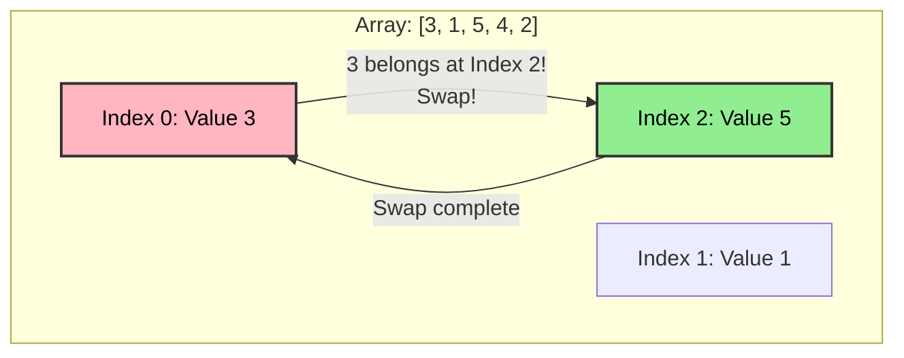

# 🔄 Cyclic Sort Pattern

> **2025 Interview Importance: ⭐⭐ MEDIUM**  
> A secret weapon for "Missing Number" or "Duplicate Number" problems in **O(n) Time** and **O(1) Space**.

---

## 📖 What is it? (Deep Dive for Beginners)

### The "Guests at a Wedding" Analogy

Imagine a wedding reception where tables are numbered 1 to N.
Each guest has an assigned Seat Number (1 to N).
However, **everyone sat at the wrong table!**
- Guest 5 is at Table 1.
- Guest 2 is at Table 5.
- Guest 1 is at Table 2.

**How do you fix this efficiently?**
You (the organizer) go to Table 1.
1. "Guest 5, you are at Table 1! Go to Table 5!"
2. Guest 5 runs to Table 5 and **swaps places** with whoever is there (Guest 2).
3. Now Guest 2 is at Table 1. "Guest 2, go to Table 2!"
4. Guest 2 swaps with the person at Table 2 (Guest 1).
5. Now Guest 1 is at Table 1. "Perfect! Stay there."

You repeat this for every table.
**Result:** Everyone is at their correct table with minimal running around.

**In Coding:**
If you have an array of numbers from 1 to N (e.g., `[3, 1, 5, 4, 2]`), you want to sort them.
Instead of standard sorting (which takes O(n log n)), you can do this **in-place** in **O(n)** because you know exactly where each number belongs!

---

## 🌍 Real-World Applications

### 1. Data Integrity Checks
Database systems often have records with unique IDs (1 to N). If a transaction fails, you might have a "gap" or a "duplicate". Cyclic sort logic helps identify these anomalies instantly without sorting the entire terabyte database.

### 2. File System Defragmentation
When optimizing a disk, if file blocks are labeled 1 to N, moving them to their physical sequence is essentially a cyclic sort operation to minimize seek time.

---

## 🎯 When to Use This Pattern

**Magic Keywords:**
| If you see... | Think... |
|--------------|----------|
| "Numbers from 1 to N" | Cyclic Sort |
| "Numbers from 0 to N" | Cyclic Sort |
| "Find the missing number" | Cyclic Sort |
| "Find the duplicate number" | Cyclic Sort (or Fast & Slow Pointers) |
| "Smallest missing positive integer" | Cyclic Sort |

**The Constraint:** This ONLY works if the numbers are in a specific range (like 1 to N). If the numbers are random (`[10, 500, -2, 40]`), you cannot use this.

---

## 🧠 Core Concept Visualization


**After Swap**:
Array becomes `[5, 1, 3, 4, 2]`.
- Value 3 is now happy at Index 2.
- Value 5 is at Index 0. It's wrong! Swap 5 to Index 4...
- Pattern repeats until Index 0 has Value 1.

---

## 📐 Template Code

### Python
```python
def cyclic_sort(nums):
    """
    Sorts an array containing numbers 1 to n in O(n)
    
    Logic:
    Iterate through the array.
    If nums[i] is not at the correct index (nums[i]-1),
    swap it with the number at its correct index.
    """
    i = 0
    while i < len(nums):
        correct_index = nums[i] - 1
        
        # If number is not in correct spot, SWAP
        if nums[i] != nums[correct_index]:
            nums[i], nums[correct_index] = nums[correct_index], nums[i]
        else:
            # Number is correct, move to next
            i += 1
            
    return nums
```

### JavaScript
```javascript
function cyclicSort(nums) {
    let i = 0;
    while (i < nums.length) {
        const correctIndex = nums[i] - 1;
        
        // Swap if not at correct index
        if (nums[i] !== nums[correctIndex]) {
            [nums[i], nums[correctIndex]] = [nums[correctIndex], nums[i]];
        } else {
            i++;
        }
    }
    return nums;
}
```

---

## 🏆 Famous FAANG Problems

### Problem 1: Missing Number (Easy)
**Asked by**: Amazon, Microsoft, Google
**LeetCode #268**

**Problem**: Array contains distinct numbers from 0 to n. One is missing. Find it.
```
Input: [3, 0, 1]
Output: 2
```
**Solution Strategy**:
1. Use Cyclic Sort to place everyone.
2. Scan array. The index `i` that doesn't have value `i` is the missing one!

### Problem 2: Find All Duplicates in an Array (Medium)
**Asked by**: Facebook, Amazon
**LeetCode #442**

**Problem**: Integers 1 to n, some appear twice. Find all duplicates in O(n) time and O(1) space.
```
Input: [4,3,2,7,8,2,3,1]
Output: [2,3]
```

### Problem 3: First Missing Positive (Hard)
**Asked by**: Amazon (Top 5!), Facebook, Google
**LeetCode #41**

**Problem**: Find the smallest missing positive integer. Unsorted array. O(n) time, O(1) space.
```
Input: [3, 4, -1, 1]
Output: 2
```
**Why Cyclic Sort?**
Ignore negatives and numbers > N. Put valid positives (1 to N) in their seats.
Then scan: the first index `i` that doesn't have `i+1` is the missing answer!
