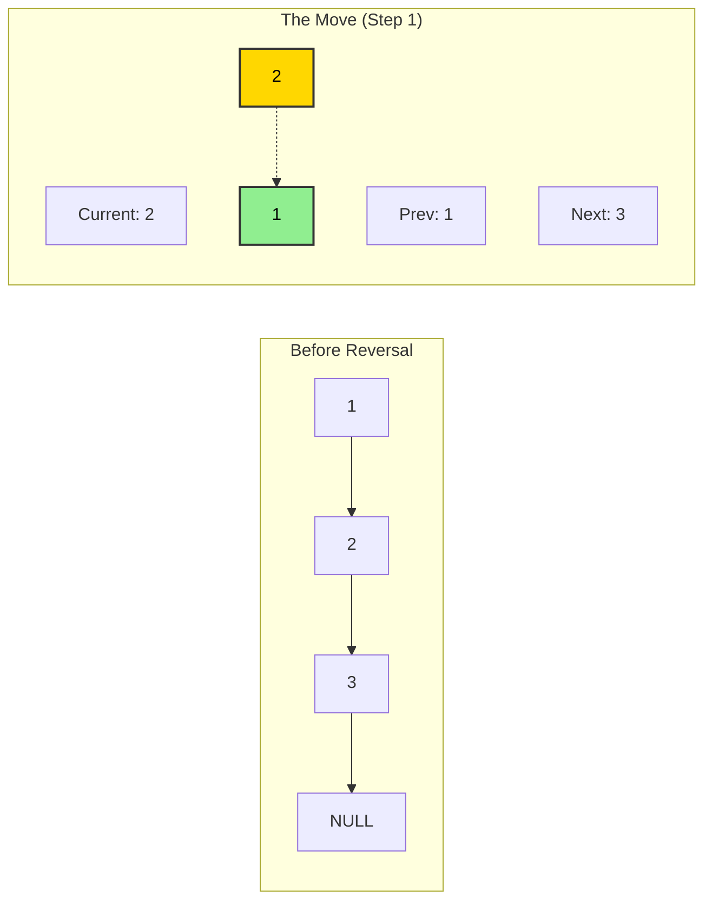

# 🔄 In-Place Linked List Reversal Pattern

> **2025 Interview Importance: ⭐⭐⭐ MEDIUM**  
> A fundamental skill. Often the "Step 1" of a harder problem (e.g., checking Palindromes, Reordering).

---

## 📖 What is it? (Deep Dive for Beginners)

### The "One-Way Train Switch" Analogy

Imagine a train track where each car is hooked only to the one *behind* it.
`Locomotive -> Car A -> Car B -> Car C -> Caboose`
This is a **Linked List**. You can only walk from front to back.

**The Task:**
Reverse the train so the Locomotive is at the end and Caboose is at the front.
`Caboose -> Car C -> Car B -> Car A -> Locomotive`

**The Constraint (In-Place):**
You cannot build a second train. You must unhook Car A, swing it around, and hook it to the Locomotive. Then unhook Car B...
You are modifying the physical connections **one by one**.

### Why This Pattern is Genius
Typically, to reverse something, you might create a new list and copy items in reverse order.
**Copying takes Double Memory (O(n))**.
**In-Place Reversal takes Zero Extra Memory (O(1))**.
This is crucial for systems with limited RAM (like embedded devices used in IoT).

---

## 🌍 Real-World Applications

### 1. Browser "Back" Button
History is often stored as a list. To go back, you essentially traverse the history. Sometimes, for memory efficiency or specific navigation flows (like undo/redo stacks), structures need to be reversed or reordered without allocating new memory.

### 2. Transaction Rollbacks
In a blockchain or ledger, if you need to reverse a sequence of transactions to verify a state from the past, you might technically "reverse" the traversal order of the block list.

---

## 🎯 When to Use This Pattern

**Magic Keywords:**
| If you see... | Think... |
|--------------|----------|
| "Reverse a linked list" | In-Place Reversal |
| "Reverse the first K elements" | In-Place Reversal |
| "Reverse elements from index M to N" | In-Place Reversal |
| "Reorder List" | Fast & Slow Pointers + Reversal |
| "Palindrome Linked List" | Fast & Slow Pointers + Reversal |

---

## 🧠 Core Concept Visualization


**The Three Musketeers:**
To reverse `2 -> 3`, you need 3 pointers:
1. **Prev**: The node behind you (`1`).
2. **Current**: The node you are switching (`2`).
3. **Next**: The node ahead (`3`, so you don't lose the rest of the train!).

---

## 📐 Template Code

### Python
```python
def reverse_list(head):
    """
    Reverse a singly linked list in-place
    
    Time: O(n)
    Space: O(1)
    """
    prev = None
    current = head
    
    while current:
        next_node = current.next  # Save next node (Don't lose it!)
        current.next = prev       # Reverse the link
        prev = current            # Move prev forward
        current = next_node       # Move current forward
        
    return prev  # Prev is the NEW HEAD
```

### JavaScript
```javascript
function reverseList(head) {
    let prev = null;
    let current = head;
    
    while (current) {
        const nextNode = current.next; // Save
        current.next = prev;           // Reverse
        prev = current;                // Move
        current = nextNode;            // Move
    }
    
    return prev;
}
```

### Go
```go
func reverseList(head *ListNode) *ListNode {
    var prev *ListNode
    current := head
    
    for current != nil {
        next := current.Next // Save
        current.Next = prev  // Reverse
        prev = current       // Move
        current = next       // Move
    }
    
    return prev
}
```

---

## 🏆 Famous FAANG Problems

### Problem 1: Reverse Linked List (Easy)
**Asked by**: Everyone (Google, Facebook, Amazon, etc.)
**LeetCode #206**
The classic interview warmup.

### Problem 2: Reverse Linked List II (Medium)
**Asked by**: Facebook, Microsoft, Amazon
**LeetCode #92**

**Problem**: Reverse a linked list from position `m` to `n`.
```
Input: 1->2->3->4->5, m=2, n=4
Output: 1->4->3->2->5
```
**Why it's harder**: You have to keep the *first part* (1) connected to the *new start* (4), and the *new end* (2) connected to the *rest* (5).

### Problem 3: Reverse Nodes in k-Group (Hard)
**Asked by**: Microsoft, Amazon, Facebook
**LeetCode #25**

**Problem**: Reverse nodes in groups of `k` at a time.
```
Input: 1->2->3->4->5, k=2
Output: 2->1->4->3->5
```
This is the ultimate test of your pointer skills!
