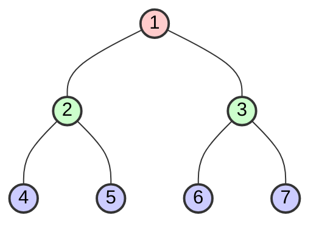

# 🌳 Tree Breadth-First Search (BFS) Pattern

> **2025 Interview Importance: ⭐⭐⭐⭐⭐ CRITICAL**  
> The backbone of "Level Order" problems. If you see "Shortest Path" in an unweighted graph, this is the answer 99% of the time.

---

## 📖 What is it? (Deep Dive for Beginners)

### The "Corporate Announcement" Analogy

Imagine the CEO of a huge company wants to spread a message.
1.  **Level 1 (The Root)**: The CEO tells their 3 VPs.
2.  **Level 2**: The VPs simultaneously tell all their Managers.
3.  **Level 3**: The Managers tell all their Team Leads.
4.  **Level 4**: The Team Leads tell all the Interns.

The message spreads **layer by layer**.
- The CEO doesn't call an Intern directly (skipping levels).
- Everyone at the SAME level finds out at roughly the same time.

**In Coding:**
We explore a Tree (or Graph) **level-by-level**.
- Visit Node A.
- Visit all neighbors of A.
- Visit all neighbors of neighbors of A.

**The Tool:** We use a **Queue** (First-In, First-Out).
- "I see a node, I add it to the back of the line to process later."

---

## 🌍 Real-World Applications

### 1. GPS Shortest Route (Google Maps)
If you want to go from Point A to Point B, BFS looks at all roads 1 minute away, then 2 minutes away, etc. The moment it finds Point B, **that is guaranteed to be the shortest path**. (DFS might take a scenic 100-mile detour!).

### 2. Social Media "People You May Know"
- You = Level 0.
- Friends = Level 1.
- Friends of Friends = Level 2 (Suggested connections!).
BFS is perfect for finding things "nearby" in a network.

### 3. Web Crawlers
Google starts at `google.com`. It finds all links on that page (Level 1 scan). Then it visits those links and finds *their* links (Level 2). This ensures it doesn't get stuck in a deep rabbit hole on one random website.

---

## 🎯 When to Use This Pattern

**Magic Keywords:**
| If you see... | Think... |
|--------------|----------|
| "Level order traversal" | Tree BFS |
| "Print tree level by level" | Tree BFS |
| "Minimum depth of tree" | Tree BFS (Faster than DFS!) |
| "Shortest path" (Unweighted) | Tree BFS |
| "Connect nodes at same level" | Tree BFS |

---

## 🧠 Core Concept Visualization


**Execution Flow (Queue):**
1. **Start**: Queue = `[1]`
2. Pop `1`. Add children `2, 3`. Queue = `[2, 3]`
3. Pop `2`. Add children `4, 5`. Queue = `[3, 4, 5]`
4. Pop `3`. Add children `6, 7`. Queue = `[4, 5, 6, 7]`
5. **Process Level 3**: Pop `4, 5, 6, 7`...

---

## 📐 Template Code

### Python
```python
from collections import deque

def tree_bfs(root):
    """
    Level-order traversal
    Time: O(n)
    Space: O(w) where w is max width of tree
    """
    if not root:
        return []
        
    result = []
    queue = deque([root])
    
    while queue:
        level_size = len(queue)
        current_level = []
        
        for _ in range(level_size):
            node = queue.popleft()
            current_level.append(node.val)
            
            if node.left:
                queue.append(node.left)
            if node.right:
                queue.append(node.right)
        
        result.append(current_level)
        
    return result
```

### JavaScript
```javascript
function treeBFS(root) {
    if (!root) return [];
    
    const result = [];
    const queue = [root];
    
    while (queue.length > 0) {
        const levelSize = queue.length;
        const currentLevel = [];
        
        for (let i = 0; i < levelSize; i++) {
            const node = queue.shift();
            currentLevel.push(node.val);
            
            if (node.left) queue.push(node.left);
            if (node.right) queue.push(node.right);
        }
        
        result.push(currentLevel);
    }
    
    return result;
}
```

---

## 🏆 Famous FAANG Problems

### Problem 1: Binary Tree Level Order Traversal (Easy)
**Asked by**: Facebook, Microsoft, Amazon
**LeetCode #102**

**Problem**: Return values of nodes level by level.
```
Input: [3,9,20,null,null,15,7]
Output: [[3],[9,20],[15,7]]
```

### Problem 2: Course Schedule (Medium)
**Asked by**: Amazon, Google, Uber
**LeetCode #207**
It's a graph, but BFS (Topological Sort) is key.

### Problem 3: Zigzag Level Order Traversal (Medium)
**Asked by**: Microsoft, Amazon
**LeetCode #103**

**Problem**: Same as level order, but alternate direction (Left->Right, then Right->Left).
**Trick**: Just use a boolean `leftToRight` flag and reverse the level array before adding it to result!
