```mermaid
graph TD
    A["Level 0: → 3"] --> B["Level 1: ← 20, 9"]
    B --> C["Level 2: → 15, 7"]
    
    D["Queue at Level 1:<br/>[9, 20]"] --> E["Insert Right-to-Left:<br/>[20, 9]"]
    
    style A fill:#90EE90
    style B fill:#FFD700
    style C fill:#90EE90
```

```mermaid
graph TD
    A["     1<br/>    / \<br/>   2   3<br/>    \   \<br/>     5   4"]
    
    B["Level 0: 1 → Visible"] --> C["Level 1: 2, 3 → 3 Visible"]
    C --> D["Level 2: 5, 4 → 4 Visible"]
    
    E["Result: 1, 3, 4"]
    
    style B fill:#90EE90
    style C fill:#FFD700
    style D fill:#87CEEB
```

# 🌳 Tree BFS (Breadth-First Search) Pattern

## 📖 What is it? (In Layman's Terms)

Imagine you're at a family reunion taking a group photo:
- **BFS approach**: Take photos **level by level** - grandparents first, then parents, then children
- You process everyone at the same "generation" before moving to the next

**BFS = Level Order Traversal**

It's like exploring a building **floor by floor** instead of room by room!

### Real-World Analogy
Think of **social media friend suggestions**:
- Level 0: You
- Level 1: Your direct friends
- Level 2: Friends of friends
- Level 3: Friends of friends of friends

BFS explores closest relationships first!

---

## 🎯 When to Use Tree BFS

Use this pattern when you see:
- ✅ **"Level order"** traversal
- ✅ **"Shortest path"** in tree
- ✅ **"Minimum depth"**
- ✅ **"Right side view"** / **"left side view"**
- ✅ **"Level by level"** processing
- ✅ **"Zigzag"** traversal
- ✅ **"Connect nodes at same level"**

### BFS vs DFS Quick Comparison


---

## 🧠 Core Concept


**Key Tool**: Use a **Queue** (FIFO - First In, First Out)

---

## 📐 Template Code

### Tree Node Definition

#### Python
```python
class TreeNode:
    def __init__(self, val=0, left=None, right=None):
        self.val = val
        self.left = left
        self.right = right
```

#### JavaScript
```javascript
class TreeNode {
    constructor(val = 0, left = null, right = null) {
        this.val = val;
        this.left = left;
        this.right = right;
    }
}
```

#### Go
```go
type TreeNode struct {
    Val   int
    Left  *TreeNode
    Right *TreeNode
}
```

---

### Standard BFS Template

#### Python
```python
from collections import deque

def level_order_traversal(root):
    """
    Standard BFS template for trees
    
    Time Complexity: O(n) - visit each node once
    Space Complexity: O(w) - w is max width of tree
    """
    if not root:
        return []
    
    result = []
    queue = deque([root])  # Initialize queue with root
    
    while queue:
        level_size = len(queue)  # Number of nodes at current level
        current_level = []
        
        # Process all nodes at current level
        for _ in range(level_size):
            node = queue.popleft()
            current_level.append(node.val)
            
            # Add children to queue for next level
            if node.left:
                queue.append(node.left)
            if node.right:
                queue.append(node.right)
        
        result.append(current_level)
    
    return result


# Example usage
#       1
#      / \
#     2   3
#    / \   \
#   4   5   6
root = TreeNode(1)
root.left = TreeNode(2)
root.right = TreeNode(3)
root.left.left = TreeNode(4)
root.left.right = TreeNode(5)
root.right.right = TreeNode(6)

print(level_order_traversal(root))
# Output: [[1], [2, 3], [4, 5, 6]]
```

#### JavaScript
```javascript
/**
 * Standard BFS template
 * @param {TreeNode} root
 * @return {number[][]}
 */
function levelOrderTraversal(root) {
    if (!root) return [];
    
    const result = [];
    const queue = [root];
    
    while (queue.length > 0) {
        const levelSize = queue.length;
        const currentLevel = [];
        
        for (let i = 0; i < levelSize; i++) {
            const node = queue.shift();
            currentLevel.push(node.val);
            
            if (node.left) queue.push(node.left);
            if (node.right) queue.push(node.right);
        }
        
        result.push(currentLevel);
    }
    
    return result;
}
```

#### Go
```go
func levelOrderTraversal(root *TreeNode) [][]int {
    if root == nil {
        return [][]int{}
    }
    
    result := [][]int{}
    queue := []*TreeNode{root}
    
    for len(queue) > 0 {
        levelSize := len(queue)
        currentLevel := []int{}
        
        for i := 0; i < levelSize; i++ {
            node := queue[0]
            queue = queue[1:]
            
            currentLevel = append(currentLevel, node.Val)
            
            if node.Left != nil {
                queue = append(queue, node.Left)
            }
            if node.Right != nil {
                queue = append(queue, node.Right)
            }
        }
        
        result = append(result, currentLevel)
    }
    
    return result
}
```

---

## 🎨 Visual Explanation

### How BFS Works Step-by-Step


---

## 🏆 Famous FAANG Problems

### Problem 1: Binary Tree Level Order Traversal (Medium)
**Asked by**: Amazon, Microsoft, Facebook, Google

**LeetCode #102**

**Problem**: Return level order traversal of a binary tree.

```
Input:     3
          / \
         9  20
           /  \
          15   7

Output: [[3], [9,20], [15,7]]
```

#### Python Solution
```python
from collections import deque

def level_order(root):
    """
    Level order traversal
    
    Time: O(n)
    Space: O(w) where w is max width
    """
    if not root:
        return []
    
    result = []
    queue = deque([root])
    
    while queue:
        level_size = len(queue)
        current_level = []
        
        for _ in range(level_size):
            node = queue.popleft()
            current_level.append(node.val)
            
            if node.left:
                queue.append(node.left)
            if node.right:
                queue.append(node.right)
        
        result.append(current_level)
    
    return result
```

---

### Problem 2: Binary Tree Zigzag Level Order (Medium)
**Asked by**: Microsoft, Amazon, Facebook

**LeetCode #103**

**Problem**: Traverse tree in zigzag pattern (left-to-right, then right-to-left).

```
Input:     3
          / \
         9  20
           /  \
          15   7

Output: [[3], [20,9], [15,7]]
```

#### Python Solution
```python
from collections import deque

def zigzag_level_order(root):
    """
    Zigzag level order traversal
    
    Time: O(n)
    Space: O(w)
    """
    if not root:
        return []
    
    result = []
    queue = deque([root])
    left_to_right = True  # Direction flag
    
    while queue:
        level_size = len(queue)
        current_level = deque()  # Use deque for efficient insertion
        
        for _ in range(level_size):
            node = queue.popleft()
            
            # Add to front or back based on direction
            if left_to_right:
                current_level.append(node.val)
            else:
                current_level.appendleft(node.val)
            
            if node.left:
                queue.append(node.left)
            if node.right:
                queue.append(node.right)
        
        result.append(list(current_level))
        left_to_right = not left_to_right  # Toggle direction
    
    return result
```

#### Visualization


---

### Problem 3: Minimum Depth of Binary Tree (Easy)
**Asked by**: Facebook, Amazon, Google

**LeetCode #111**

**Problem**: Find minimum depth (shortest path from root to any leaf).

```
Input:     3
          / \
         9  20
           /  \
          15   7

Output: 2 (path: 3 → 9)
```

#### Python Solution
```python
from collections import deque

def min_depth(root):
    """
    Find minimum depth using BFS
    BFS is perfect because it finds shortest path!
    
    Time: O(n)
    Space: O(w)
    """
    if not root:
        return 0
    
    queue = deque([(root, 1)])  # (node, depth)
    
    while queue:
        node, depth = queue.popleft()
        
        # Found a leaf! (first leaf is at minimum depth)
        if not node.left and not node.right:
            return depth
        
        if node.left:
            queue.append((node.left, depth + 1))
        if node.right:
            queue.append((node.right, depth + 1))
    
    return 0


# Alternative: Level-by-level approach
def min_depth_v2(root):
    if not root:
        return 0
    
    queue = deque([root])
    depth = 1
    
    while queue:
        level_size = len(queue)
        
        for _ in range(level_size):
            node = queue.popleft()
            
            # First leaf found!
            if not node.left and not node.right:
                return depth
            
            if node.left:
                queue.append(node.left)
            if node.right:
                queue.append(node.right)
        
        depth += 1
    
    return depth
```

---

### Problem 4: Binary Tree Right Side View (Medium)
**Asked by**: Amazon, Facebook, Microsoft

**LeetCode #199**

**Problem**: Imagine standing on right side of tree - what nodes do you see?

```
Input:     1
          / \
         2   3
          \   \
           5   4

Output: [1, 3, 4]
```

#### Python Solution
```python
from collections import deque

def right_side_view(root):
    """
    Get right side view of binary tree
    
    Approach: Return last node of each level
    
    Time: O(n)
    Space: O(w)
    """
    if not root:
        return []
    
    result = []
    queue = deque([root])
    
    while queue:
        level_size = len(queue)
        
        for i in range(level_size):
            node = queue.popleft()
            
            # Last node in this level - visible from right!
            if i == level_size - 1:
                result.append(node.val)
            
            if node.left:
                queue.append(node.left)
            if node.right:
                queue.append(node.right)
    
    return result
```

#### Visualization


---

### Problem 5: Average of Levels (Easy)
**Asked by**: Amazon, Facebook

**LeetCode #637**

**Problem**: Calculate average value of nodes at each level.

```
Input:     3
          / \
         9  20
           /  \
          15   7

Output: [3.0, 14.5, 11.0]
```

#### Python Solution
```python
from collections import deque

def average_of_levels(root):
    """
    Calculate average of each level
    
    Time: O(n)
    Space: O(w)
    """
    if not root:
        return []
    
    result = []
    queue = deque([root])
    
    while queue:
        level_size = len(queue)
        level_sum = 0
        
        for _ in range(level_size):
            node = queue.popleft()
            level_sum += node.val
            
            if node.left:
                queue.append(node.left)
            if node.right:
                queue.append(node.right)
        
        # Calculate average for this level
        result.append(level_sum / level_size)
    
    return result
```

---

### Problem 6: Populating Next Right Pointers (Medium)
**Asked by**: Microsoft, Facebook, Amazon

**LeetCode #116, #117**

**Problem**: Connect all nodes at the same level (next pointer).

```
Input:     1
          / \
         2   3
        / \   \
       4   5   7

Output: 1 → NULL
        2 → 3 → NULL
        4 → 5 → 7 → NULL
```

#### Python Solution
```python
class Node:
    def __init__(self, val=0, left=None, right=None, next=None):
        self.val = val
        self.left = left
        self.right = right
        self.next = next

def connect(root):
    """
    Connect nodes at same level
    
    Time: O(n)
    Space: O(w)
    """
    if not root:
        return None
    
    queue = deque([root])
    
    while queue:
        level_size = len(queue)
        
        for i in range(level_size):
            node = queue.popleft()
            
            # Connect to next node in level (if not last)
            if i < level_size - 1:
                node.next = queue[0]  # Peek at next node
            
            if node.left:
                queue.append(node.left)
            if node.right:
                queue.append(node.right)
    
    return root


# O(1) space solution (more advanced)
def connect_constant_space(root):
    """
    Connect using O(1) space
    Use next pointers to traverse instead of queue!
    """
    if not root:
        return None
    
    leftmost = root
    
    while leftmost:
        current = leftmost
        
        # Connect children of current level
        while current:
            # Connect left to right
            if current.left:
                current.left.next = current.right
            
            # Connect right to next node's left
            if current.right and current.next:
                current.right.next = current.next.left
            
            current = current.next
        
        # Move to next level
        leftmost = leftmost.left
    
    return root
```

---

## 📊 Complexity Analysis

| Operation | Time Complexity | Space Complexity | Notes |
|-----------|----------------|------------------|-------|
| Basic BFS | O(n) | O(w) | w = max width of tree |
| Level Order | O(n) | O(w) | Visit each node once |
| Zigzag | O(n) | O(w) | Same as level order |
| Min Depth | O(n) worst, O(w) best | O(w) | Can stop early |
| Right Side View | O(n) | O(w) | One pass |
| Connect Nodes | O(n) | O(w) or O(1) | O(1) with clever approach |

**Note**: For complete binary tree, w can be O(n/2) ≈ O(n) in worst case

---

## 🎯 BFS vs DFS Decision Tree

```mermaid
flowchart TD
    A[Tree Problem] --> B{What do you need?}
    B -->|Level by level| C[✓ BFS Queue]
    B -->|All paths| D[✓ DFS Recursion]
    B -->|Shortest path| C
    B -->|Specific path| D
    
    C --> E[Examples:<br/>Level Order<br/>Min Depth<br/>Right Side View]
    
    D --> F[Examples:<br/>Path Sum<br/>Max Depth<br/>All Paths]
    
    style C fill:#90EE90
    style D fill:#87CEEB
```



---

## 🔥 More Practice Problems

### Easy Level
1. **Maximum Depth of Binary Tree** (LeetCode #104) - Can use BFS
2. **Symmetric Tree** (LeetCode #101) - Amazon
3. **Invert Binary Tree** (LeetCode #226) - Google

### Medium Level
4. **Binary Tree Level Order Traversal II** (LeetCode #107) - Reverse order
5. **Binary Tree Vertical Order Traversal** (LeetCode #314) - Facebook
6. **All Nodes Distance K** (LeetCode #863) - Facebook, Amazon
7. **Deepest Leaves Sum** (LeetCode #1302) - Amazon

### Hard Level
8. **Serialize and Deserialize Binary Tree** (LeetCode #297) - Amazon, Google
9. **Binary Tree Maximum Path Sum** (LeetCode #124) - Facebook, Amazon
10. **Vertical Order Traversal** (LeetCode #987) - Amazon

---

## 💡 Common Patterns & Tricks

### Pattern 1: Track Level Number
```python
# Keep depth with each node
queue = deque([(root, 0)])

while queue:
    node, level = queue.popleft()
    # Use level info...
```

### Pattern 2: Last Node in Level
```python
# For right side view, leftmost, etc.
for i in range(level_size):
    node = queue.popleft()
    if i == level_size - 1:
        # This is rightmost!
        result.append(node.val)
```

### Pattern 3: Connect Siblings
```python
# Peek at next node in queue
if i < level_size - 1:
    node.next = queue[0]
```

### Pattern 4: Early Termination
```python
# Stop as soon as you find what you need
if condition_met:
    return result
```

---

## 🎨 BFS Algorithm Flowchart


---

## 🧪 Testing Checklist

Test your BFS solution with:
- ✅ Empty tree (null root)
- ✅ Single node
- ✅ Only left children (skewed left)
- ✅ Only right children (skewed right)
- ✅ Perfect binary tree
- ✅ Complete binary tree
- ✅ Tree with varying widths
- ✅ Large tree (performance)

---

## 📚 Key Takeaways

1. **Queue is Essential**: BFS = Queue (FIFO)
2. **Level Processing**: Track `level_size` to process level-by-level
3. **Shortest Path**: BFS naturally finds shortest paths
4. **Space Complexity**: O(width) which can be O(n) for complete trees
5. **Template Reuse**: Same template for 80% of BFS problems
6. **When to Use**: "Level", "shortest", "minimum depth"

---

## 🎓 Next Steps

After mastering Tree BFS:
1. Learn **Tree DFS** pattern (complementary approach)
2. Practice **Graph BFS** (similar but with visited set)
3. Combine with other patterns (BFS + DP, BFS + Backtracking)
4. Master N-ary trees (multiple children)

---

**Remember**: BFS explores neighbors before going deeper - like ripples in water! 🌊
