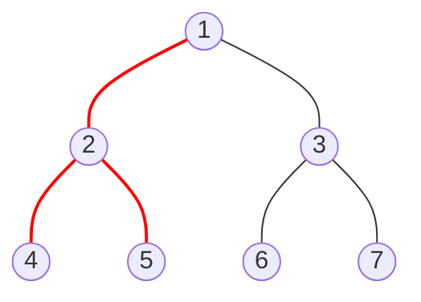

# 🌲 Tree Depth-First Search (DFS) Pattern

> **2025 Interview Importance: ⭐⭐⭐⭐⭐ CRITICAL**  
> The "Swiss Army Knife" of tree/graph problems. Essential for recursion, backtracking, and exhaustive search.

---

## 📖 What is it? (Deep Dive for Beginners)

### The "Maze Explorer" Analogy

Imagine you are in a giant hedge maze.
1.  **Start at the entrance.**
2.  **Pick a path** (say, always go Left).
3.  **Walk deep** down that path until you hit a dead end.
4.  **Backtrack**: Retrace your steps to the last intersection.
5.  **Try the next path** (Right).

This is **Depth-First Search**.
- It dives as **deep** as possible before coming back up.
- Unlike BFS (which goes layer-by-layer), DFS goes branch-by-branch.

**In Coding:**
We usually implement this with **Recursion** (a function calling itself).
The computer's "Call Stack" remembers where to go back to (our breadcrumbs).

---

## 🌍 Real-World Applications

### 1. Solving Puzzles (Sudoku, Mazes)
If you solve a Sudoku, you try a '5' in a cell. Then you move to the next cell. If you get stuck, you go back and try a '6'. This "try and backtrack" is DFS.

### 2. Chess AI
The computer thinks: "If I move Knight to C3... then Opponent moves Pawn... then I move..." It traces one possible future game deeply to see if it leads to a win or loss.

### 3. Folder Structure Analysis
To calculate the total size of a folder, you must open it, look at subfolder A, open THAT, count its files... all the way to the bottom, before checking subfolder B.

---

## 🎯 When to Use This Pattern

**Magic Keywords:**
| If you see... | Think... |
|--------------|----------|
| "Visit every node" | Tree DFS (Simplest code) |
| "Path from A to B" | Tree DFS |
| "Does a path exist?" | Tree DFS |
| "Count paths" | Tree DFS |
| "Validate BST" | Tree DFS (In-Order) |
| "Maximum depth" | Tree DFS |

---

## 🧠 Core Concept Visualization


**DFS Path (Pre-Order):**
`1 -> 2 -> 4 -> (back) -> 5 -> (back) -> (back) -> 3 -> 6 -> 7`

It traces the outline of the tree like a snake!

### The 3 Flavors of DFS
1.  **Pre-Order**: **Me**, Left, Right (Good for copying trees)
    - Order: `1, 2, 4, 5, 3, 6, 7`
2.  **In-Order**: Left, **Me**, Right (Sorted order for BST!)
    - Order: `4, 2, 5, 1, 6, 3, 7`
3.  **Post-Order**: Left, Right, **Me** (Good for deleting trees - children first)
    - Order: `4, 5, 2, 6, 7, 3, 1`

---

## 📐 Template Code

### Python (Recursive)
```python
def dfs_recursive(node):
    if not node:
        return
    
    # 1. Process current node (Pre-order)
    print(node.val)
    
    # 2. Go Left
    dfs_recursive(node.left)
    
    # 3. Go Right
    dfs_recursive(node.right)
```

### Python (Iterative - Challenge Mode)
To simulate recursion without crashing stack, use your own **Stack**!
```python
def dfs_iterative(root):
    if not root:
        return []
    
    stack = [root]
    result = []
    
    while stack:
        node = stack.pop()
        result.append(node.val)
        
        # Add Right FIRST so Left is popped first (LIFO)
        if node.right:
            stack.append(node.right)
        if node.left:
            stack.append(node.left)
            
    return result
```

---

## 🏆 Famous FAANG Problems

### Problem 1: Path Sum (Easy)
**Asked by**: Amazon, Microsoft, Facebook
**LeetCode #112**

**Problem**: Does the tree have a root-to-leaf path that adds up to `targetSum`?
```python
def hasPathSum(root, targetSum):
    if not root:
        return False
    
    # If leaf, check if value matches remaining sum
    if not root.left and not root.right:
        return targetSum == root.val
        
    # Check children with reduced sum
    remaining = targetSum - root.val
    return hasPathSum(root.left, remaining) or hasPathSum(root.right, remaining)
```

### Problem 2: Count Paths for a Sum (Medium)
**Asked by**: Microsoft, Amazon
**LeetCode #437**

**Problem**: Count ALL paths (can start/end anywhere) that sum to Target.
*Strategy: Two DFS traversals. One to choose "Start Node", one to count path from there.*

### Problem 3: Lowest Common Ancestor (Medium)
**Asked by**: Facebook (Top 3!), Amazon
**LeetCode #236**

**Problem**: Find the lowest node that is an ancestor of both P and Q.
*Logic: If I find P on left and Q on right, I AM the ancestor!*
