# 🌲 Tree DFS (Depth-First Search) Pattern

## 📖 What is it? (In Layman's Terms)

Imagine you're exploring a **family tree**:
- **DFS** = Go deep into one branch before exploring others
- Like reading a book: finish one chapter completely before starting the next

**BFS vs DFS**:
- **BFS** (Breadth-First) = Explore all cousins at same level
- **DFS** (Depth-First) = Explore all descendants of one child first

### Real-World Analogy

**Exploring a file system**:
- DFS: Open folder → Go into subfolder → Open file → Finish, then go to next subfolder
- Like: `/Documents/Work/2024/report.pdf` - go ALL the way down first

**Maze solving**:
- Pick one path and follow it to the end
- If dead end, backtrack and try another path
- Eventually explore everything

---

## 🎯 When to Use Tree DFS

Use this pattern when you see:
- ✅ **"All paths"** from root to leaf
- ✅ **"Path sum"** or **"target sum"**
- ✅ **"Maximum depth"** / **"minimum depth"**
- ✅ **"Diameter"** of tree
- ✅ **"Lowest common ancestor"** (LCA)
- ✅ **"Serialize/Deserialize"** tree
- ✅ **"Validate BST"**
- ✅ Any problem requiring **backtracking** in trees

### DFS Traversal Types

```mermaid
graph TD
    A["DFS Traversals"] --> B["Pre-order<br/>Root → Left → Right"]
    A --> C["In-order<br/>Left → Root → Right"]
    A --> D["Post-order<br/>Left → Right → Root"]
    
    style B fill:#FFD700
    style C fill:#90EE90
    style D fill:#87CEEB
```



---

## 🧠 Core Concept


**Key Insight**: DFS uses **recursion** (or explicit stack), BFS uses **queue**

---

## 📐 Template Code

### TreeNode Definition

#### Python
```python
class TreeNode:
    def __init__(self, val=0, left=None, right=None):
        self.val = val
        self.left = left
        self.right = right
```

---

### Template 1: Pre-order Traversal (Root → Left → Right)

#### Python - Recursive
```python
def preorder_recursive(root):
    """
    Pre-order: Process root BEFORE children
    Use cases: Copy tree, prefix expressions
    
    Time: O(n), Space: O(h) - h is height
    """
    result = []
    
    def dfs(node):
        if not node:
            return
        
        result.append(node.val)   # Process root
        dfs(node.left)            # Go left
        dfs(node.right)           # Go right
    
    dfs(root)
    return result
```

#### Python - Iterative
```python
def preorder_iterative(root):
    """
    Pre-order using explicit stack
    """
    if not root:
        return []
    
    result = []
    stack = [root]
    
    while stack:
        node = stack.pop()
        result.append(node.val)
        
        # Push right first (so left is processed first)
        if node.right:
            stack.append(node.right)
        if node.left:
            stack.append(node.left)
    
    return result
```

---

### Template 2: In-order Traversal (Left → Root → Right)

#### Python - Recursive
```python
def inorder_recursive(root):
    """
    In-order: Process root BETWEEN children
    Use cases: BST sorted order, expression trees
    
    Time: O(n), Space: O(h)
    """
    result = []
    
    def dfs(node):
        if not node:
            return
        
        dfs(node.left)           # Go left first
        result.append(node.val)  # Process root
        dfs(node.right)          # Go right
    
    dfs(root)
    return result
```

#### Python - Iterative
```python
def inorder_iterative(root):
    """
    In-order using stack
    """
    result = []
    stack = []
    current = root
    
    while stack or current:
        # Go to leftmost node
        while current:
            stack.append(current)
            current = current.left
        
        # Process node
        current = stack.pop()
        result.append(current.val)
        
        # Move to right subtree
        current = current.right
    
    return result
```

---

### Template 3: Post-order Traversal (Left → Right → Root)

#### Python - Recursive
```python
def postorder_recursive(root):
    """
    Post-order: Process root AFTER children
    Use cases: Delete tree, postfix expressions, tree size
    
    Time: O(n), Space: O(h)
    """
    result = []
    
    def dfs(node):
        if not node:
            return
        
        dfs(node.left)           # Go left
        dfs(node.right)          # Go right
        result.append(node.val)  # Process root last
    
    dfs(root)
    return result
```

---

### Template 4: Path Finding (Most Common!)

#### Python
```python
def find_all_paths(root):
    """
    Find all root-to-leaf paths
    Classic DFS + Backtracking pattern
    
    Time: O(n), Space: O(h) for recursion + O(n) for paths
    """
    result = []
    
    def dfs(node, path):
        if not node:
            return
        
        # Add current node to path
        path.append(node.val)
        
        # If leaf node, save path
        if not node.left and not node.right:
            result.append(list(path))  # Copy path!
        else:
            # Explore children
            dfs(node.left, path)
            dfs(node.right, path)
        
        # Backtrack: remove current node
        path.pop()
    
    dfs(root, [])
    return result


# Example tree:
#       1
#      / \
#     2   3
#    / \
#   4   5
#
# Paths: [[1,2,4], [1,2,5], [1,3]]
```

---

## 🏆 Famous FAANG Problems

### Problem 1: Maximum Depth of Binary Tree (Easy)
**Asked by**: Everyone! Google, Amazon, Microsoft, Facebook, Apple

**LeetCode #104**

**Problem**: Find the maximum depth (height) of a binary tree.

```
Input:    3
         / \
        9  20
          /  \
         15   7
Output: 3
```

#### Python Solution
```python
def maxDepth(root):
    """
    Simple recursive DFS
    
    Depth = 1 + max(left_depth, right_depth)
    
    Time: O(n), Space: O(h)
    """
    # Base case: empty tree
    if not root:
        return 0
    
    # Recursive case
    left_depth = maxDepth(root.left)
    right_depth = maxDepth(root.right)
    
    return 1 + max(left_depth, right_depth)


# Iterative DFS with stack
def maxDepth_iterative(root):
    """Using stack with (node, depth) pairs"""
    if not root:
        return 0
    
    stack = [(root, 1)]
    max_depth = 0
    
    while stack:
        node, depth = stack.pop()
        max_depth = max(max_depth, depth)
        
        if node.right:
            stack.append((node.right, depth + 1))
        if node.left:
            stack.append((node.left, depth + 1))
    
    return max_depth
```

**Layman explanation**: 
- Go down left path, find depth
- Go down right path, find depth
- Total depth = 1 (current) + max of both sides

---

### Problem 2: Path Sum (Easy)
**Asked by**: Amazon, Microsoft, Facebook

**LeetCode #112**

**Problem**: Check if there's a root-to-leaf path with target sum.

```
Input:      5
           / \
          4   8
         /   / \
        11  13  4
       /  \      \
      7    2      1
Target sum = 22
Output: true (5→4→11→2)
```

#### Python Solution
```python
def hasPathSum(root, targetSum):
    """
    DFS checking if any path sums to target
    
    Approach: Subtract current value, check if leaf has sum 0
    
    Time: O(n), Space: O(h)
    """
    if not root:
        return False
    
    # Check if leaf node with exact sum
    if not root.left and not root.right:
        return root.val == targetSum
    
    # Recursively check both subtrees with remaining sum
    remaining = targetSum - root.val
    return (hasPathSum(root.left, remaining) or 
            hasPathSum(root.right, remaining))


# Alternative: Keep track of current sum
def hasPathSum_v2(root, targetSum):
    def dfs(node, current_sum):
        if not node:
            return False
        
        current_sum += node.val
        
        # Leaf node
        if not node.left and not node.right:
            return current_sum == targetSum
        
        return (dfs(node.left, current_sum) or 
                dfs(node.right, current_sum))
    
    return dfs(root, 0)
```

---

### Problem 3: Path Sum II (Medium)
**Asked by**: Facebook, Amazon, Google

**LeetCode #113**

**Problem**: Find ALL root-to-leaf paths with target sum.

```
Input: root = [5,4,8,11,null,13,4,7,2,null,null,5,1], targetSum = 22
Output: [[5,4,11,2],[5,8,4,5]]
```

#### Python Solution
```python
def pathSum(root, targetSum):
    """
    Find all paths with target sum
    Classic DFS + Backtracking!
    
    Time: O(n), Space: O(h) recursion + O(n) for paths
    """
    result = []
    
    def dfs(node, path, remaining):
        if not node:
            return
        
        # Add current node to path
        path.append(node.val)
        
        # Check if leaf with target sum
        if not node.left and not node.right and remaining == node.val:
            result.append(list(path))  # Save copy!
        
        # Explore children
        new_remaining = remaining - node.val
        dfs(node.left, path, new_remaining)
        dfs(node.right, path, new_remaining)
        
        # Backtrack
        path.pop()
    
    dfs(root, [], targetSum)
    return result
```

**Key insight**: Use backtracking! Add node, explore, then remove (pop) to try other paths.

---

### Problem 4: Diameter of Binary Tree (Easy)
**Asked by**: Facebook, Amazon, Google, Microsoft

**LeetCode #543**

**Problem**: Find longest path between any two nodes (may not pass through root).

```
Input:    1
         / \
        2   3
       / \
      4   5
Output: 3 (path: 4→2→1→3 or 5→2→1→3)
```

#### Python Solution
```python
def diameterOfBinaryTree(root):
    """
    Diameter = max of:
    1. Diameter through root (left_height + right_height)
    2. Diameter in left subtree
    3. Diameter in right subtree
    
    Time: O(n), Space: O(h)
    """
    diameter = [0]  # Use list to modify in nested function
    
    def height(node):
        """Return height and update diameter"""
        if not node:
            return 0
        
        left_height = height(node.left)
        right_height = height(node.right)
        
        # Update diameter (path through this node)
        diameter[0] = max(diameter[0], left_height + right_height)
        
        # Return height of this node
        return 1 + max(left_height, right_height)
    
    height(root)
    return diameter[0]
```

**Layman explanation**:
- For each node, longest path through it = left height + right height
- Keep track of max across all nodes
- That's the diameter!

---

### Problem 5: Lowest Common Ancestor (Medium)
**Asked by**: Facebook, Amazon, LinkedIn, Microsoft, Google

**LeetCode #236** - Classic tree problem!

**Problem**: Find lowest common ancestor of two nodes.

```
Input: root = [3,5,1,6,2,0,8,null,null,7,4], p = 5, q = 1
Output: 3 (LCA of 5 and 1)
```

#### Python Solution
```python
def lowestCommonAncestor(root, p, q):
    """
    Brilliant recursive solution!
    
    If we find p or q, return it.
    If left and right both return non-null, current node is LCA.
    Otherwise, return whichever side found something.
    
    Time: O(n), Space: O(h)
    """
    # Base cases
    if not root or root == p or root == q:
        return root
    
    # Search in left and right subtrees
    left = lowestCommonAncestor(root.left, p, q)
    right = lowestCommonAncestor(root.right, p, q)
    
    # If both sides found something, this is LCA
    if left and right:
        return root
    
    # Otherwise, return whichever side found something
    return left if left else right


# Why it works:
# Case 1: p and q in different subtrees → current node is LCA
# Case 2: One contains the other → the upper one is LCA
# Case 3: Both in same subtree → LCA is in that subtree
```

**This is GENIUS!** Simple but handles all cases perfectly.

---

### Problem 6: Binary Tree Maximum Path Sum (Hard)
**Asked by**: Facebook, Amazon, Google

**LeetCode #124** - Very common!

**Problem**: Find path with maximum sum (can start and end anywhere).

```
Input: root = [-10,9,20,null,null,15,7]
Output: 42 (path: 15→20→7)
```

#### Python Solution
```python
def maxPathSum(root):
    """
    Very similar to diameter problem!
    
    For each node, max path through it = 
    node.val + max_left_gain + max_right_gain
    
    Time: O(n), Space: O(h)
    """
    max_sum = [float('-inf')]
    
    def max_gain(node):
        """
        Return max gain from this node going down one branch
        Also update global max_sum
        """
        if not node:
            return 0
        
        # Recursively get max gain from children
        # Only take positive gains (ignore negative paths)
        left_gain = max(max_gain(node.left), 0)
        right_gain = max(max_gain(node.right), 0)
        
        # Path through this node
        path_sum = node.val + left_gain + right_gain
        
        # Update global max
        max_sum[0] = max(max_sum[0], path_sum)
        
        # Return max gain going through this node (one direction only)
        return node.val + max(left_gain, right_gain)
    
    max_gain(root)
    return max_sum[0]
```

**Key insight**: At each node, we have choice:
- Include both children (update max_sum)
- Return only one child + current (for parent to use)

---

### Problem 7: Validate Binary Search Tree (Medium)
**Asked by**: Facebook, Amazon, Microsoft, Apple

**LeetCode #98** - Must know!

**Problem**: Check if tree is a valid BST.

```
Input:    2
         / \
        1   3
Output: true
```

#### Python Solution
```python
def isValidBST(root):
    """
    In-order traversal of BST gives sorted array!
    
    Alternative: Track valid range for each node
    
    Time: O(n), Space: O(h)
    """
    # Method 1: In-order traversal should be sorted
    def inorder(node, prev):
        if not node:
            return True
        
        # Check left subtree
        if not inorder(node.left, prev):
            return False
        
        # Check current node
        if prev[0] is not None and node.val <= prev[0]:
            return False
        prev[0] = node.val
        
        # Check right subtree
        return inorder(node.right, prev)
    
    return inorder(root, [None])


# Method 2: Track valid range
def isValidBST_v2(root):
    """
    Each node must be in valid range:
    - Left child: (-inf, node.val)
    - Right child: (node.val, inf)
    """
    def validate(node, min_val, max_val):
        if not node:
            return True
        
        # Check if current node is in valid range
        if node.val <= min_val or node.val >= max_val:
            return False
        
        # Validate children with updated ranges
        return (validate(node.left, min_val, node.val) and
                validate(node.right, node.val, max_val))
    
    return validate(root, float('-inf'), float('inf'))
```

---

### Problem 8: Serialize and Deserialize Binary Tree (Hard)
**Asked by**: Facebook, Amazon, Microsoft, Google

**LeetCode #297**

**Problem**: Convert tree to string and back.

```
Input: root = [1,2,3,null,null,4,5]
Output: "1,2,null,null,3,4,null,null,5,null,null"
```

#### Python Solution
```python
class Codec:
    """
    Use pre-order traversal (DFS)
    'X' represents null nodes
    """
    
    def serialize(self, root):
        """
        Encode tree to string
        
        Time: O(n), Space: O(n)
        """
        def dfs(node):
            if not node:
                return 'X'
            
            # Pre-order: root, left, right
            left = dfs(node.left)
            right = dfs(node.right)
            
            return f'{node.val},{left},{right}'
        
        return dfs(root)
    
    def deserialize(self, data):
        """
        Decode string to tree
        
        Time: O(n), Space: O(n)
        """
        def dfs(nodes):
            val = next(nodes)
            
            if val == 'X':
                return None
            
            # Create node
            node = TreeNode(int(val))
            
            # Recursively build children
            node.left = dfs(nodes)
            node.right = dfs(nodes)
            
            return node
        
        nodes = iter(data.split(','))
        return dfs(nodes)


# Test
codec = Codec()
tree = TreeNode(1)
tree.left = TreeNode(2)
tree.right = TreeNode(3)
tree.right.left = TreeNode(4)
tree.right.right = TreeNode(5)

serialized = codec.serialize(tree)  # "1,2,X,X,3,4,X,X,5,X,X"
deserialized = codec.deserialize(serialized)  # Recreates tree!
```

---

### Problem 9: Binary Tree Right Side View (Medium)
**Asked by**: Facebook, Amazon, Microsoft

**LeetCode #199** - Can use DFS too!

**Problem**: View from right side (rightmost node at each level).

#### Python Solution (DFS approach)
```python
def rightSideView(root):
    """
    DFS: Go right first, track depth
    First node at each depth is visible from right!
    
    Time: O(n), Space: O(h)
    """
    result = []
    
    def dfs(node, depth):
        if not node:
            return
        
        # First time visiting this depth from right
        if depth == len(result):
            result.append(node.val)
        
        # Visit right first!
        dfs(node.right, depth + 1)
        dfs(node.left, depth + 1)
    
    dfs(root, 0)
    return result
```

---

### Problem 10: Sum Root to Leaf Numbers (Medium)
**Asked by**: Facebook, Amazon, Microsoft

**LeetCode #129**

**Problem**: Sum all numbers formed by root-to-leaf paths.

```
Input:    1
         / \
        2   3
Output: 25 (12 + 13)
```

#### Python Solution
```python
def sumNumbers(root):
    """
    DFS building numbers as we go
    
    Time: O(n), Space: O(h)
    """
    def dfs(node, current_num):
        if not node:
            return 0
        
        # Build number
        current_num = current_num * 10 + node.val
        
        # Leaf node - return this number
        if not node.left and not node.right:
            return current_num
        
        # Sum of all paths through this node
        return (dfs(node.left, current_num) + 
                dfs(node.right, current_num))
    
    return dfs(root, 0)


# Example:
#     1
#    / \
#   2   3
#
# Left path: 1*10+2 = 12
# Right path: 1*10+3 = 13
# Sum: 12 + 13 = 25
```

---

## 📊 DFS Traversal Comparison

| Traversal | Order | Use Case | Example |
|-----------|-------|----------|---------|
| **Pre-order** | Root → L → R | Copy tree, prefix notation | 1,2,4,5,3,6,7 |
| **In-order** | L → Root → R | BST sorted, infix notation | 4,2,5,1,6,3,7 |
| **Post-order** | L → R → Root | Delete tree, postfix notation | 4,5,2,6,7,3,1 |


---

## 🎯 Problem-Solving Framework


---

## 🔥 More Practice Problems

### Easy
1. **Same Tree** (LeetCode #100)
2. **Symmetric Tree** (LeetCode #101)
3. **Invert Binary Tree** (LeetCode #226)
4. **Min Depth** (LeetCode #111) - Can use DFS
5. **Balanced Binary Tree** (LeetCode #110)

### Medium
6. **Count Good Nodes** (LeetCode #1448)
7. **Kth Smallest in BST** (LeetCode #230)
8. **Construct from Preorder/Inorder** (LeetCode #105)
9. **Flatten to Linked List** (LeetCode #114)
10. **House Robber III** (LeetCode #337) - DP on trees!

### Hard
11. **Binary Tree Cameras** (LeetCode #968)
12. **Vertical Order Traversal** (LeetCode #987)
13. **All Nodes Distance K** (LeetCode #863)

---

## 💡 Pro Tips & Tricks

### 1. Backtracking Pattern
```python
def dfs(node, path):
    path.append(node.val)   # Choose
    # ... explore ...
    path.pop()              # Un-choose
```

### 2. Global Variable Trick
```python
result = [0]  # Use list to modify in nested function
def dfs(node):
    result[0] = max(result[0], value)
```

### 3. Return Multiple Values
```python
def dfs(node):
    # Return (property1, property2)
    return max_path, diameter
```

### 4. Null Checks
```python
# Always check before accessing
if not node:
    return base_case
```

---

## 🧠 Memory Tricks

**Pre/In/Post Order**:
- **PRE**-order = Process **BEFORE** going down
- **IN**-order = Process **IN** the middle
- **POST**-order = Process **AFTER** coming back up

**When to use which traversal**:
- Need sorted order? → **In-order** (for BST)
- Need to copy? → **Pre-order**
- Need to delete? → **Post-order** (delete children first)

---

## 📚 Key Takeaways

1. **DFS = Go Deep First** - Explore one branch completely
2. **Three types**: Pre/In/Post-order (remember the order!)
3. **Recursion is natural** - Tree structure is recursive
4. **Backtracking for paths** - Add, explore, remove
5. **Global vars for updates** - Use list/object to modify
6. **O(h) space** - Recursion stack depth = height

---

## 🎓 Common Patterns

| Pattern | When to Use | Example |
|---------|-------------|---------|
| **Simple DFS** | Height, depth, size | Max Depth |
| **DFS + Global Var** | Diameter, max path | Diameter, Max Path Sum |
| **DFS + Backtracking** | All paths | Path Sum II, All Paths |
| **DFS + Return Tuple** | Multiple properties | Balanced Tree |
| **DFS + Range** | Validation | Validate BST |

---

**Master these 10 problems and tree DFS will become second nature! 🌲**

**Remember: "DFS is like reading a book - finish one chapter before starting the next!" 📖**
