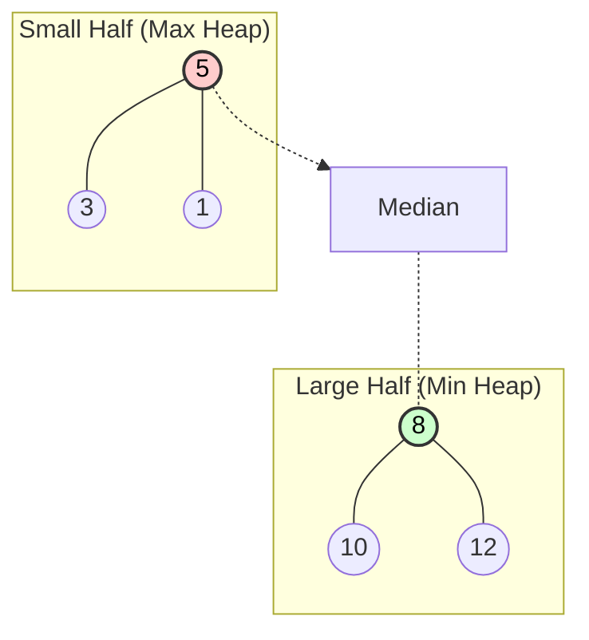

# ⚖️ Two Heaps Pattern

> **2025 Interview Importance: ⭐⭐⭐ MEDIUM**  
> The "Silver Bullet" for finding Medians in streaming data. A favorite of Goldman Sachs, Netflix, and Facebook.

---

## 📖 What is it? (Deep Dive for Beginners)

### The "Gold Coin Sorter" Analogy

Imagine you are a bank teller receiving a stream of gold coins of different weights.
Your boss asks you constantly: **"What is the median (middle) weight of all coins so far?"**

If you have 1,000,000 coins, sorting them every time a new coin comes in is WAY too slow (O(N log N)).
Instead, you use **Two Magic Scales** (Heaps):

1.  **Small Pile (Max Heap)**: Keeps the smaller half of the coins. The "biggest" of the smalls is at the top.
2.  **Big Pile (Min Heap)**: Keeps the larger half of the coins. The "smallest" of the bigs is at the top.

**The Magic:**
- The top of the Small Pile and the top of the Big Pile are the **two middle elements**.
- Average them, and you have the Median!
- When a new coin comes, you just toss it onto the correct pile and rebalance. **O(log N)** speed!

### Why This Pattern is Genius
It turns an O(N) or O(N log N) median problem into **O(1)** access time.
It's the only efficient way to handle "Continuous Data Streams" (like stock tickers or sensor data).

---

## 🌍 Real-World Applications

### 1. Netflix Rating System
As millions of users rate movies in real-time, Netflix might want to know the median rating of a movie instantly to display "Trending" stats, without sorting the entire database of ratings every second.

### 2. High-Frequency Trading
Stock prices tick thousands of times a second. Algorithms need the median price of the last 5 minutes to make buy/sell decisions instantly.

### 3. Load Balancing
Servers report their current load (CPU usage). To know the "Average" or "Median" load of a cluster efficiently, a central system can use heaps to track statistics dynamically.

---

## 🎯 When to Use This Pattern

**Magic Keywords:**
| If you see... | Think... |
|--------------|----------|
| "Find Median" in data stream | Two Heaps |
| "Find Median" in sliding window | Two Heaps |
| "Maximize Capital" | Two Heaps (Min cost, Max profit) |
| "Schedule tasks on CPU" | Two Heaps |

---

## 🧠 Core Concept Visualization


**Interpretation:**
- **Max Heap Top (5)**: The largest of the small numbers.
- **Min Heap Top (8)**: The smallest of the large numbers.
- **Median**: (5 + 8) / 2 = 6.5.
- Balancing Act: We always keep the heaps size equal (or off by 1).

---

## 📐 Template Code

### Python
```python
import heapq

class MedianFinder:
    def __init__(self):
        # Python defaults to Min Heap. 
        # For Max Heap, we store negative numbers!
        self.small = []  # Max Heap (stores -numbers)
        self.large = []  # Min Heap (stores +numbers)

    def addNum(self, num: int) -> None:
        # Step 1: Add to 'small' (Max Heap)
        heapq.heappush(self.small, -num)
        
        # Step 2: Ensure every num in 'small' <= every num in 'large'
        if self.small and self.large and (-self.small[0] > self.large[0]):
            val = -heapq.heappop(self.small)
            heapq.heappush(self.large, val)
            
        # Step 3: Handle Size disparity (Small size > Large size + 1)
        if len(self.small) > len(self.large) + 1:
            val = -heapq.heappop(self.small)
            heapq.heappush(self.large, val)
        if len(self.large) > len(self.small) + 1:
            val = heapq.heappop(self.large)
            heapq.heappush(self.small, -val)

    def findMedian(self) -> float:
        if len(self.small) > len(self.large):
            return -self.small[0]
        if len(self.large) > len(self.small):
            return self.large[0]
            
        return (-self.small[0] + self.large[0]) / 2.0
```

### JavaScript
(Note: JS doesn't have a built-in Heap, you'd usually implement a simple one or use a library in an interview. Here is the logic assuming a `MinPriorityQueue` class exists).

---

## 🏆 Famous FAANG Problems

### Problem 1: Find Median from Data Stream (Hard)
**Asked by**: Google, Amazon, Apple, Goldman Sachs
**LeetCode #295**
The definition of this pattern.

### Problem 2: Sliding Window Median (Hard)
**Asked by**: Facebook, Google
**LeetCode #480**
Combine **Sliding Window** + **Two Heaps**.
*Hint: You need to "remove" elements leaving the window from the heaps. Since standard heaps don't support random removal, use "Lazy Removal" (mark them as deleted in a hash map and ignore them when they float to the top).*

### Problem 3: IPO (Hard)
**Asked by**: Amazon
**LeetCode #502**
Maximize capital by choosing projects.
*Strategy: Two Heaps. Min-Heap for "Projects I can afford". Max-Heap for "Projects giving most profit".*
