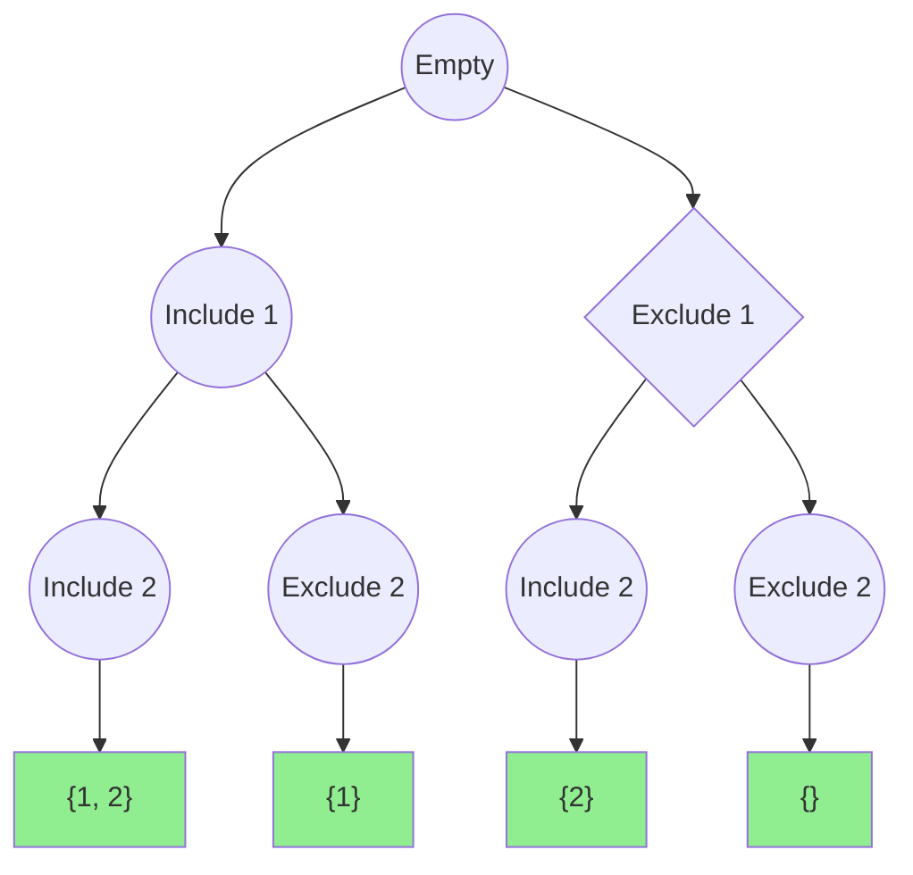

# 🔢 Subsets Pattern (Backtracking)

> **2025 Interview Importance: ⭐⭐⭐ MEDIUM**  
> Foundational for "Combinatorics" questions. While not the most common, it's the only way to solve "Generate all X" problems.

---

## 📖 What is it? (Deep Dive for Beginners)

### The "Pizza Topping" Analogy

Imagine you are ordering a pizza and have 3 toppings: **Pepperoni (P)**, **Mushrooms (M)**, and **Onions (O)**.
You need to list **every single possible pizza** you could create.

**The Decision Tree:**
1.  **Start (Plain Cheese)**
2.  Do you want **Pepperoni**?
    - **YES**: You have {P}.
    - **NO**: You have {}.
3.  Next, do you want **Mushrooms**?
    - If you had {P}:
        - **YES** -> {P, M}
        - **NO** -> {P}
    - If you had {}:
        - **YES** -> {M}
        - **NO** -> {}
4.  Finally, **Onions**...

By making a Yes/No decision for every item, you generate the **Power Set** (all subsets).
Total combinations = 2^N (where N is number of toppings).

**In Coding:**
We use **BFS** (iteratively adding new element to all existing sets) or **DFS** (Recursion with Backtracking).

---

## 🌍 Real-World Applications

### 1. Feature Toggles
Software testing often requires testing all combinations of enabled features. If you have 10 beta features, you need to generate all subsets to ensure no two features crash when enabled together.

### 2. Genetic Research
Analyzing combinations of genes to find which specific subset causes a trait.

### 3. Shopping Cart Discounts
Finding which combination of items in a cart qualifies for the "Best Bundle Deal".

---

## 🎯 When to Use This Pattern

**Magic Keywords:**
| If you see... | Think... |
|--------------|----------|
| "Find all subsets" | Subsets Pattern |
| "Find all permutations" | Subsets Pattern |
| "Find all combinations" | Subsets Pattern |
| "Generate valid parentheses" | Subsets Pattern |

---

## 🧠 Core Concept Visualization



---

## 📐 Template Code

### Python (Iterative / Cascading)
```python
def subsets(nums):
    """
    Start with [[]]
    For each num, take all existing subsets, add num to them,
    and add back to the list.
    """
    result = [[]]
    
    for num in nums:
        # Create new subsets by adding 'num' to all existing ones
        new_subsets = []
        for curr_set in result:
            new_subsets.append(curr_set + [num])
            
        result.extend(new_subsets)
        
    return result

# Trace for [1, 5, 3]:
# Start: [[]]
# Add 1: [ [], [1] ]
# Add 5: [ [], [1], [5], [1,5] ]
# Add 3: [ [], [1], [5], [1,5], [3], [1,3], [5,3], [1,5,3] ]
```

### Python (Recursive DFS)
```python
def subsets_dfs(nums):
    res = []
    subset = []
    
    def dfs(i):
        if i >= len(nums):
            res.append(subset.copy())
            return
        
        # Decision 1: Include nums[i]
        subset.append(nums[i])
        dfs(i + 1)
        
        # Decision 2: Exclude nums[i]
        subset.pop()
        dfs(i + 1)
        
    dfs(0)
    return res
```

---

## 🏆 Famous FAANG Problems

### Problem 1: Subsets (Medium)
**Asked by**: Facebook, Amazon, Google
**LeetCode #78**

### Problem 2: Permutations (Medium)
**Asked by**: Microsoft, Google, LinkedIn
**LeetCode #46**
Generate all orderings (e.g., `[1,2,3]`, `[1,3,2]`, `[2,1,3]`).
*Key difference: Order matters! You need a "used" tracker or swap logic.*

### Problem 3: Letter Combinations of a Phone Number (Medium)
**Asked by**: Amazon, Facebook, Apple
**LeetCode #17**
"2" -> "abc", "3" -> "def". Input "23" -> ["ad", "ae", "af", "bd", ...].
*This is just subsets logic applied to mapping!*
