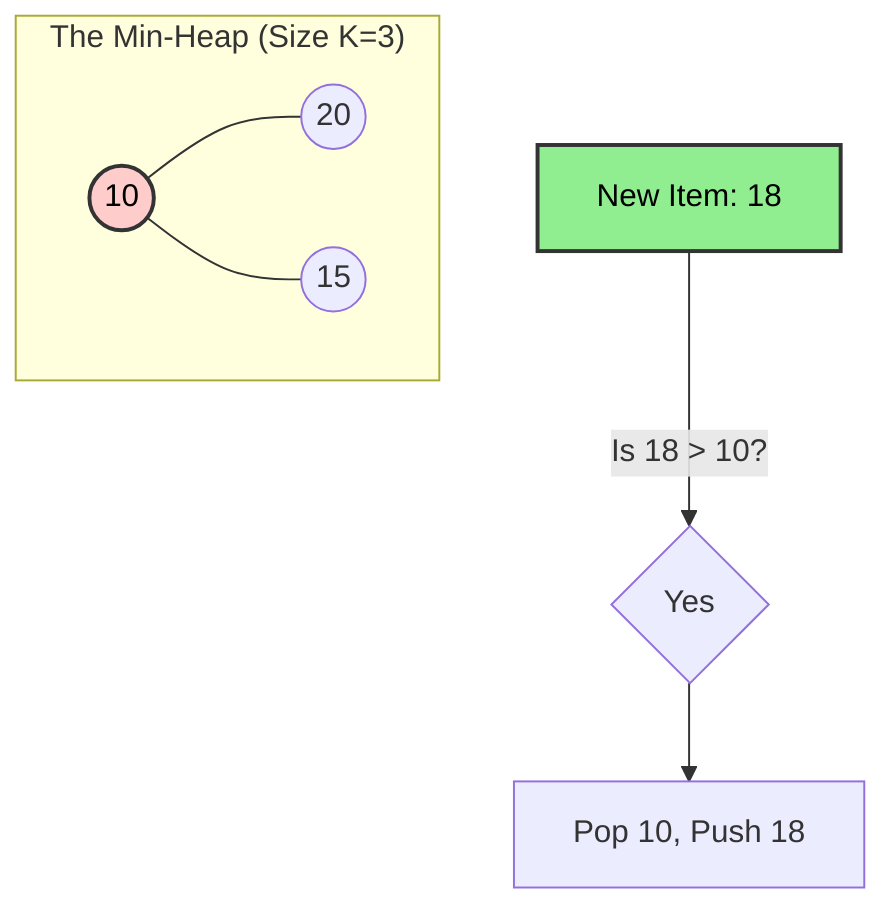

# 🔝 Top 'K' Elements Pattern

> **2025 Interview Importance: ⭐⭐⭐⭐ HIGH**  
> "Find the Top 10..." is the Hello World of System Design and Data Engineering algorithms.

---

## 📖 What is it? (Deep Dive for Beginners)

### The "VIP Shelf" Analogy

Imagine you own a bookstore with 1,000,000 books.
You want a small display shelf for the **"Top 3 Bestsellers"**.

**Bad Way**: Sort ALL 1,000,000 books by sales count, then pick the top 3. (Too slow!)
**Better Way (Top K Pattern)**:
1.  Keep a small shelf that fits ONLY 3 books.
2.  Walk through the library.
3.  Fill the shelf with the first 3 books you see.
4.  For the 4th book: **Is it better than the "Worst" book on your shelf?**
    - **No?** Ignore it.
    - **Yes?** Kick out the worst book, and put this new one in.

By tracking only the "Weakest of the Top 3", you can process infinite books efficiently.

**In Coding:**
We use a **Min-Heap** of size K.
- The Root is the smallest of the top K (the "gatekeeper").
- If a new number > Root, pop Root and push new number.

---

## 🌍 Real-World Applications

### 1. Uber/Lyft "Closest Drivers"
When you request a ride, the system finds the K drivers nearest to your Geo-Location. It doesn't sort all 10,000 drivers in the city; it just maintains the top K.

### 2. Monitoring Alerts
"Show me the Top 5 memory-hogging processes." The OS tracks this live without pausing the system to sort everything.

### 3. YouTube/TikTok Comments
"Show Top 10 liked comments."

---

## 🎯 When to Use This Pattern

**Magic Keywords:**
| If you see... | Think... |
|--------------|----------|
| "Top K largest/smallest" | Top K Elements (Heap) |
| "K most frequent" | Top K Elements |
| "Sort a nearly sorted array" | Top K Elements |
| "Kth largest element" | Top K Elements |

---

## 🧠 Core Concept Visualization


**Why Min-Heap for "Largest"?**
It sounds counter-intuitive!
- To keep the **Largest** K, you need to easily **remove the smallest** of them to make room for bigger fish.
- Min-Heap gives you O(1) access to the smallest.

---

## 📐 Template Code

### Python
```python
import heapq

def find_k_largest(nums, k):
    """
    Find k largest elements using Min-Heap
    Time: O(N log K)
    Space: O(K)
    """
    min_heap = []
    
    for num in nums:
        if len(min_heap) < k:
            heapq.heappush(min_heap, num)
        else:
            # If current num is bigger than the smallest in heap
            if num > min_heap[0]:
                heapq.heappop(min_heap)
                heapq.heappush(min_heap, num)
                
    return min_heap  # Contains top K largest
```

---

## 🏆 Famous FAANG Problems

### Problem 1: Kth Largest Element in an Array (Medium)
**Asked by**: Facebook (Top 2), Amazon, Google
**LeetCode #215**
*Solution:* Top K pattern returns the K largest. The "smallest" of those (the root) is the Kth largest!

### Problem 2: Top K Frequent Elements (Medium)
**Asked by**: Amazon, Facebook, Google
**LeetCode #347**
*Strategy:* Count frequencies (HashMap). Then Keep Top K items based on count.

### Problem 3: K Closest Points to Origin (Medium)
**Asked by**: Amazon, Facebook
**LeetCode #973**
*Strategy:* Max-Heap of size K (because we want closest/smallest distance). Keep K smallest!
