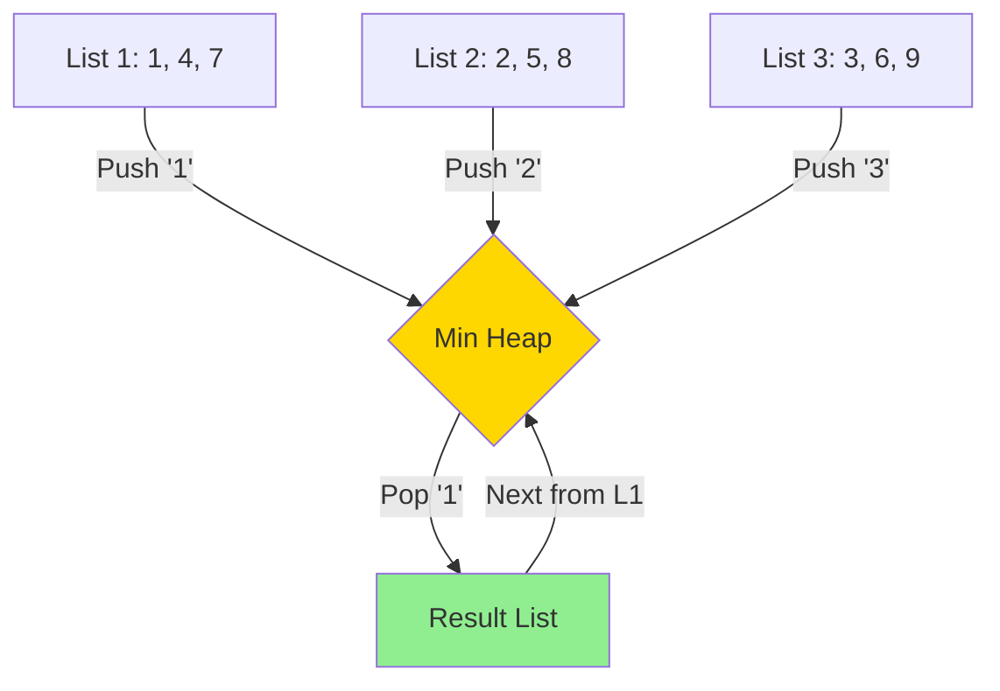

# 🛣️ K-Way Merge Pattern

> **2025 Interview Importance: ⭐⭐⭐ MEDIUM-HIGH**  
> Crucial for Big Data / Systems Design. "How do you sort 1TB of data with 1GB of RAM?" -> K-Way Merge!

---

## 📖 What is it? (Deep Dive for Beginners)

### The "Supermarket Checkout" Analogy

Imagine a supermarket with **K=3 checkout lanes**.
- Lane 1: Customers sorted by arrival time.
- Lane 2: Customers sorted by arrival time.
- Lane 3: Customers sorted by arrival time.

**The Task:** Merge them into **ONE** single exit line, strictly sorted by time.

**How do you do it?**
1. Look at the **front person** of Lane 1, Lane 2, and Lane 3.
2. Who arrived earliest? Let's say Lane 2's person.
3. Move Lane 2's person to the Exit.
4. Now look at the *new* front person of Lane 2, compare with Lane 1 and 3.

**In Coding:**
We use a **Min-Heap** to store the "Head" of each of the K lists.
1. Push first element of all K lists into Heap.
2. Pop the smallest (write to result).
3. If the popped element came from List X, push the *next* element of List X into the Heap.
4. Repeat.

---

## 🌍 Real-World Applications

### 1. External Merge Sort
When sorting a file too large for RAM (1TB), we split it into small chunks, sort the chunks, and save them. Then we use K-Way Merge to combine these chunk files into one final sorted file.

### 2. Aggregating User Feeds
Instagram needs to show you a feed combined from 500 friends you follow. Each friend's posts are sorted by time. Merging 500 sorted lists efficiently is a K-Way Merge problem.

---

## 🎯 When to Use This Pattern

**Magic Keywords:**
| If you see... | Think... |
|--------------|----------|
| "Merge K sorted lists" | K-Way Merge |
| "Find Kth smallest in M sorted arrays" | K-Way Merge |
| "Smallest number range covering K lists" | K-Way Merge |

---

## 🧠 Core Concept Visualization



---

## 📐 Template Code

### Python
```python
import heapq

def merge_k_lists(lists):
    """
    Merge K sorted lists
    Time: O(N log K) where N is total elements, K is number of lists
    Space: O(K) for heap
    """
    min_heap = []
    
    # 1. Add first element of each list to heap
    # Tuple: (value, list_index, element_index)
    for i in range(len(lists)):
        if lists[i]:
            heapq.heappush(min_heap, (lists[i][0], i, 0))
            
    result = []
    
    while min_heap:
        val, list_idx, elem_idx = heapq.heappop(min_heap)
        result.append(val)
        
        # 2. Push next element from the SAME list
        if elem_idx + 1 < len(lists[list_idx]):
            next_val = lists[list_idx][elem_idx + 1]
            heapq.heappush(min_heap, (next_val, list_idx, elem_idx + 1))
            
    return result
```

---

## 🏆 Famous FAANG Problems

### Problem 1: Merge k Sorted Lists (Hard)
**Asked by**: Facebook, Amazon, Microsoft, Google
**LeetCode #23**
The textbook definition.

### Problem 2: Kth Smallest Number in M Sorted Lists (Medium)
**Asked by**: Google, Uber
Same logic. Stop when you've popped K times.

### Problem 3: Smallest Range Covering Elements from K Lists (Hard)
**Asked by**: Google, Apple
**LeetCode #632**
*Strategy:* Keep a Min-Heap of K elements (one from each list). Track the logic: Range = `CurrentMax - CurrentMin`. To reduce range, you *must* increment the minimum (pop from heap).
