# 🎯 Dynamic Programming Pattern

## 📖 What is it? (The "Notebook" Analogy)

Imagine you're solving a huge math problem. Instead of doing the hard parts over and over again, you **write down the answer** to every small part in a notebook.
- Next time you see that same small problem? You don't solve it.
- You just **look it up** in your notebook!

**Dynamic Programming = Logic + A Notebook.**

### 🏠 Real-World Examples
1. **Google Maps**: To find the shortest path from New York to LA, Google doesn't recalculate the best way to cross every single bridge in America every time. It remembers the best paths between cities (sub-problems) and combines them.
2. **Auto-Complete**: When you type, your phone remembers common sequences of letters so it doesn't have to guess from scratch for every single character.
3. **Saving Money**: You want to buy a car. You break it down: "I need $500 this month, $500 next month." You solve the small goal (saving monthly) to achieve the big goal (the car).

---

## 🎯 Where can this be used?

Use this whenever a big problem can be broken into **smaller versions of itself** that repeat.

- ✅ **Optimization**: "What is the cheapest way to fly to Europe?"
- ✅ **Counting**: "How many different ways can I make $10 using only 1s and 2s?"
- ✅ **Decisions**: "Which items should I pack in my bag to get the most value without it breaking?"
- ✅ **Sequences**: "What is the longest secret code hidden inside this text?"

---

## 🧠 Core Concept


**Key Insight**: 
- **White Cards**: Breaking the problem into pieces.
- **Green Card (Notebook)**: Saving the answer so you never do the work twice.
- Result: You save **massive amounts of time**.

### The DP Mindset


---

## 📐 Template Code

### Template 1: Top-Down (Memoization)

#### Python
```python
def top_down_dp(n, memo=None):
    """
    Top-down DP using recursion + memoization
    Start from big problem, break down to small
    
    Time Complexity: O(n) - each subproblem solved once
    Space Complexity: O(n) - recursion stack + memo
    """
    # Initialize memo on first call
    if memo is None:
        memo = {}
    
    # Base case
    if n <= 1:
        return n
    
    # Check if already computed
    if n in memo:
        return memo[n]
    
    # Recursive case: compute and store
    memo[n] = top_down_dp(n - 1, memo) + top_down_dp(n - 2, memo)
    
    return memo[n]


# Example: Fibonacci
print(top_down_dp(10))  # 55
print(top_down_dp(50))  # 12586269025 (fast!)
```

#### JavaScript
```javascript
/**
 * Top-down DP with memoization
 * @param {number} n - Problem size
 * @param {Map} memo - Memoization cache
 * @returns {number} Result
 */
function topDownDP(n, memo = new Map()) {
    // Base case
    if (n <= 1) return n;
    
    // Check cache
    if (memo.has(n)) {
        return memo.get(n);
    }
    
    // Compute and store
    const result = topDownDP(n - 1, memo) + topDownDP(n - 2, memo);
    memo.set(n, result);
    
    return result;
}

// Example usage
console.log(topDownDP(10));  // 55
console.log(topDownDP(50));  // 12586269025
```

#### Go
```go
package main

import "fmt"

// topDownDP implements Fibonacci with memoization
func topDownDP(n int, memo map[int]int) int {
    // Base case
    if n <= 1 {
        return n
    }
    
    // Check memo
    if val, exists := memo[n]; exists {
        return val
    }
    
    // Compute and store
    memo[n] = topDownDP(n-1, memo) + topDownDP(n-2, memo)
    return memo[n]
}

func fibonacci(n int) int {
    memo := make(map[int]int)
    return topDownDP(n, memo)
}

func main() {
    fmt.Println(fibonacci(10))  // 55
    fmt.Println(fibonacci(50))  // 12586269025
}
```

---

### Template 2: Bottom-Up (Tabulation)

#### Python
```python
def bottom_up_dp(n):
    """
    Bottom-up DP using iteration + table
    Start from base cases, build up to answer
    
    Time Complexity: O(n)
    Space Complexity: O(n) - can optimize to O(1)
    """
    # Edge case
    if n <= 1:
        return n
    
    # Create DP table
    dp = [0] * (n + 1)
    
    # Base cases
    dp[0] = 0
    dp[1] = 1
    
    # Fill table bottom-up
    for i in range(2, n + 1):
        dp[i] = dp[i - 1] + dp[i - 2]
    
    return dp[n]


# Example: Fibonacci
print(bottom_up_dp(10))  # 55
print(bottom_up_dp(50))  # 12586269025
```

#### Space-Optimized Version (Python)
```python
def bottom_up_dp_optimized(n):
    """
    Space-optimized DP - only keep last 2 values
    
    Time Complexity: O(n)
    Space Complexity: O(1) ✨
    """
    if n <= 1:
        return n
    
    prev2 = 0  # dp[i-2]
    prev1 = 1  # dp[i-1]
    
    for i in range(2, n + 1):
        current = prev1 + prev2
        prev2 = prev1
        prev1 = current
    
    return prev1


print(bottom_up_dp_optimized(10))  # 55
```

#### JavaScript
```javascript
function bottomUpDP(n) {
    if (n <= 1) return n;
    
    const dp = new Array(n + 1).fill(0);
    dp[0] = 0;
    dp[1] = 1;
    
    for (let i = 2; i <= n; i++) {
        dp[i] = dp[i - 1] + dp[i - 2];
    }
    
    return dp[n];
}

// Space-optimized
function bottomUpDPOptimized(n) {
    if (n <= 1) return n;
    
    let prev2 = 0, prev1 = 1;
    
    for (let i = 2; i <= n; i++) {
        const current = prev1 + prev2;
        prev2 = prev1;
        prev1 = current;
    }
    
    return prev1;
}
```

#### Go
```go
func bottomUpDP(n int) int {
    if n <= 1 {
        return n
    }
    
    dp := make([]int, n+1)
    dp[0] = 0
    dp[1] = 1
    
    for i := 2; i <= n; i++ {
        dp[i] = dp[i-1] + dp[i-2]
    }
    
    return dp[n]
}

// Space-optimized
func bottomUpDPOptimized(n int) int {
    if n <= 1 {
        return n
    }
    
    prev2, prev1 := 0, 1
    
    for i := 2; i <= n; i++ {
        current := prev1 + prev2
        prev2 = prev1
        prev1 = current
    }
    
    return prev1
}
```

---

## 🎨 Visual Explanation

### Fibonacci Without DP (Exponential Time!)


### Fibonacci With DP (Linear Time!)


---

## 🏆 Famous FAANG Problems

### Problem 1: Climbing Stairs (Easy)
**Asked by**: Amazon, Google, Apple, Microsoft

**LeetCode #70**

**Problem**: You can climb 1 or 2 steps. How many ways to reach n steps?

```
Input: n = 3
Output: 3
Explanation: Three ways: (1+1+1), (1+2), (2+1)
```

#### Python Solution
```python
def climb_stairs(n):
    """
    Count ways to climb n stairs (1 or 2 steps at a time)
    
    Recurrence: ways[n] = ways[n-1] + ways[n-2]
    (can reach from n-1 or n-2)
    
    Time Complexity: O(n)
    Space Complexity: O(1)
    """
    if n <= 2:
        return n
    
    # Only need to track last 2 values
    one_step_before = 2  # ways to reach n-1
    two_steps_before = 1  # ways to reach n-2
    
    for i in range(3, n + 1):
        current = one_step_before + two_steps_before
        two_steps_before = one_step_before
        one_step_before = current
    
    return one_step_before


# Test cases
print(climb_stairs(2))  # 2
print(climb_stairs(3))  # 3
print(climb_stairs(5))  # 8
print(climb_stairs(10)) # 89
```

#### Visual Explanation


---

### Problem 2: House Robber (Medium)
**Asked by**: Amazon, Google, Microsoft, Facebook

**LeetCode #198**

**Problem**: Rob houses, but can't rob two adjacent ones. Maximum money?

```
Input: nums = [2,7,9,3,1]
Output: 12
Explanation: Rob house 0 (2) + house 2 (9) + house 4 (1) = 12
```

#### Python Solution
```python
def rob(nums):
    """
    Maximum money from non-adjacent houses
    
    Recurrence: rob[i] = max(
        rob[i-1],              # skip current house
        rob[i-2] + nums[i]     # rob current house
    )
    
    Time Complexity: O(n)
    Space Complexity: O(1)
    """
    if not nums:
        return 0
    if len(nums) == 1:
        return nums[0]
    
    # Track max money up to previous 2 houses
    prev2 = 0  # max money 2 houses ago
    prev1 = 0  # max money 1 house ago
    
    for money in nums:
        current = max(prev1, prev2 + money)
        prev2 = prev1
        prev1 = current
    
    return prev1


# Test cases
print(rob([1, 2, 3, 1]))        # 4 (1+3)
print(rob([2, 7, 9, 3, 1]))     # 12 (2+9+1)
print(rob([2, 1, 1, 2]))        # 4 (2+2)
```

#### Decision Tree Visualization

```mermaid
graph TD
    A["Houses: 2,7,9,3,1"] --> B["At house 0 val=2"]
    B --> C["Rob it: money=2<br/>next=house 2"]
    B --> D["Skip it: money=0<br/>next=house 1"]
    
    C --> E["At house 2 val=9<br/>money=2+9=11"]
    E --> F["Rob house 4 val=1<br/>Total=12 ✓"]
    
    D --> G["At house 1 val=7<br/>money=7"]
    G --> H["At house 3 val=3<br/>money=7+3=10"]
    
    style F fill:#FFD700
```


---

### Problem 3: Longest Increasing Subsequence (Medium)
**Asked by**: Google, Amazon, Microsoft, Facebook

**LeetCode #300**

**Problem**: Find length of longest increasing subsequence.

```
Input: nums = [10,9,2,5,3,7,101,18]
Output: 4
Explanation: [2,3,7,101] or [2,3,7,18]
```

#### Python Solution (DP Approach)
```python
def length_of_lis(nums):
    """
    Longest Increasing Subsequence using DP
    
    dp[i] = length of LIS ending at index i
    
    Time Complexity: O(n²)
    Space Complexity: O(n)
    """
    if not nums:
        return 0
    
    n = len(nums)
    # dp[i] = length of LIS ending at index i
    dp = [1] * n  # Each element is a subsequence of length 1
    
    for i in range(1, n):
        for j in range(i):
            # If nums[i] can extend the subsequence ending at j
            if nums[j] < nums[i]:
                dp[i] = max(dp[i], dp[j] + 1)
    
    return max(dp)


# Test cases
print(length_of_lis([10, 9, 2, 5, 3, 7, 101, 18]))  # 4
print(length_of_lis([0, 1, 0, 3, 2, 3]))            # 4
print(length_of_lis([7, 7, 7, 7, 7]))               # 1
```

#### Binary Search Approach (Optimal)
```python
def length_of_lis_optimal(nums):
    """
    Optimal LIS using binary search
    
    Time Complexity: O(n log n) ✨
    Space Complexity: O(n)
    """
    from bisect import bisect_left
    
    if not nums:
        return 0
    
    # tails[i] = smallest tail of all increasing subsequences of length i+1
    tails = []
    
    for num in nums:
        # Find position to insert/replace
        pos = bisect_left(tails, num)
        
        if pos == len(tails):
            tails.append(num)  # Extend longest subsequence
        else:
            tails[pos] = num   # Replace to keep smallest tail
    
    return len(tails)


print(length_of_lis_optimal([10, 9, 2, 5, 3, 7, 101, 18]))  # 4
```

#### Visualization

```mermaid
graph LR
    A["Array: 10,9,2,5,3,7,101,18"] --> B["DP Table"]
    B --> C["dp 0 = 1"]
    C --> D["dp 1 = 1"]
    D --> E["dp 2 = 1"]
    E --> F["dp 3 = 2 extends from 2"]
    F --> G["dp 4 = 2 extends from 2"]
    G --> H["dp 5 = 3 extends from 5"]
    H --> I["dp 6 = 4 extends from 7 ✓"]
    
    style I fill:#FFD700
```


---

### Problem 4: Coin Change (Medium)
**Asked by**: Amazon, Microsoft, Google, Facebook

**LeetCode #322**

**Problem**: Minimum coins to make amount. Coins unlimited.

```
Input: coins = [1,2,5], amount = 11
Output: 3
Explanation: 11 = 5 + 5 + 1
```

#### Python Solution
```python
def coin_change(coins, amount):
    """
    Minimum coins to make amount
    
    dp[i] = minimum coins to make amount i
    
    Time Complexity: O(amount × coins)
    Space Complexity: O(amount)
    """
    # Initialize DP array
    dp = [float('inf')] * (amount + 1)
    dp[0] = 0  # 0 coins needed for amount 0
    
    # For each amount from 1 to target
    for amt in range(1, amount + 1):
        # Try each coin
        for coin in coins:
            if coin <= amt:
                # Can we use this coin?
                dp[amt] = min(dp[amt], dp[amt - coin] + 1)
    
    return dp[amount] if dp[amount] != float('inf') else -1


# Test cases
print(coin_change([1, 2, 5], 11))  # 3 (5+5+1)
print(coin_change([2], 3))         # -1 (impossible)
print(coin_change([1], 0))         # 0
```

#### Visual DP Table
```
Amount:  0  1  2  3  4  5  6  7  8  9  10  11
Coins:  [1, 2, 5]

dp[0] = 0 (base case)
dp[1] = 1 (use coin 1)
dp[2] = 1 (use coin 2)
dp[3] = 2 (use 2+1)
dp[4] = 2 (use 2+2)
dp[5] = 1 (use coin 5)
dp[6] = 2 (use 5+1)
dp[7] = 2 (use 5+2)
dp[8] = 3 (use 5+2+1)
dp[9] = 3 (use 5+2+2)
dp[10] = 2 (use 5+5)
dp[11] = 3 (use 5+5+1) ✓
```

---

### Problem 5: 0/1 Knapsack (Classic)
**Asked by**: Amazon, Microsoft, Google

**Problem**: Given weights and values, maximize value without exceeding capacity.

```
Input: 
  weights = [1, 3, 4, 5]
  values = [1, 4, 5, 7]
  capacity = 7
Output: 9
Explanation: Take items with weight 3 and 4 (values 4 and 5)
```

#### Python Solution
```python
def knapsack_01(weights, values, capacity):
    """
    0/1 Knapsack - each item can be taken once
    
    dp[i][w] = max value using first i items with capacity w
    
    Time Complexity: O(n × capacity)
    Space Complexity: O(n × capacity)
    """
    n = len(weights)
    
    # Create DP table
    dp = [[0] * (capacity + 1) for _ in range(n + 1)]
    
    # Build table bottom-up
    for i in range(1, n + 1):
        for w in range(1, capacity + 1):
            # Current item's weight and value
            weight = weights[i - 1]
            value = values[i - 1]
            
            # Don't take current item
            dp[i][w] = dp[i - 1][w]
            
            # Take current item (if it fits)
            if weight <= w:
                dp[i][w] = max(dp[i][w], dp[i - 1][w - weight] + value)
    
    return dp[n][capacity]


# Test
weights = [1, 3, 4, 5]
values = [1, 4, 5, 7]
capacity = 7
print(knapsack_01(weights, values, capacity))  # 9
```

#### Space-Optimized Version
```python
def knapsack_01_optimized(weights, values, capacity):
    """
    Space-optimized 0/1 Knapsack
    
    Space Complexity: O(capacity) ✨
    """
    n = len(weights)
    dp = [0] * (capacity + 1)
    
    for i in range(n):
        # Traverse backwards to avoid using same item twice
        for w in range(capacity, weights[i] - 1, -1):
            dp[w] = max(dp[w], dp[w - weights[i]] + values[i])
    
    return dp[capacity]
```

#### Decision Tree


---

## 📊 DP Pattern Types & When to Use

| Pattern | When to Use | Example Problems | Time Complexity |
|---------|-------------|------------------|----------------|
| **Fibonacci** | Previous states determine current | Climbing Stairs, House Robber | O(n) |
| **0/1 Knapsack** | Include/exclude decisions, limited items | Partition Sets, Subset Sum | O(n × capacity) |
| **Unbounded Knapsack** | Unlimited use of items | Coin Change, Rod Cutting | O(n × target) |
| **LCS** | Two sequences, matching | Edit Distance, Diff Tool | O(m × n) |
| **LIS** | One sequence, ordering | Russian Doll, Max Height | O(n²) or O(n log n) |
| **Palindrome** | Substrings/subsequences | Longest Palindrome | O(n²) |
| **Grid/Matrix** | 2D navigate, paths | Unique Paths, Min Path Sum | O(m × n) |
| **Interval** | Overlapping ranges | Burst Balloons, Merge Intervals | O(n³) |
| **Tree DP** | Subtree problems | Binary Tree Max Path | O(n) |
| **Bitmask DP** | State = set of elements | TSP, Assignment Problem | O(2^n × n) |

---

## 🎯 5-Step DP Problem-Solving Framework

```mermaid
flowchart TD
    A[1. Define State<br/>What does dp i represent?] --> B[2. Find Recurrence<br/>How to compute dp i ?]
    B --> C[3. Identify Base Cases<br/>What are dp 0 , dp 1 ?]
    C --> D[4. Determine Order<br/>Top-down or bottom-up?]
    D --> E[5. Optimize Space<br/>Can we reduce dimensions?]
    
    E --> F[✓ Solution Complete]
    
    style A fill:#FFE5E5
    style B fill:#FFF5E5
    style C fill:#E5F5FF
    style D fill:#F0E5FF
    style E fill:#E5FFE5
    style F fill:#90EE90
```



### Example: Climbing Stairs

1. **State**: `dp[i]` = ways to reach step i
2. **Recurrence**: `dp[i] = dp[i-1] + dp[i-2]`
3. **Base**: `dp[0] = 1, dp[1] = 1`
4. **Order**: Bottom-up (iterative)
5. **Optimize**: Only need last 2 values → O(1) space

---

## 🔥 More Practice Problems

### Easy Level
1. **Min Cost Climbing Stairs** (LeetCode #746) - Amazon
2. **Divisor Game** (LeetCode #1025) - Microsoft
3. **Fibonacci Number** (LeetCode #509) - Practice

### Medium Level
4. **Unique Paths** (LeetCode #62) - Google, Amazon
5. **Jump Game** (LeetCode #55) - Microsoft, Amazon
6. **Word Break** (LeetCode #139) - Facebook, Google, Amazon
7. **Decode Ways** (LeetCode #91) - Facebook, Microsoft
8. **Maximum Product Subarray** (LeetCode #152) - Amazon, Microsoft
9. **Longest Palindromic Substring** (LeetCode #5) - Amazon, Microsoft
10. **Partition Equal Subset Sum** (LeetCode #416) - Amazon

### Hard Level
11. **Edit Distance** (LeetCode #72) - Google, Facebook
12. **Regular Expression Matching** (LeetCode #10) - Google, Facebook
13. **Wildcard Matching** (LeetCode #44) - Google, Amazon
14. **Burst Balloons** (LeetCode #312) - Google
15. **Best Time to Buy and Sell Stock IV** (LeetCode #188) - Google, Amazon

---

## 💡 Common DP Patterns Cheat Sheet

### Pattern 1: Fibonacci (Previous States)
```python
dp[i] = dp[i-1] + dp[i-2]
# Examples: Climb Stairs, House Robber, Decode Ways
```

### Pattern 2: 0/1 Knapsack (Include/Exclude)
```python
dp[i][w] = max(
    dp[i-1][w],                    # exclude
    dp[i-1][w-weight[i]] + val[i]  # include
)
# Examples: Subset Sum, Partition, Target Sum
```

### Pattern 3: LCS (Two Sequences)
```python
if s1[i] == s2[j]:
    dp[i][j] = dp[i-1][j-1] + 1
else:
    dp[i][j] = max(dp[i-1][j], dp[i][j-1])
# Examples: LCS, Edit Distance, Diff Tool
```

### Pattern 4: Grid Paths
```python
dp[i][j] = dp[i-1][j] + dp[i][j-1]
# Examples: Unique Paths, Min Path Sum
```

---

## 🎨 DP Decision Tree


---

## 🧪 Testing Tips

Always test with:
- ✅ Empty input
- ✅ Single element
- ✅ All same elements
- ✅ Alternating elements
- ✅ Best case (sorted, aligned)
- ✅ Worst case (reverse, no match)
- ✅ Large inputs (performance)

---

## 📚 Key Takeaways

1. **Recognize Overlapping Subproblems**: Same calculation repeated → use DP
2. **Two Approaches**: Top-down (memoization) vs Bottom-up (tabulation)
3. **Space Optimization**: Often can reduce dimensions
4. **Practice Patterns**: Master templates, recognize variations
5. **Draw It Out**: Visualize DP table to understand recurrence
6. **Start Simple**: Solve small examples by hand first

---

## 🎓 Next Steps

1. **Master These 5 Problems**:
   - Climbing Stairs (Fibonacci pattern)
   - House Robber (Decision pattern)
   - Coin Change (Unbounded knapsack)
   - LIS (Subsequence pattern)
   - 0/1 Knapsack (Classic)

2. **Then Move To**:
   - LeetCode DP tag (sort by acceptance)
   - "14 Patterns to Ace Any Coding Interview"
   - Company-specific DP problems

3. **Time Goals**:
   - Easy: 15-20 minutes
   - Medium: 25-35 minutes
   - Hard: 40+ minutes (okay to struggle!)

---

**Remember**: DP is learned through practice, not just theory. Solve 30+ problems and patterns will click! 🚀
