# 🔄 Backtracking Pattern

## 📖 What is it? (In Layman's Terms)

Imagine you're in a **maze** trying to find the exit:
- Try one path
- If it's a dead end → **go back** and try another path
- Keep trying until you find the exit (or try everything)

**Backtracking = "Try, and if it doesn't work, undo and try something else"**

### Real-World Analogies

**Sudoku solving**:
- Put a number in a cell
- Try to solve rest
- If stuck → erase that number and try a different one

**Chess player thinking**:
- "If I move here, then opponent moves there, then I move..."
- If it leads to loss → backtrack and try different move

**Choosing outfit**:
- Try shirt + pants combination
- Don't like it? → Change pants
- Still don't like? → Change shirt
- Try all combinations!

---

## 🎯 When to Use Backtracking

Use this pattern when you see:
- ✅ **"Find all"** combinations/permutations/subsets
- ✅ **"Generate all"** valid configurations
- ✅ **"Count number of ways"**
- ✅ **Constraint satisfaction** problems
- ✅ **"Place N items"** with rules (N-Queens, Sudoku)
- ✅ **"Can we do X?"** questions needing exploration

### Problem Categories

1. **Subsets/Combinations** - Choose elements
2. **Permutations** - Arrange elements
3. **Partitioning** - Split into groups
4. **Board Problems** - N-Queens, Sudoku
5. **Path Finding** - All paths in grid/graph

---

## 🧠 Core Concept

```mermaid
graph TD
    A[Start] --> B[Make Choice 1]
    A --> C[Make Choice 2]
    A --> D[Make Choice 3]
    
    B --> E[Explore...]
    B --> F[Dead end?<br/>BACKTRACK!]
    F -.-> A
    
    C --> G[Explore...]
    C --> H[Solution found! ✓]
    
    D --> I[Explore...]
    
    style F fill:#FFB6C1
    style H fill:#90EE90
```



**The Backtracking Template**:
```
1. Choose (add to current solution)
2. Explore (recursively try remaining choices)
3. Un-choose (remove from solution) ← This is backtracking!
```

---

## 📐 Universal Backtracking Template

### Python Template
```python
def backtrack_template(input_data):
    """
    Universal backtracking template
    
    Time: Often O(2^n) or O(n!)
    Space: O(n) for recursion depth
    """
    result = []
    
    def backtrack(current_solution, remaining_choices):
        # Base case: valid solution found
        if is_solution(current_solution):
            result.append(current_solution[:])  # Copy!
            return
        
        # Try each possible choice
        for choice in remaining_choices:
            # Skip invalid choices
            if not is_valid(choice, current_solution):
                continue
            
            # 1. CHOOSE: Add choice to solution
            current_solution.append(choice)
            
            # 2. EXPLORE: Recurse with remaining choices
            backtrack(current_solution, get_next_choices(choice))
            
            # 3. UN-CHOOSE: Remove choice (backtrack)
            current_solution.pop()
    
    backtrack([], get_initial_choices())
    return result
```

---

## 🏆 Famous FAANG Problems

### Problem 1: Subsets (Medium)
**Asked by**: Facebook, Amazon, Google, Microsoft

**LeetCode #78** - THE classic backtracking problem!

**Problem**: Generate all possible subsets of a set.

```
Input: nums = [1,2,3]
Output: [[],[1],[2],[1,2],[3],[1,3],[2,3],[1,2,3]]
```

#### Python Solution
```python
def subsets(nums):
    """
    Generate all subsets (power set)
    
    Total subsets = 2^n (each element: include or exclude)
    
    Time: O(2^n), Space: O(n) recursion depth
    """
    result = []
    
    def backtrack(start, current):
        # Every state is a valid subset!
        result.append(current[:])  # Copy current subset
        
        # Try adding each remaining element
        for i in range(start, len(nums)):
            # Choose
            current.append(nums[i])
            
            # Explore (start from i+1 to avoid duplicates)
            backtrack(i + 1, current)
            
            # Un-choose (backtrack)
            current.pop()
    
    backtrack(0, [])
    return result


# Visual execution for [1,2,3]:
#                    []
#           /         |         \
#         [1]        [2]        [3]
#        /   \        |
#     [1,2] [1,3]   [2,3]
#      |
#   [1,2,3]
```

**Layman explanation**: 
- Start with empty set
- For each number, you have 2 choices: include it or don't
- Try all combinations!

---

### Problem 2: Subsets II (Medium)
**Asked by**: Facebook, Amazon, Microsoft

**LeetCode #90** - With duplicates!

**Problem**: Generate subsets when input has duplicates.

```
Input: nums = [1,2,2]
Output: [[],[1],[1,2],[1,2,2],[2],[2,2]]
```

#### Python Solution
```python
def subsetsWithDup(nums):
    """
    Handle duplicates by sorting and skipping
    
    Time: O(2^n), Space: O(n)
    """
    result = []
    nums.sort()  # Sort to group duplicates!
    
    def backtrack(start, current):
        result.append(current[:])
        
        for i in range(start, len(nums)):
            # Skip duplicate at same level
            if i > start and nums[i] == nums[i-1]:
                continue
            
            current.append(nums[i])
            backtrack(i + 1, current)
            current.pop()
    
    backtrack(0, [])
    return result


# Key insight: Skip duplicates at SAME LEVEL
# But allow duplicates in DIFFERENT LEVELS
# Example: [1,2,2]
#   Level 0: Can use first 2
#   Level 1: Skip second 2 (duplicate at same level)
```

---

### Problem 3: Permutations (Medium)
**Asked by**: Facebook, Amazon, Microsoft, Google

**LeetCode #46** - Classic!

**Problem**: Generate all permutations of distinct numbers.

```
Input: nums = [1,2,3]
Output: [[1,2,3],[1,3,2],[2,1,3],[2,3,1],[3,1,2],[3,2,1]]
```

#### Python Solution
```python
def permute(nums):
    """
    Generate all permutations
    
    n! permutations (factorial)
    
    Time: O(n!), Space: O(n)
    """
    result = []
    
    def backtrack(current, remaining):
        # All elements used - found permutation!
        if not remaining:
            result.append(current[:])
            return
        
        # Try each remaining element as next choice
        for i in range(len(remaining)):
            # Choose
            current.append(remaining[i])
            
            # Explore with this element removed
            new_remaining = remaining[:i] + remaining[i+1:]
            backtrack(current, new_remaining)
            
            # Un-choose
            current.pop()
    
    backtrack([], nums)
    return result


# Alternative using swap approach
def permute_swap(nums):
    """Using swap instead of creating new lists"""
    result = []
    
    def backtrack(start):
        if start == len(nums):
            result.append(nums[:])
            return
        
        for i in range(start, len(nums)):
            # Swap
            nums[start], nums[i] = nums[i], nums[start]
            
            # Recurse
            backtrack(start + 1)
            
            # Swap back (backtrack)
            nums[start], nums[i] = nums[i], nums[start]
    
    backtrack(0)
    return result


# Visual for [1,2,3]:
#         [1,2,3]
#      /     |     \
#   [1,2,3] [2,1,3] [3,2,1]
#    |        |        |
#  [1,3,2]  [2,3,1]  [3,1,2]
```

---

### Problem 4: Combination Sum (Medium)
**Asked by**: Amazon, Facebook, Google, Uber

**LeetCode #39** - Very popular!

**Problem**: Find all combinations that sum to target (can reuse elements).

```
Input: candidates = [2,3,6,7], target = 7
Output: [[2,2,3],[7]]
```

#### Python Solution
```python
def combinationSum(candidates, target):
    """
    Find combinations with repetition allowed
    
    Time: O(2^target), Space: O(target)
    """
    result = []
    
    def backtrack(start, current, total):
        # Found valid combination!
        if total == target:
            result.append(current[:])
            return
        
        # Exceeded target - prune this branch
        if total > target:
            return
        
        # Try each candidate
        for i in range(start, len(candidates)):
            # Choose
            current.append(candidates[i])
            
            # Explore (can reuse same element, so pass i not i+1)
            backtrack(i, current, total + candidates[i])
            
            # Un-choose
            current.pop()
    
    backtrack(0, [], 0)
    return result


# Example execution for [2,3], target=5:
#              []
#         /          \
#      [2]           [3]
#     /   \           |
#  [2,2] [2,3]✓    [3,3]
#   |
# [2,2,2] (exceeds, prune)
```

**Key insight**: Can reuse elements, so we don't increment start index!

---

### Problem 5: N-Queens (Hard)
**Asked by**: Google, Amazon, Microsoft, Facebook

**LeetCode #51** - THE classic backtracking problem!

**Problem**: Place N queens on N×N board so none attack each other.

```
Input: n = 4
Output: [
 [".Q..",
  "...Q",
  "Q...",
  "..Q."],
 ["..Q.",
  "Q...",
  "...Q",
  ".Q.."]
]
```

#### Python Solution
```python
def solveNQueens(n):
    """
    Place N queens on N×N board
    
    Queens attack: same row, column, or diagonal
    
    Time: O(n!), Space: O(n²)
    """
    result = []
    board = [['.' for _ in range(n)] for _ in range(n)]
    
    # Track attacked positions
    cols = set()
    diag1 = set()  # row - col
    diag2 = set()  # row + col
    
    def backtrack(row):
        # Placed all queens successfully!
        if row == n:
            result.append([''.join(row) for row in board])
            return
        
        # Try placing queen in each column
        for col in range(n):
            # Check if position is safe
            if (col in cols or 
                (row - col) in diag1 or 
                (row + col) in diag2):
                continue
            
            # Choose: Place queen
            board[row][col] = 'Q'
            cols.add(col)
            diag1.add(row - col)
            diag2.add(row + col)
            
            # Explore: Try next row
            backtrack(row + 1)
            
            # Un-choose: Remove queen (backtrack)
            board[row][col] = '.'
            cols.remove(col)
            diag1.remove(row - col)
            diag2.remove(row + col)
    
    backtrack(0)
    return result


# Why (row - col) and (row + col) for diagonals?
#
# Diagonal \ (top-left to bottom-right):
#   All cells have same (row - col) value
#   Example: (0,0), (1,1), (2,2) all have diff = 0
#
# Diagonal / (top-right to bottom-left):
#   All cells have same (row + col) value
#   Example: (0,2), (1,1), (2,0) all have sum = 2
```

**Layman explanation**:
- Place queens row by row
- For each row, try each column
- If safe, place queen and try next row
- If stuck, remove queen and try next column

---

### Problem 6: Generate Parentheses (Medium)
**Asked by**: Facebook, Google, Amazon, Microsoft, Uber

**LeetCode #22** - Beautiful problem!

**Problem**: Generate all valid parentheses combinations with n pairs.

```
Input: n = 3
Output: ["((()))","(()())","(())()","()(())","()()()"]
```

#### Python Solution
```python
def generateParenthesis(n):
    """
    Generate valid parentheses
    
    Rules:
    - Can add '(' if we haven't used all n
    - Can add ')' if it wouldn't exceed '('
    
    Time: O(4^n / √n) - Catalan number
    Space: O(n)
    """
    result = []
    
    def backtrack(current, open_count, close_count):
        # Used all pairs - valid combination!
        if len(current) == 2 * n:
            result.append(current)
            return
        
        # Can add opening bracket
        if open_count < n:
            backtrack(current + '(', open_count + 1, close_count)
        
        # Can add closing bracket (if balanced)
        if close_count < open_count:
            backtrack(current + ')', open_count, close_count + 1)
    
    backtrack('', 0, 0)
    return result


# Tree visualization for n=2:
#                    ""
#                   /
#                 "("
#              /      \
#           "(("      "()"
#           |          |
#         "(()"      "()("
#          |          |
#        "(())"    "()()"
```

**Key insight**: At each step, we have 2 choices:
1. Add '(' if we haven't used all n
2. Add ')' if it won't make it invalid

---

### Problem 7: Letter Combinations of Phone Number (Medium)
**Asked by**: Facebook, Amazon, Google, Uber

**LeetCode #17**

**Problem**: Generate all letter combinations from phone number.

```
Input: digits = "23"
Output: ["ad","ae","af","bd","be","bf","cd","ce","cf"]

Phone mapping:
2 -> abc
3 -> def
...
```

#### Python Solution
```python
def letterCombinations(digits):
    """
    Generate all letter combinations
    
    Time: O(4^n) worst case, Space: O(n)
    """
    if not digits:
        return []
    
    # Phone mapping
    phone = {
        '2': 'abc', '3': 'def', '4': 'ghi',
        '5': 'jkl', '6': 'mno', '7': 'pqrs',
        '8': 'tuv', '9': 'wxyz'
    }
    
    result = []
    
    def backtrack(index, current):
        # Processed all digits
        if index == len(digits):
            result.append(current)
            return
        
        # Get letters for current digit
        letters = phone[digits[index]]
        
        # Try each letter
        for letter in letters:
            backtrack(index + 1, current + letter)
    
    backtrack(0, '')
    return result


# For digits "23":
#           ""
#      /     |     \
#    "a"    "b"   "c"
#   / | \  / | \ / | \
# "ad" ... "cf"
```

---

### Problem 8: Word Search (Medium)
**Asked by**: Facebook, Amazon, Microsoft, Google

**LeetCode #79** - Classic grid backtracking!

**Problem**: Find if word exists in grid (can move up/down/left/right).

```
Input: board = [["A","B","C","E"],
                ["S","F","C","S"],
                ["A","D","E","E"]], word = "ABCCED"
Output: true
```

#### Python Solution
```python
def exist(board, word):
    """
    Search for word in grid using backtracking
    
    Time: O(m×n×4^L) where L is word length
    Space: O(L) recursion depth
    """
    rows, cols = len(board), len(board[0])
    
    def backtrack(r, c, index):
        # Found entire word!
        if index == len(word):
            return True
        
        # Bounds check
        if (r < 0 or r >= rows or c < 0 or c >= cols or
            board[r][c] != word[index]):
            return False
        
        # Mark as visited (choose)
        temp = board[r][c]
        board[r][c] = '#'
        
        # Explore all 4 directions
        found = (backtrack(r+1, c, index+1) or
                 backtrack(r-1, c, index+1) or
                 backtrack(r, c+1, index+1) or
                 backtrack(r, c-1, index+1))
        
        # Restore cell (un-choose/backtrack)
        board[r][c] = temp
        
        return found
    
    # Try starting from each cell
    for r in range(rows):
        for c in range(cols):
            if backtrack(r, c, 0):
                return True
    
    return False
```

**Trick**: Mark visited cells with '#', then restore after exploring!

---

### Problem 9: Palindrome Partitioning (Medium)
**Asked by**: Amazon, Google, Facebook

**LeetCode #131**

**Problem**: Partition string into all possible palindromic substrings.

```
Input: s = "aab"
Output: [["a","a","b"],["aa","b"]]
```

#### Python Solution
```python
def partition(s):
    """
    Find all palindromic partitions
    
    Time: O(n×2^n), Space: O(n)
    """
    result = []
    
    def is_palindrome(string):
        return string == string[::-1]
    
    def backtrack(start, current):
        # Partitioned entire string
        if start == len(s):
            result.append(current[:])
            return
        
        # Try all possible splits
        for end in range(start + 1, len(s) + 1):
            substring = s[start:end]
            
            # Only continue if current part is palindrome
            if is_palindrome(substring):
                # Choose
                current.append(substring)
                
                # Explore
                backtrack(end, current)
                
                # Un-choose
                current.pop()
    
    backtrack(0, [])
    return result


# For "aab":
#            ""
#       /     |      \
#     "a"   "aa"   "aab"(not palindrome)
#    / |     |
# "a" "ab"  "b"
#  |   (not)  |
# "b" ----- "b"
#  ✓           ✓
# [a,a,b]   [aa,b]
```

---

### Problem 10: Sudoku Solver (Hard)
**Asked by**: Google, Amazon, Microsoft, Uber

**LeetCode #37** - Ultimate backtracking challenge!

**Problem**: Solve a Sudoku puzzle.

#### Python Solution
```python
def solveSudoku(board):
    """
    Solve Sudoku using backtracking
    
    Time: O(9^(empty cells))
    Space: O(1) - modify in place
    """
    def is_valid(row, col, num):
        """Check if placing num is valid"""
        num_str = str(num)
        
        # Check row
        if num_str in board[row]:
            return False
        
        # Check column
        if num_str in [board[i][col] for i in range(9)]:
            return False
        
        # Check 3x3 box
        box_row, box_col = 3 * (row // 3), 3 * (col // 3)
        for i in range(box_row, box_row + 3):
            for j in range(box_col, box_col + 3):
                if board[i][j] == num_str:
                    return False
        
        return True
    
    def backtrack():
        """Try to fill the board"""
        for row in range(9):
            for col in range(9):
                if board[row][col] == '.':
                    # Try each number 1-9
                    for num in range(1, 10):
                        if is_valid(row, col, num):
                            # Choose
                            board[row][col] = str(num)
                            
                            # Explore
                            if backtrack():
                                return True
                            
                            # Un-choose (backtrack)
                            board[row][col] = '.'
                    
                    # No valid number found
                    return False
        
        # All cells filled successfully!
        return True
    
    backtrack()
    # board is modified in place
```

---

## 📊 Complexity Analysis

| Problem Type | Time Complexity | Space Complexity | Notes |
|-------------|----------------|------------------|-------|
| Subsets | O(2^n) | O(n) | 2 choices per element |
| Permutations | O(n!) | O(n) | n! arrangements |
| Combinations | O(C(n,k) × k) | O(k) | Binomial coefficient |
| N-Queens | O(n!) | O(n²) | Pruning helps significantly |
| Sudoku | O(9^m) | O(1) | m = empty cells |
| Parentheses | O(4^n / √n) | O(n) | Catalan number |

---

## 🎯 Backtracking Decision Tree


---

## 💡 Master Template Breakdown

```python
def backtrack(state, choices):
    # BASE CASE
    if is_solution(state):
        save(state)
        return
    
    # RECURSIVE CASE
    for choice in choices:
        if is_valid(choice):
            make_choice(choice)      # ← CHOOSE
            backtrack(new_state)     # ← EXPLORE
            undo_choice(choice)      # ← UN-CHOOSE (backtrack!)
```

---

## 🔥 More Practice Problems

### Medium
1. **Combination Sum II** (LeetCode #40)
2. **Combination Sum III** (LeetCode #216)
3. **Permutations II** (LeetCode #47) - With duplicates
4. **Gray Code** (LeetCode #89)
5. **Restore IP Addresses** (LeetCode #93)

### Hard
6. **Word Search II** (LeetCode #212) - Trie + backtracking
7. **N-Queens II** (LeetCode #52)
8. **Partition to K Equal Sum Subsets** (LeetCode #698)
9. **Matchsticks to Square** (LeetCode #473)
10. **Expression Add Operators** (LeetCode #282)

---

## 🧠 Key Insights

1. **Choose → Explore → Un-choose** - The golden rule
2. **Pruning** saves time - Skip invalid branches early
3. **Copy the state** when saving results
4. **Track visited** to avoid revisiting
5. **Sort for duplicates** handling

---

**Remember: Backtracking is like solving a maze - try paths, backtrack when stuck! 🔄**

**Master these 10 problems and backtracking becomes intuitive! 🚀**
