# 🕸️ Graph Algorithms Pattern

> **2025 Interview Importance: ⭐⭐⭐⭐⭐ CRITICAL**  
> Graph problems (DFS/BFS) are ubiquituous. "Number of Islands" is a test of life.

---

## 📖 What is it? (In Layman's Terms)

Imagine **Facebook friends**, **road maps**, or **computer networks**:
- **Nodes/Vertices** = People, Cities, Computers
- **Edges** = Friendships, Roads, Connections

A **graph** is just a way to represent relationships between things!

### Real-World Analogies

1. **Social Network**: You → Friends → Friends of friends
2. **GPS Navigation**: Cities connected by roads
3. **Website Links**: Pages linked to each other
4. **Dependency Graph**: Task A must complete before Task B

---

## 🎯 When to Use Graph Algorithms

Look for these keywords:
- ✅ **"Network"**, **"connections"**, **"relationships"**
- ✅ **"Shortest path"** between two points
- ✅ **"Connected components"** or **"islands"**
- ✅ **"Dependencies"** or **"prerequisites"** (topological sort)
- ✅ **"Cycle detection"**
- ✅ **"Minimum spanning tree"**

### Graph Types


---

## 🧠 Core Concepts

### Graph Representation

#### Adjacency List (Most Common)
```python
# Example graph:
#   0 --- 1
#   |     |
#   2 --- 3

graph = {
    0: [1, 2],
    1: [0, 3],
    2: [0, 3],
    3: [1, 2]
}
```

#### Adjacency Matrix
```python
# Same graph as matrix
graph = [
    [0, 1, 1, 0],  # 0 connects to 1, 2
    [1, 0, 0, 1],  # 1 connects to 0, 3
    [1, 0, 0, 1],  # 2 connects to 0, 3
    [0, 1, 1, 0]   # 3 connects to 1, 2
]
```

---

## 📐 Core Algorithms & Templates

### Algorithm 1: BFS (Breadth-First Search)

**Use when**: Finding **shortest path** in unweighted graph

#### Python
```python
from collections import deque

def bfs(graph, start):
    """
    BFS traversal of graph
    
    Time: O(V + E) - V vertices, E edges
    Space: O(V) - queue and visited set
    
    Use cases:
    - Shortest path (unweighted)
    - Level-order traversal
    - Connected components
    """
    visited = set([start])
    queue = deque([start])
    result = []
    
    while queue:
        node = queue.popleft()
        result.append(node)
        
        # Visit all neighbors
        for neighbor in graph[node]:
            if neighbor not in visited:
                visited.add(neighbor)
                queue.append(neighbor)
    
    return result


# Example usage
graph = {
    0: [1, 2],
    1: [0, 3, 4],
    2: [0],
    3: [1],
    4: [1]
}
print(bfs(graph, 0))  # [0, 1, 2, 3, 4]
```

#### Shortest Path with BFS
```python
def shortest_path_bfs(graph, start, end):
    """
    Find shortest path using BFS
    Returns: distance and path
    """
    if start == end:
        return 0, [start]
    
    visited = {start}
    queue = deque([(start, 0, [start])])  # (node, distance, path)
    
    while queue:
        node, dist, path = queue.popleft()
        
        for neighbor in graph[node]:
            if neighbor not in visited:
                new_path = path + [neighbor]
                
                if neighbor == end:
                    return dist + 1, new_path
                
                visited.add(neighbor)
                queue.append((neighbor, dist + 1, new_path))
    
    return -1, []  # No path found
```

#### JavaScript
```javascript
function bfs(graph, start) {
    const visited = new Set([start]);
    const queue = [start];
    const result = [];
    
    while (queue.length > 0) {
        const node = queue.shift();
        result.push(node);
        
        for (const neighbor of graph[node]) {
            if (!visited.has(neighbor)) {
                visited.add(neighbor);
                queue.push(neighbor);
            }
        }
    }
    
    return result;
}
```

#### Go
```go
func bfs(graph map[int][]int, start int) []int {
    visited := make(map[int]bool)
    visited[start] = true
    queue := []int{start}
    result := []int{}
    
    for len(queue) > 0 {
        node := queue[0]
        queue = queue[1:]
        result = append(result, node)
        
        for _, neighbor := range graph[node] {
            if !visited[neighbor] {
                visited[neighbor] = true
                queue = append(queue, neighbor)
            }
        }
    }
    
    return result
}
```

---

### Algorithm 2: DFS (Depth-First Search)

**Use when**: Exploring **all paths**, detecting **cycles**, solving **mazes**

#### Python - Recursive
```python
def dfs_recursive(graph, node, visited=None):
    """
    Recursive DFS traversal
    
    Time: O(V + E)
    Space: O(V) - recursion stack and visited set
    
    Use cases:
    - Find all paths
    - Cycle detection
    - Topological sort
    - Connected components
    """
    if visited is None:
        visited = set()
    
    visited.add(node)
    result = [node]
    
    for neighbor in graph[node]:
        if neighbor not in visited:
            result.extend(dfs_recursive(graph, neighbor, visited))
    
    return result


# Example
graph = {
    0: [1, 2],
    1: [0, 3, 4],
    2: [0],
    3: [1],
    4: [1]
}
print(dfs_recursive(graph, 0))  # [0, 1, 3, 4, 2]
```

#### Python - Iterative
```python
def dfs_iterative(graph, start):
    """
    Iterative DFS using stack
    """
    visited = set()
    stack = [start]
    result = []
    
    while stack:
        node = stack.pop()
        
        if node not in visited:
            visited.add(node)
            result.append(node)
            
            # Add neighbors in reverse order for left-to-right traversal
            for neighbor in reversed(graph[node]):
                if neighbor not in visited:
                    stack.append(neighbor)
    
    return result
```

#### Cycle Detection with DFS
```python
def has_cycle_directed(graph, num_nodes):
    """
    Detect cycle in directed graph using DFS
    
    Uses 3 colors:
    - White (0): Unvisited
    - Gray (1): Currently visiting
    - Black (2): Completely visited
    """
    colors = [0] * num_nodes  # All white initially
    
    def dfs(node):
        if colors[node] == 1:  # Gray - back edge found!
            return True
        if colors[node] == 2:  # Already processed
            return False
        
        colors[node] = 1  # Mark as visiting
        
        for neighbor in graph.get(node, []):
            if dfs(neighbor):
                return True
        
        colors[node] = 2  # Mark as visited
        return False
    
    # Check each component
    for node in range(num_nodes):
        if colors[node] == 0:
            if dfs(node):
                return True
    
    return False
```

---

### Algorithm 3: Dijkstra's Algorithm (Shortest Path in Weighted Graph)

#### Python
```python
import heapq

def dijkstra(graph, start):
    """
    Find shortest path from start to all nodes
    
    Time: O((V + E) log V) with min-heap
    Space: O(V)
    
    graph format: {node: [(neighbor, weight), ...]}
    """
    distances = {node: float('inf') for node in graph}
    distances[start] = 0
    
    # Min-heap: (distance, node)
    pq = [(0, start)]
    visited = set()
    
    while pq:
        current_dist, node = heapq.heappop(pq)
        
        if node in visited:
            continue
        
        visited.add(node)
        
        for neighbor, weight in graph[node]:
            distance = current_dist + weight
            
            # Found shorter path to neighbor
            if distance < distances[neighbor]:
                distances[neighbor] = distance
                heapq.heappush(pq, (distance, neighbor))
    
    return distances


# Example
graph = {
    'A': [('B', 4), ('C', 2)],
    'B': [('C', 1), ('D', 5)],
    'C': [('D', 8), ('E', 10)],
    'D': [('E', 2)],
    'E': []
}
print(dijkstra(graph, 'A'))
# {'A': 0, 'B': 4, 'C': 2, 'D': 9, 'E': 11}
```

---

### Algorithm 4: Topological Sort (DAG - Directed Acyclic Graph)

**Use for**: Course prerequisites, task scheduling, build systems

#### Python - Using DFS
```python
def topological_sort(graph, num_nodes):
    """
    Topological sort using DFS
    
    Time: O(V + E)
    Space: O(V)
    
    Returns: List of nodes in topological order
    (or None if cycle exists)
    """
    visited = set()
    stack = []
    rec_stack = set()  # For cycle detection
    
    def dfs(node):
        if node in rec_stack:
            return False  # Cycle detected
        if node in visited:
            return True
        
        visited.add(node)
        rec_stack.add(node)
        
        for neighbor in graph.get(node, []):
            if not dfs(neighbor):
                return False
        
        rec_stack.remove(node)
        stack.append(node)
        return True
    
    # Process all nodes
    for node in range(num_nodes):
        if node not in visited:
            if not dfs(node):
                return None  # Cycle exists
    
    return stack[::-1]  # Reverse to get correct order
```

#### Python - Using Kahn's Algorithm (BFS)
```python
from collections import deque

def topological_sort_kahn(graph, num_nodes):
    """
    Kahn's algorithm for topological sort
    
    More intuitive for prerequisites problems
    """
    # Calculate in-degrees
    in_degree = [0] * num_nodes
    for node in graph:
        for neighbor in graph[node]:
            in_degree[neighbor] += 1
    
    # Start with nodes having in-degree 0
    queue = deque([i for i in range(num_nodes) if in_degree[i] == 0])
    result = []
    
    while queue:
        node = queue.popleft()
        result.append(node)
        
        # Reduce in-degree of neighbors
        for neighbor in graph.get(node, []):
            in_degree[neighbor] -= 1
            if in_degree[neighbor] == 0:
                queue.append(neighbor)
    
    # If result doesn't contain all nodes, cycle exists
    return result if len(result) == num_nodes else None
```

---

### Algorithm 5: Union-Find (Disjoint Set)

**Use for**: Connected components, cycle detection in undirected graphs

#### Python
```python
class UnionFind:
    """
    Union-Find with path compression and union by rank
    
    Time: O(α(n)) ≈ O(1) amortized for both operations
    α(n) is inverse Ackermann function (practically constant)
    """
    
    def __init__(self, n):
        self.parent = list(range(n))
        self.rank = [0] * n
        self.components = n
    
    def find(self, x):
        """Find root with path compression"""
        if self.parent[x] != x:
            self.parent[x] = self.find(self.parent[x])  # Path compression
        return self.parent[x]
    
    def union(self, x, y):
        """Union by rank"""
        root_x = self.find(x)
        root_y = self.find(y)
        
        if root_x == root_y:
            return False  # Already in same set
        
        # Union by rank
        if self.rank[root_x] < self.rank[root_y]:
            self.parent[root_x] = root_y
        elif self.rank[root_x] > self.rank[root_y]:
            self.parent[root_y] = root_x
        else:
            self.parent[root_y] = root_x
            self.rank[root_x] += 1
        
        self.components -= 1
        return True
    
    def connected(self, x, y):
        """Check if x and y are in same component"""
        return self.find(x) == self.find(y)


# Example: Detect cycle in undirected graph
def has_cycle_undirected(edges, n):
    """edges: list of (u, v) tuples"""
    uf = UnionFind(n)
    
    for u, v in edges:
        if uf.connected(u, v):
            return True  # Cycle found!
        uf.union(u, v)
    
    return False
```

---

## 🎨 Visual Explanations

### BFS vs DFS Visualization

```mermaid
graph TD
    A[0] --> B[1]
    A --> C[2]
    B --> D[3]
    B --> E[4]
    C --> F[5]
    
    G["BFS: 0 → 1, 2 → 3, 4, 5<br/> Level by level "]
    H["DFS: 0 → 1 → 3 → 4 → 2 → 5<br/> Deep first "]
    
    style G fill:#90EE90
    style H fill:#87CEEB
```



### Dijkstra's Algorithm Steps


---

## 🏆 Famous FAANG Problems

### Problem 1: Number of Islands (Medium)
**Asked by**: Amazon, Microsoft, Facebook, Google

**LeetCode #200** - Classic graph problem!

**Problem**: Count number of islands in a 2D grid.

```
Input:
[
  ['1','1','0','0','0'],
  ['1','1','0','0','0'],
  ['0','0','1','0','0'],
  ['0','0','0','1','1']
]
Output: 3
```

#### Python Solution (DFS)
```python
def num_islands(grid):
    """
    Count islands using DFS
    
    Time: O(m × n)
    Space: O(m × n) worst case for recursion
    """
    if not grid:
        return 0
    
    rows, cols = len(grid), len(grid[0])
    count = 0
    
    def dfs(r, c):
        # Base cases
        if (r < 0 or r >= rows or c < 0 or c >= cols or
            grid[r][c] == '0'):
            return
        
        # Mark as visited
        grid[r][c] = '0'
        
        # Explore 4 directions
        dfs(r + 1, c)  # down
        dfs(r - 1, c)  # up
        dfs(r, c + 1)  # right
        dfs(r, c - 1)  # left
    
    # Check each cell
    for r in range(rows):
        for c in range(cols):
            if grid[r][c] == '1':
                count += 1
                dfs(r, c)  # Sink the island
    
    return count
```

#### Python Solution (BFS)
```python
from collections import deque

def num_islands_bfs(grid):
    """Count islands using BFS"""
    if not grid:
        return 0
    
    rows, cols = len(grid), len(grid[0])
    count = 0
    
    def bfs(r, c):
        queue = deque([(r, c)])
        grid[r][c] = '0'
        
        while queue:
            row, col = queue.popleft()
            
            # Check 4 directions
            for dr, dc in [(1,0), (-1,0), (0,1), (0,-1)]:
                nr, nc = row + dr, col + dc
                if (0 <= nr < rows and 0 <= nc < cols and
                    grid[nr][nc] == '1'):
                    grid[nr][nc] = '0'
                    queue.append((nr, nc))
    
    for r in range(rows):
        for c in range(cols):
            if grid[r][c] == '1':
                count += 1
                bfs(r, c)
    
    return count
```

---

### Problem 2: Course Schedule (Medium)
**Asked by**: Google, Amazon, Microsoft, Facebook

**LeetCode #207**

**Problem**: Can you finish all courses given prerequisites?

```
Input: numCourses = 2, prerequisites = [[1,0]]
Output: true
Explanation: Take course 0, then course 1
```

#### Python Solution (Topological Sort)
```python
from collections import deque, defaultdict

def can_finish(numCourses, prerequisites):
    """
    Detect cycle using Kahn's algorithm
    
    Time: O(V + E)
    Space: O(V + E)
    """
    # Build graph
    graph = defaultdict(list)
    in_degree = [0] * numCourses
    
    for course, prereq in prerequisites:
        graph[prereq].append(course)
        in_degree[course] += 1
    
    # Start with courses having no prerequisites
    queue = deque([i for i in range(numCourses) if in_degree[i] == 0])
    completed = 0
    
    while queue:
        course = queue.popleft()
        completed += 1
        
        # "Take" this course, unlock dependent courses
        for next_course in graph[course]:
            in_degree[next_course] -= 1
            if in_degree[next_course] == 0:
                queue.append(next_course)
    
    # If completed all courses, no cycle exists
    return completed == numCourses
```

---

### Problem 3: Clone Graph (Medium)
**Asked by**: Facebook, Amazon, Microsoft

**LeetCode #133**

**Problem**: Deep copy a graph.

#### Python Solution
```python
class Node:
    def __init__(self, val=0, neighbors=None):
        self.val = val
        self.neighbors = neighbors if neighbors else []

def clone_graph(node):
    """
    Clone graph using DFS + HashMap
    
    Time: O(V + E)
    Space: O(V)
    """
    if not node:
        return None
    
    clones = {}  # original -> clone mapping
    
    def dfs(node):
        if node in clones:
            return clones[node]
        
        # Create clone
        clone = Node(node.val)
        clones[node] = clone
        
        # Clone neighbors
        for neighbor in node.neighbors:
            clone.neighbors.append(dfs(neighbor))
        
        return clone
    
    return dfs(node)
```

---

### Problem 4: Network Delay Time (Medium)
**Asked by**: Amazon, Google

**LeetCode #743**

**Problem**: Time for signal to reach all nodes (Dijkstra's shortest path).

#### Python Solution
```python
import heapq
from collections import defaultdict

def network_delay_time(times, n, k):
    """
    Find max of all shortest paths (Dijkstra)
    
    times: [[u, v, w]] (edge from u to v with weight w)
    n: number of nodes
    k: starting node
    
    Time: O(E log E)
    Space: O(V + E)
    """
    # Build graph
    graph = defaultdict(list)
    for u, v, w in times:
        graph[u].append((v, w))
    
    # Dijkstra
    dist = {i: float('inf') for i in range(1, n + 1)}
    dist[k] = 0
    pq = [(0, k)]  # (time, node)
    
    while pq:
        time, node = heapq.heappop(pq)
        
        if time > dist[node]:
            continue
        
        for neighbor, weight in graph[node]:
            new_time = time + weight
            if new_time < dist[neighbor]:
                dist[neighbor] = new_time
                heapq.heappush(pq, (new_time, neighbor))
    
    max_time = max(dist.values())
    return max_time if max_time < float('inf') else -1
```

---

## 📊 Algorithm Comparison

| Algorithm | Time | Space | Use Case | Graph Type |
|-----------|------|-------|----------|-----------|
| **BFS** | O(V + E) | O(V) | Shortest path (unweighted) | Any |
| **DFS** | O(V + E) | O(V) | All paths, cycles, components | Any |
| **Dijkstra** | O((V+E) log V) | O(V) | Shortest path (weighted, no negative) | Weighted |
| **Bellman-Ford** | O(V × E) | O(V) | Shortest path (with negative edges) | Weighted |
| **Topological Sort** | O(V + E) | O(V) | Dependencies, ordering | DAG |
| **Union-Find** | O(α(n)) ≈ O(1) | O(V) | Connected components, MST | Undirected |
| **Prim's/Kruskal's** | O(E log E) | O(V) | Minimum spanning tree | Weighted undirected |

---

## 🔥 More Practice Problems

### Easy
1. Find if Path Exists in Graph (LeetCode #1971)
2. Find Center of Star Graph (LeetCode #1791)

### Medium
3. Word Ladder (LeetCode #127) - BFS
4. Pacific Atlantic Water Flow (LeetCode #417) - DFS/BFS
5. Graph Valid Tree (LeetCode #261) - Cycle detection
6. Redundant Connection (LeetCode #684) - Union-Find
7. Minimum Height Trees (LeetCode #310) - Topological sort

### Hard
8. Word Ladder II (LeetCode #126) - BFS + backtracking  
9. Alien Dictionary (LeetCode #269) - Topological sort
10. Cheapest Flights Within K Stops (LeetCode #787) - Modified Dijkstra

---

## 📚 Key Takeaways

1. **BFS**: Use queue, good for shortest path (unweighted)
2. **DFS**: Use stack/recursion, good for exploring all possibilities
3. **Choose Representation**: Adjacency list usually better than matrix
4. **Track Visited**: Always use visited set to avoid cycles
5. **Graph = Tree + Cycles**: Trees are just graphs without cycles!

**Master these 5 algorithms and you can solve 90% of graph problems! 🚀**
