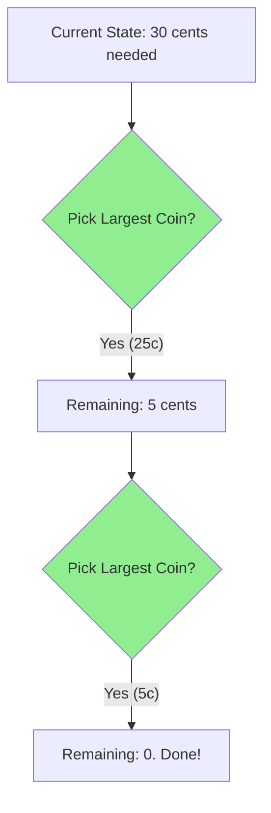

# 🤑 Greedy Algorithms Pattern

> **2025 Interview Importance: ⭐⭐⭐ MEDIUM**  
> Tricky. Easy to code, hard to prove. Interviewers love asking "Why does Greedy work here? Why not DP?"

---

## 📖 What is it? (Deep Dive for Beginners)

### The "Marshmallow Test" Analogy

Imagine you are hungry. You have two choices:
1.  **Greedy**: Eat 1 marshmallow RIGHT NOW.
2.  **Patient**: Wait 10 minutes, and get 2 marshmallows.

A **Greedy Algorithm** always picks Option 1. It makes the **locally optimal choice** at every step, hoping it leads to the global optimum.
- It doesn't look ahead.
- It doesn't regret or backtrack.
- It sees "Best Thing Now" -> Takes it.

**Sometimes it works perfectly:**
(e.g., Making Change with US Coins: 25¢, 10¢, 5¢, 1¢). To give 30¢, Greedy picks 25¢ then 5¢. 2 coins. Optimal!

**Sometimes it fails:**
(e.g., Weird Coins: 1¢, 3¢, 4¢). To give 6¢:
- Greedy picks 4¢, then 1¢, 1¢ (3 coins).
- Optimal picks 3¢, 3¢ (2 coins).
Greedy FAILED because taking 4¢ blinded it to the 3+3 solution.

---

## 🌍 Real-World Applications

### 1. Data Compression (Huffman Coding)
To compress a file, we assign short binary codes (like `01`) to frequent letters (like 'e') and long codes to rare letters (like 'z'). The algorithm greedily combines the rarest remaining letters into a tree.

### 2. Network Routing (Dijkstra's Algorithm)
Finding the shortest path is often greedy. "Which neighbor is closest to me? Go there. Repeat."

### 3. Activity Selection
You have a conference room and 10 meeting requests. To host the MAX number of meetings, you greedily pick the meeting that **ends earliest**, leaving as much time as possible for others.

---

## 🎯 When to Use This Pattern

**Magic Keywords:**
| If you see... | Think... |
|--------------|----------|
| "Find minimum/maximum" | Greedy (or DP) |
| "Optimize resources" | Greedy |
| "Activity selection" | Greedy |
| "Interval scheduling" | Greedy |

**Greedy vs DP Rule of Thumb:**
- Can I make a decision now that I will NEVER regret? -> **Greedy**.
- Might my current decision block a better future option? -> **Dynamic Programming**.

---

## 🧠 Core Concept Visualization



---

## 📐 Template Code

### Python (Activity Selection)
```python
def max_meetings(start, end):
    # Zip and sort by End Time
    meetings = sorted(zip(start, end), key=lambda x: x[1])
    
    count = 0
    last_end_time = -1
    
    for s, e in meetings:
        # If meeting starts after the last one ended
        if s > last_end_time:
            count += 1
            last_end_time = e
            
    return count
```

---

## 🏆 Famous FAANG Problems

### Problem 1: Jump Game (Medium)
**Asked by**: Amazon, Facebook, Google
**LeetCode #55**
Can you reach the last index?
*Greedy:* "What is the furthest index I can reach from here?" Keep updating `max_reach`.

### Problem 2: Gas Station (Medium)
**Asked by**: Google, Uber, Amazon
**LeetCode #134**
*Greedy:* If I run out of gas between A and B, I couldn't have started at A (or anywhere between A and B). Start at B+1.

### Problem 3: Partition Labels (Medium)
**Asked by**: Amazon (Top 10!)
**LeetCode #763**
Split string `ababcbacadefegdehijhklij` so each letter appears in at most one part.
*Greedy:* Find the *last occurrence* of the first letter 'a'. The partition MUST go at least that far. Extend if other characters inside go further.
