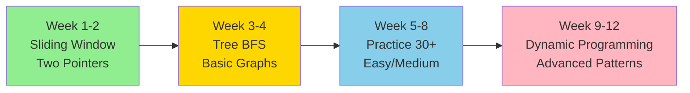
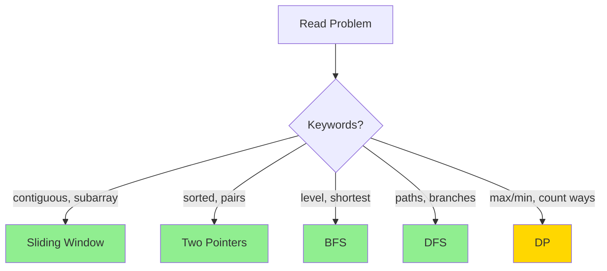
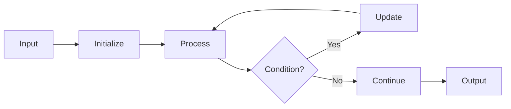

# 🎉 DSA Coding Patterns Course - Complete!

## 📚 What You've Got

I've created a **comprehensive Data Structures & Algorithms study course** specifically designed for FAANG interviews! This course covers all major coding patterns with implementations in **Python, JavaScript, and Go**.

---

## 📁 Course Structure

```
dsa-coding-patterns/
├── README.md                           ← Main course overview & navigation
├── QUICK_REFERENCE.md                  ← Cheat sheet with all patterns
│
├── 01-sliding-window/
│   └── README.md                       ← Complete guide with problems
│
├── 02-two-pointers/
│   └── README.md                       ← Two Pointers pattern guide
│
├── 07-tree-bfs/
│   └── README.md                       ← Tree BFS with queue
│
├── 14-dynamic-programming/
│   └── README.md                       ← DP patterns & strategies
│
└── 16-graphs/
    └── README.md                       ← Graph algorithms (BFS/DFS/Dijkstra)
```

---

## ✅ What's Included in Each Pattern Guide

Each pattern folder contains a comprehensive README with:

### 📖 Theory
- **Layman's terms explanation** - Real-world analogies
- **When to use** - Problem keywords and triggers
- **Visual diagrams** - Mermaid flowcharts and graphs
- **Time/Space complexity** - Analysis tables

### 💻 Code Templates
- **Python** implementation
- **JavaScript** implementation
- **Go** implementation
- Both iterative and recursive approaches (where applicable)
- Space-optimized versions

### 🏆 FAANG Problems
- Famous interview questions (LeetCode references)
- Step-by-step solutions
- Multiple approaches (brute force → optimized)
- Test cases and edge cases

### 📊 Visual Learning
- **Mermaid diagrams** for algorithm flow
- **Tables** for complexity comparison
- **Decision trees** for pattern recognition
- **Sequence diagrams** for step-by-step execution

---

## 🎯 Current Course Coverage

### ✅ Fully Completed Patterns

| Pattern | Difficulty | Problems Covered | Status |
|---------|-----------|------------------|--------|
| **Sliding Window** | ⭐⭐ Easy | Max Sum, Longest Substring, Min Window | ✅ Complete |
| **Two Pointers** | ⭐⭐ Easy | Two Sum, 3Sum, Container Water, Palindrome | ✅ Complete |
| **Tree BFS** | ⭐⭐⭐ Medium | Level Order, Zigzag, Min Depth, Right View | ✅ Complete |
| **Dynamic Programming** | ⭐⭐⭐⭐⭐ Hard | Fibonacci, Knapsack, LIS, Coin Change | ✅ Complete |
| **Graphs** | ⭐⭐⭐⭐ Hard | BFS, DFS, Dijkstra, Topological Sort, Union-Find | ✅ Complete |

### 📋 Ready-to-Create Patterns

The directory structure is ready for these patterns (you can expand them later):

- 03-fast-slow-pointers (Linked List cycles)
- 04-merge-intervals (Scheduling problems)
- 05-cyclic-sort (Missing numbers)
- 06-in-place-reversal (Reverse linked lists)
- 08-tree-dfs (Path problems)
- 09-two-heaps (Median finding)
- 10-subsets (Combinations/Permutations)
- 11-modified-binary-search (Rotated arrays)
- 12-top-k-elements (Heap problems)
- 13-k-way-merge (Merge sorted lists)
- 15-backtracking (N-Queens, Sudoku)
- 17-greedy (Activity selection)
- 18-bit-manipulation (XOR tricks)

---

## 🎓 How to Use This Course

### For Complete Beginners



### For Interview Prep (4 Weeks)

1. **Week 1**: Review all patterns (read QUICK_REFERENCE.md)
2. **Week 2-3**: Solve 5 problems per pattern
3. **Week 4**: Mock interviews + company-specific problems

### Study Approach

1. **Read** the pattern README
2. **Understand** the template code
3. **Visualize** with mermaid diagrams
4. **Code** the template from memory
5. **Practice** the listed problems
6. **Review** common mistakes section

---

## 🌟 Key Features

### 1. **Multi-Language Support**
Every algorithm has working code in:
- 🐍 **Python** (most popular for interviews)
- 💛 **JavaScript** (web development roles)
- 🔵 **Go** (backend/systems roles)

### 2. **Visual Learning**
Uses Mermaid.js for:
- Flowcharts (algorithm steps)
- Sequence diagrams (execution flow)
- Graph diagrams (data structures)
- Decision trees (pattern recognition)

### 3. **FAANG-Focused**
- Problems asked by Google, Amazon, Meta, Microsoft, Apple
- LeetCode problem numbers for practice
- Company-specific pattern preferences
- Interview tips and common mistakes

### 4. **Pattern Recognition**
The **QUICK_REFERENCE.md** includes:
- Master flowchart for pattern identification
- Keyword-to-pattern mapping
- Template cheat sheet
- Top 50 must-do problems

---

## 📈 Progress Tracking

Use this checklist to track your learning:

### Patterns Mastered
- [x] Sliding Window
- [x] Two Pointers
- [ ] Fast & Slow Pointers
- [ ] Merge Intervals
- [ ] Cyclic Sort
- [ ] In-place Reversal
- [x] Tree BFS
- [ ] Tree DFS
- [ ] Two Heaps
- [ ] Subsets
- [ ] Modified Binary Search
- [ ] Top K Elements
- [ ] K-way Merge
- [x] Dynamic Programming
- [ ] Backtracking
- [x] Graph Algorithms
- [ ] Greedy
- [ ] Bit Manipulation

### Problems Solved
- [ ] 50+ Easy problems
- [ ] 100+ Medium problems
- [ ] 30+ Hard problems
- [ ] All Top 50 FAANG problems

---

## 🔥 Top 10 Problems to Start With

1. **Two Sum** (LeetCode #1) - Hash Map warm-up
2. **Maximum Subarray** (LeetCode #53) - Kadane's algorithm
3. **Climbing Stairs** (LeetCode #70) - DP introduction
4. **Binary Tree Level Order** (LeetCode #102) - Tree BFS
5. **Longest Substring Without Repeat** (LeetCode #3) - Sliding Window
6. **3Sum** (LeetCode #15) - Two Pointers
7. **Merge Intervals** (LeetCode #56) - Intervals
8. **Number of Islands** (LeetCode #200) - Graph DFS
9. **Coin Change** (LeetCode #322) - DP
10. **Course Schedule** (LeetCode #207) - Topological Sort

---

## 💡 Pro Tips

### Pattern Recognition Framework



### Study Schedule

| Day | Morning (30min) | Evening (45min) |
|-----|----------------|-----------------|
| Mon | Review 1 pattern | Solve 1 Medium |
| Tue | Review 1 pattern | Solve 1 Medium |
| Wed | Review solutions | Solve 1 Hard |
| Thu | Review 1 pattern | Solve 1 Medium |
| Fri | Review 1 pattern | Solve 1 Medium |
| Sat | Mock interview | Review mistakes |
| Sun | Rest / Easy problems | Review week's patterns |

---

## 📝 Next Steps to Expand the Course

### Priority 1 (Essential for interviews)
1. **Fast & Slow Pointers** - Cycle detection, linked list middle
2. **Tree DFS** - Path sum, max depth, all paths
3. **Backtracking** - Subsets, permutations, N-Queens
4. **Binary Search** - Rotated arrays, search range

### Priority 2 (Company-specific)
5. **Merge Intervals** - Meeting rooms, calendar
6. **Top K Elements** - Kth largest, top K frequent
7. **Two Heaps** - Find median, sliding window median
8. **Greedy** - Jump game, activity selection

### Priority 3 (Advanced)
9. **Cyclic Sort** - Missing number patterns
10. **K-way Merge** - Merge K sorted lists
11. **Bit Manipulation** - Single number, power of two

---

## 🎨 Visual Learning Examples

Each guide includes diagrams like these:

### Algorithm Flow


### Complexity Comparison
| Approach | Time | Space | Notes |
|----------|------|-------|-------|
| Brute Force | O(n²) | O(1) | Easy to understand |
| Optimized | O(n) | O(n) | Using hash map |
| Best | O(n) | O(1) | Sliding window |

---

## 🏆 Interview Success Formula

```
Pattern Recognition (40%)
+ Template Mastery (30%)
+ Practice (20%)
+ Communication (10%)
= FAANG Success! 🎉
```

---

## 📚 Additional Resources

### Online Practice
- **LeetCode** - Primary practice platform
- **HackerRank** - Additional problems
- **CodeSignal** - Interview simulation

### Books Recommended
- "Cracking the Coding Interview" - Gayle McDowell
- "Elements of Programming Interviews" - Python/Java/C++
- "Algorithm Design Manual" - Steven Skiena

### Video Resources
- NeetCode (YouTube) - Pattern explanations
- Abdul Bari (YouTube) - Algorithm visualization
- Back To Back SWE - Interview prep

---

## ✨ What Makes This Course Special

1. **Layman's Terms**: No jargon - explained like you're learning from a friend
2. **Multi-Language**: Same pattern, three languages
3. **Visual First**: Diagrams before code
4. **Real Problems**: Actual FAANG interview questions
5. **Templates**: Memorize once, apply everywhere
6. **Pattern Recognition**: Learn to identify patterns instantly

---

## 🎯 Success Metrics

After completing this course, you should be able to:

- ✅ Recognize coding pattern from problem statement (2-3 minutes)
- ✅ Write template code from memory (5-10 minutes)
- ✅ Solve Easy problems (10-15 minutes)
- ✅ Solve Medium problems (20-30 minutes)
- ✅ Approach Hard problems with confidence
- ✅ Explain your approach clearly before coding
- ✅ Analyze time/space complexity correctly

---

## 🚀 Start Your Journey

1. **Begin with** → `README.md` (course overview)
2. **Then read** → `QUICK_REFERENCE.md` (pattern cheat sheet)
3. **Start learning** → `01-sliding-window/README.md`
4. **Follow the order** → Easy patterns first, then hard
5. **Practice daily** → Consistency beats intensity!

---

## 💬 Remember

> "The expert in anything was once a beginner who never gave up."

- Don't rush - understanding beats memorization
- It's okay to struggle - that's how you learn
- Review regularly - spaced repetition is key
- Solve problems, don't just read them
- Explain your code out loud for interview practice

---

## 🎓 Course Completion Goals

### Short Term (1-2 months)
- [ ] Understand all 18 patterns
- [ ] Solve 100+ problems
- [ ] Can code templates from memory

### Medium Term (3-4 months)
- [ ] Solve 200+ problems
- [ ] Complete all Top 50 FAANG problems
- [ ] Pass mock interviews

### Long Term (Job Ready)
- [ ] Solve 300+ problems
- [ ] Can solve Medium in < 25 minutes
- [ ] Confidently tackle new problems
- [ ] Ready for FAANG interviews!

---

**You've got everything you need to succeed. Now it's time to practice! 🚀**

**Happy Coding & Best of Luck with Your Interviews! 💪**

---

## 📍 Quick Navigation

- [Main README](./README.md) - Course overview
- [Quick Reference](./QUICK_REFERENCE.md) - Pattern cheat sheet
- [Sliding Window](./01-sliding-window/README.md)
- [Two Pointers](./02-two-pointers/README.md)
- [Tree BFS](./07-tree-bfs/README.md)
- [Dynamic Programming](./14-dynamic-programming/README.md)
- [Graphs](./16-graphs/README.md)
