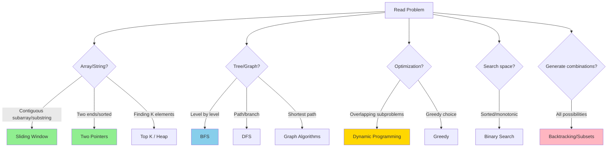
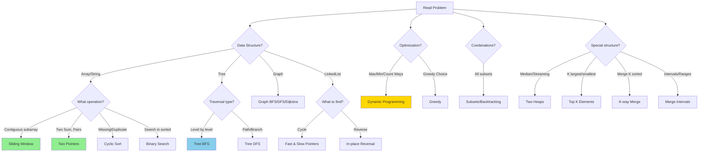
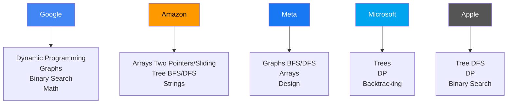
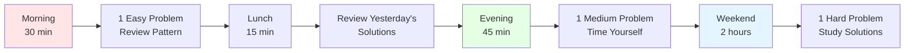

# 📝 Quick Reference Guide - All Coding Patterns

## 🚀 Pattern Recognition Strategy (Quick Decision Tree)



---

## 🎯 Detailed Pattern Recognition Flowchart



---

## 📊 Patterns at a Glance

| # | Pattern | Time | Space | When to Use | Difficulty |
|---|---------|------|-------|-------------|-----------|
| 1 | **Sliding Window** | O(n) | O(1)-O(k) | Contiguous subarray/substring | ⭐⭐ |
| 2 | **Two Pointers** | O(n) | O(1) | Sorted array, pairs, palindrome | ⭐⭐ |
| 3 | **Fast & Slow Pointers** | O(n) | O(1) | Cycle detection, middle element | ⭐⭐⭐ |
| 4 | **Merge Intervals** | O(n log n) | O(n) | Overlapping ranges | ⭐⭐⭐ |
| 5 | **Cyclic Sort** | O(n) | O(1) | Missing/duplicate numbers | ⭐⭐ |
| 6 | **In-place Reversal** | O(n) | O(1) | Reverse linked list portions | ⭐⭐⭐ |
| 7 | **Tree BFS** | O(n) | O(w) | Level order, shortest path | ⭐⭐⭐ |
| 8 | **Tree DFS** | O(n) | O(h) | Paths, branches, depth | ⭐⭐⭐ |
| 9 | **Two Heaps** | O(n log n) | O(n) | Median, streaming data | ⭐⭐⭐⭐ |
| 10 | **Subsets** | O(2^n) | O(2^n) | All combinations | ⭐⭐⭐ |
| 11 | **Binary Search** | O(log n) | O(1) | Sorted, rotated, range | ⭐⭐⭐⭐ |
| 12 | **Top K Elements** | O(n log k) | O(k) | K largest/smallest | ⭐⭐⭐ |
| 13 | **K-way Merge** | O(n log k) | O(k) | Merge K sorted lists | ⭐⭐⭐⭐ |
| 14 | **Dynamic Programming** | Varies | Varies | Optimization, count ways | ⭐⭐⭐⭐⭐ |
| 15 | **Backtracking** | O(2^n)-O(n!) | O(n) | Constraint satisfaction | ⭐⭐⭐⭐ |
| 16 | **Graphs** | O(V+E) | O(V) | Networks, connectivity | ⭐⭐⭐⭐ |
| 17 | **Greedy** | O(n log n) | O(1)-O(n) | Local optimal → global | ⭐⭐⭐⭐ |
| 18 | **Bit Manipulation** | O(1)-O(n) | O(1) | Binary operations | ⭐⭐⭐ |

---

## 🔑 Pattern Templates Cheat Sheet

### 1. Sliding Window (Fixed)
```python
window_start = 0
for window_end in range(len(arr)):
    # Add element
    window_sum += arr[window_end]
    
    if window_end >= k - 1:
        # Update result
        result = max(result, window_sum)
        # Remove element
        window_sum -= arr[window_start]
        window_start += 1
```

### 2. Two Pointers (Opposite)
```python
left, right = 0, len(arr) - 1
while left < right:
    if condition:
        return [left, right]
    elif sum < target:
        left += 1
    else:
        right -= 1
```

### 3. Fast & Slow Pointers
```python
slow = fast = head
while fast and fast.next:
    slow = slow.next
    fast = fast.next.next
    if slow == fast:
        return True  # Cycle found
```

### 4. Tree BFS
```python
from collections import deque
queue = deque([root])
while queue:
    level_size = len(queue)
    for _ in range(level_size):
        node = queue.popleft()
        # Process node
        if node.left: queue.append(node.left)
        if node.right: queue.append(node.right)
```

### 5. Tree DFS
```python
def dfs(node, path):
    if not node:
        return
    path.append(node.val)
    if not node.left and not node.right:
        # Leaf - process path
        result.append(list(path))
    dfs(node.left, path)
    dfs(node.right, path)
    path.pop()  # Backtrack
```

### 6. Dynamic Programming (Bottom-Up)
```python
dp = [0] * (n + 1)
dp[0] = base_case_0
dp[1] = base_case_1
for i in range(2, n + 1):
    dp[i] = recurrence_relation(dp)
return dp[n]
```

### 7. Backtracking
```python
def backtrack(path, choices):
    if is_solution(path):
        result.append(list(path))
        return
    for choice in choices:
        # Choose
        path.append(choice)
        # Explore
        backtrack(path, remaining_choices)
        # Unchoose (backtrack)
        path.pop()
```

### 8. Binary Search
```python
left, right = 0, len(arr) - 1
while left <= right:
    mid = left + (right - left) // 2
    if arr[mid] == target:
        return mid
    elif arr[mid] < target:
        left = mid + 1
    else:
        right = mid - 1
```

---

## 🎯 Problem Keywords → Pattern Mapping

| Keywords | Pattern |
|----------|---------|
| "contiguous", "subarray", "substring", "k elements" | **Sliding Window** |
| "sorted array", "two sum", "pairs", "palindrome" | **Two Pointers** |
| "cycle", "middle", "linked list" | **Fast & Slow Pointers** |
| "intervals", "overlapping", "merge", "scheduling" | **Merge Intervals** |
| "missing number", "duplicate", "1 to n" | **Cyclic Sort** |
| "reverse", "linked list", "k groups" | **In-place Reversal** |
| "level order", "shortest path", "minimum depth" | **Tree BFS** |
| "path", "all paths", "maximum depth" | **Tree DFS** |
| "median", "running median", "streaming" | **Two Heaps** |
| "all subsets", "permutations", "combinations" | **Subsets/Backtracking** |
| "rotated", "peak", "search in sorted" | **Modified Binary Search** |
| "k largest", "k smallest", "top k" | **Top K Elements** |
| "merge k sorted", "smallest range" | **K-way Merge** |
| "maximum", "minimum", "count ways", "can you" | **Dynamic Programming** |
| "generate all", "constraint satisfaction" | **Backtracking** |
| "graph", "connected", "shortest path" | **Graph Algorithms** |
| "maximize", "minimize", "optimal" (no DP) | **Greedy** |
| "XOR", "bits", "binary" | **Bit Manipulation** |

---

## 🏢 FAANG Companies: Favorite Patterns



### Google 🔍
- **Loves**: DP, Graphs, Hard Math
- **Practice**: LeetCode #72 (Edit Distance), #312 (Burst Balloons), #329 (Longest Increasing Path)

### Amazon 📦
- **Loves**: Arrays, Trees, Practical problems
- **Practice**: LeetCode #3 (Longest Substring), #200 (Number of Islands), #42 (Trapping Rain Water)

### Meta (Facebook) 📘
- **Loves**: Graphs, Medium Arrays, System Design
- **Practice**: LeetCode #15 (3Sum), #301 (Remove Invalid Parentheses), #621 (Task Scheduler)

### Microsoft 💼
- **Loves**: Trees, DP, Clean code
- **Practice**: LeetCode #124 (Binary Tree Max Path), #139 (Word Break), #212 (Word Search II)

### Apple 🍎
- **Loves**: Tree DFS, DP, Balanced problems
- **Practice**: LeetCode #236 (LCA), #215 (Kth Largest), #56 (Merge Intervals)

---

## 📅 12-Week Study Plan

### **Weeks 1-2: Arrays & Strings Fundamentals**
- ✅ Sliding Window (5 problems)
- ✅ Two Pointers (5 problems)
- ✅ Practice: LeetCode #3, #15, #11, #209, #567

### **Weeks 3-4: Trees & Linked Lists**
- ✅ Tree BFS (4 problems)
- ✅ Tree DFS (4 problems)
- ✅ Fast & Slow Pointers (3 problems)
- ✅ In-place Reversal (3 problems)
- ✅ Practice: LeetCode #102, #104, #236, #206, #141

### **Weeks 5-6: Advanced Arrays**
- ✅ Merge Intervals (4 problems)
- ✅ Cyclic Sort (3 problems)
- ✅ Binary Search variations (5 problems)
- ✅ Practice: LeetCode #56, #33, #287, #153

### **Weeks 7-8: Heaps & Complex Patterns**
- ✅ Top K Elements (4 problems)
- ✅ Two Heaps (3 problems)
- ✅ K-way Merge (3 problems)
- ✅ Practice: LeetCode #215, #295, #23, #347

### **Weeks 9-10: Combinatorial**
- ✅ Subsets (4 problems)
- ✅ Backtracking (5 problems)
- ✅ Practice: LeetCode #78, #46, #22, #51, #39

### **Weeks 11-12: Dynamic Programming**
- ✅ Fibonacci pattern (3 problems)
- ✅ 0/1 Knapsack (3 problems)
- ✅ LIS/LCS (3 problems)
- ✅ Hard DP (3 problems)
- ✅ Practice: LeetCode #70, #198, #300, #72, #322

### **Ongoing: Graphs & Greedy**
- ✅ Graph BFS/DFS (4 problems)
- ✅ Dijkstra/Union-Find (2 problems)
- ✅ Greedy (3 problems)
- ✅ Practice: LeetCode #200, #207, #743, #787

---

## 🎯 Daily Practice Routine



---

## 🏆 Top 50 Must-Do FAANG Problems

### Easy (15 problems)
1. Two Sum (LeetCode #1) - Hash Map basics
2. Best Time to Buy/Sell Stock (#121) - Simple DP
3. Valid Parentheses (#20) - Stack
4. Merge Two Sorted Lists (#21) - Linked List
5. Climbing Stairs (#70) - DP intro
6. Maximum Subarray (#53) - Kadane's
7. Binary Tree Level Order (#102) - BFS
8. Reverse Linked List (#206) - Classic
9. Invert Binary Tree (#226) - DFS
10. Symmetric Tree (#101) - Recursion
11. Move Zeroes (#283) - Two Pointers
12. Contains Duplicate (#217) - Hash Set
13. Valid Anagram (#242) - Hash Map
14. First Bad Version (#278) - Binary Search
15. Fizz Buzz (#412) - Warm-up

### Medium (25 problems)
16. 3Sum (#15) - Two Pointers
17. Longest Substring Without Repeat (#3) - Sliding Window
18. Container With Most Water (#11) - Two Pointers
19. Add Two Numbers (#2) - Linked List
20. Longest Palindromic Substring (#5) - DP
21. Merge Intervals (#56) - Intervals
22. Group Anagrams (#49) - Hash Map
23. Maximum Product Subarray (#152) - DP
24. Coin Change (#322) - DP
25. Word Break (#139) - DP
26. LRU Cache (#146) - Design
27. Binary Tree Zigzag Level Order (#103) - BFS
28. Kth Largest Element (#215) - Heap
29. Top K Frequent Elements (#347) - Heap
30. Find Median from Data Stream (#295) - Two Heaps
31. Permutations (#46) - Backtracking
32. Subsets (#78) - Backtracking
33. Letter Combinations of Phone Number (#17) - Backtracking
34. Search in Rotated Sorted Array (#33) - Binary Search
35. Unique Paths (#62) - DP
36. Number of Islands (#200) - Graph DFS
37. Course Schedule (#207) - Graph Topological Sort
38. Clone Graph (#133) - Graph
39. Binary Tree Right Side View (#199) - BFS
40. Reorder List (#143) - Linked List

### Hard (10 problems)
41. Trapping Rain Water (#42) - Two Pointers
42. Merge k Sorted Lists (#23) - K-way Merge
43. Longest Increasing Subsequence (#300) - DP
44. Edit Distance (#72) - DP
45. Word Ladder (#127) - BFS
46. Serialize/Deserialize Binary Tree (#297) - Tree
47. Longest Consecutive Sequence (#128) - Hash Map
48. Regular Expression Matching (#10) - DP
49. Sliding Window Maximum (#239) - Deque
50. Alien Dictionary (#269) - Graph

---

## 📝 Interview Preparation Checklist

### Before the Interview
- [ ] Practiced 50+ problems across all patterns
- [ ] Can recognize pattern from problem statement
- [ ] Know templates by heart
- [ ] Practiced coding on whiteboard/paper
- [ ] Studied company-specific patterns
- [ ] Mock interviews completed (5+)

### During the Interview
- [ ] Asked clarifying questions
- [ ] Discussed brute force first
- [ ] Explained approach before coding
- [ ] Tested with examples
- [ ] Analyzed time/space complexity
- [ ] Handled edge cases
- [ ] Optimized if time permits

### Common Pitfalls to Avoid
- ❌ Jumping to code without explaining
- ❌ Not asking about constraints
- ❌ Ignoring edge cases
- ❌ Not testing the solution
- ❌ Giving up too quickly
- ❌ Not communicating thought process

---

## 🎓 Resources

### Online Judges
- **LeetCode**: Best for FAANG prep
- **HackerRank**: Good for basics
- **CodeSignal**: Interview simulation

### Books
- "Cracking the Coding Interview" - Gayle McDowell
- "Elements of Programming Interviews" - Aziz, Lee, Prakash
- "Algorithm Design Manual" - Steven Skiena

### Courses
- Grokking the Coding Interview (Educative)
- AlgoExpert
- NeetCode (YouTube)

---

## 💡 Pro Tips

1. **Pattern First, Code Second**: Recognize pattern → Apply template → Customize
2. **Space-Time Tradeoff**: Often can trade space for time (and vice versa)
3. **Draw It Out**: Visualize with examples before coding
4. **Test While Coding**: Don't wait until the end
5. **Practice Out Loud**: Explain your thinking as you code
6. **Review Solutions**: Learn from optimal solutions, not just yours
7. **Spaced Repetition**: Review problems after 1 day, 1 week, 1 month

---

**You've got this! Consistent practice beats cramming. 30 minutes daily > 5 hours once a week! 🚀**
