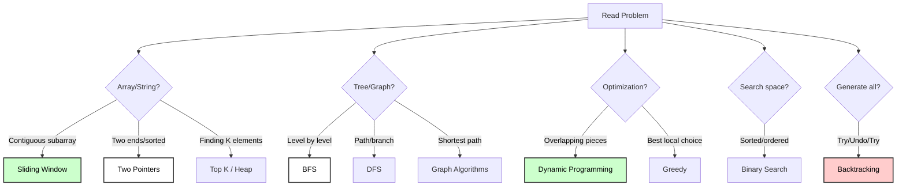

# 🎯 FAANG Career Accelerator: DSA Masterclass

> **The ultimate roadmap to mastering Coding Patterns. Explained so simply, a 10-year-old could understand it. Coded so professionally, a FAANG engineer would hire you.**

---

## 🚀 The Secret Sauce of FAANG Interviews

Most candidates fail because they try to **memorize 1000+ problems**. Successful candidates **master 18 patterns**. This course is designed to transform the way you think about code.

### 🍱 Why This Course?
- 📖 **Layman Explanations**: No complex jargon. Just paper rolls, subway windows, and notebooks.
- 🎨 **Visual First**: Dozens of **Mermaid diagrams** showing you exactly how data moves.
- 🌍 **Multi-Language**: Every problem solved in **Python, JavaScript, and Go**.
- 🏢 **FAANG Verified**: Includes the exact problems asked at Google, Amazon, and Meta.
- 🌑 **Premium Dark Mode**: Built for developers who live in the dark.

---

## 🎯 Quick Pattern Recognition Guide

Need to solve a problem in 30 seconds? Use this decision tree:

---

## 📊 Pattern Comparison Table

| Pattern | Time Complexity | Space Complexity | Best For | Difficulty |
|---------|----------------|------------------|----------|------------|
| Sliding Window | O(n) | O(1) to O(k) | Subarrays, substrings | ⭐⭐ Easy |
| Two Pointers | O(n) | O(1) | Sorted arrays, pairs | ⭐⭐ Easy |
| Fast & Slow Pointers | O(n) | O(1) | Linked lists, cycles | ⭐⭐⭐ Medium |
| Merge Intervals | O(n log n) | O(n) | Scheduling, ranges | ⭐⭐⭐ Medium |
| Cyclic Sort | O(n) | O(1) | Missing numbers | ⭐⭐ Easy |
| In-place Reversal | O(n) | O(1) | Linked list manipulation | ⭐⭐⭐ Medium |
| Tree BFS | O(n) | O(n) | Level order, shortest path | ⭐⭐⭐ Medium |
| Tree DFS | O(n) | O(h) | Paths, recursion | ⭐⭐⭐ Medium |
| Two Heaps | O(n log n) | O(n) | Medians, streaming | ⭐⭐⭐⭐ Hard |
| Subsets | O(2^n) | O(2^n) | Combinations | ⭐⭐⭐ Medium |
| Modified Binary Search | O(log n) | O(1) | Rotated, ranges | ⭐⭐⭐⭐ Hard |
| Top K Elements | O(n log k) | O(k) | K largest/smallest | ⭐⭐⭐ Medium |
| K-way Merge | O(n log k) | O(k) | Merging sorted | ⭐⭐⭐⭐ Hard |
| Dynamic Programming | O(n²) to O(2^n) | O(n) to O(n²) | Optimization | ⭐⭐⭐⭐⭐ Hard |
| Backtracking | O(2^n) to O(n!) | O(n) | Constraint problems | ⭐⭐⭐⭐ Hard |
| Graph Algorithms | O(V+E) to O(V²) | O(V) | Networks, paths | ⭐⭐⭐⭐ Hard |
| Greedy | O(n log n) | O(1) to O(n) | Optimization | ⭐⭐⭐⭐ Hard |
| Bit Manipulation | O(1) to O(n) | O(1) | Binary operations | ⭐⭐⭐ Medium |

---

## 🏢 FAANG Companies Coverage

| Company | Most Common Patterns |
|---------|---------------------|
| 🍎 **Apple** | Tree DFS, Dynamic Programming, Binary Search |
| 📘 **Meta (Facebook)** | BFS/DFS, Arrays (Sliding Window, Two Pointers), Graphs |
| 🌐 **Amazon** | Tree BFS/DFS, Arrays, Two Pointers, Sliding Window |
| 📺 **Netflix** | Dynamic Programming, Greedy, Heaps |
| 🔍 **Google** | Dynamic Programming, Graphs, Binary Search, Math |
| 💼 **Microsoft** | Tree DFS, Dynamic Programming, Backtracking |

---

## 🎯 Learning Path by Timeline

### Week 1-2: Fundamentals
- ✅ Sliding Window
- ✅ Two Pointers
- ✅ Binary Search basics

### Week 3-4: Trees & Linked Lists
- ✅ Tree BFS
- ✅ Tree DFS
- ✅ Fast & Slow Pointers
- ✅ In-place Reversal

### Week 5-6: Advanced Arrays
- ✅ Merge Intervals
- ✅ Cyclic Sort
- ✅ Top K Elements

### Week 7-8: Complex Patterns
- ✅ Subsets & Backtracking
- ✅ Two Heaps
- ✅ K-way Merge

### Week 9-12: Expert Level
- ✅ Dynamic Programming
- ✅ Graph Algorithms
- ✅ Greedy Algorithms
- ✅ Advanced Binary Search

---

## 💡 Pro Tips for FAANG Interviews

1. **Pattern Recognition is Key**: 70% of problems follow these patterns
2. **Start Simple**: Write brute force first, then optimize
3. **Think Out Loud**: Explain your approach before coding
4. **Ask Clarifying Questions**: Edge cases, constraints, input size
5. **Test with Examples**: Walk through your code with sample inputs
6. **Analyze Complexity**: Always discuss time and space complexity
7. **Practice Coding by Hand**: Get comfortable with pseudocode

---

## 📈 Progress Tracking

Use this checklist to track your progress:

- [ ] Pattern 1: Sliding Window (5 problems solved)
- [ ] Pattern 2: Two Pointers (5 problems solved)
- [ ] Pattern 3: Fast & Slow Pointers (5 problems solved)
- [ ] Pattern 4: Merge Intervals (5 problems solved)
- [ ] Pattern 5: Cyclic Sort (5 problems solved)
- [ ] Pattern 6: In-place Reversal (5 problems solved)
- [ ] Pattern 7: Tree BFS (5 problems solved)
- [ ] Pattern 8: Tree DFS (5 problems solved)
- [ ] Pattern 9: Two Heaps (5 problems solved)
- [ ] Pattern 10: Subsets (5 problems solved)
- [ ] Pattern 11: Modified Binary Search (5 problems solved)
- [ ] Pattern 12: Top K Elements (5 problems solved)
- [ ] Pattern 13: K-way Merge (5 problems solved)
- [ ] Pattern 14: Dynamic Programming (10 problems solved)
- [ ] Pattern 15: Backtracking (5 problems solved)
- [ ] Pattern 16: Graph Algorithms (5 problems solved)
- [ ] Pattern 17: Greedy (5 problems solved)
- [ ] Pattern 18: Bit Manipulation (5 problems solved)

---

## 🌟 Study Resources

### Online Judges
- [LeetCode](https://leetcode.com) - Most FAANG-representative
- [HackerRank](https://hackerrank.com) - Good for basics
- [CodeSignal](https://codesignal.com) - Interview practice

### Books
- "Cracking the Coding Interview" by Gayle Laakmann McDowell
- "Elements of Programming Interviews" (Python/Java/C++)
- "Algorithm Design Manual" by Steven Skiena

---

## 📝 Course Structure

Each pattern folder contains:
- `README.md` - Complete pattern guide with:
  - 📖 Concept explanation in layman's terms
  - 🎨 Visual diagrams (mermaid)
  - 📐 Template code in Python, JS, Go
  - 🏆 Famous FAANG problems with solutions
  - 📊 Complexity analysis tables
  - 🎯 Practice problem list

---

## 🚀 Getting Started

1. Clone or download this repository
2. Start with the [Sliding Window pattern](./01-sliding-window/README.md)
3. Read → Understand → Code → Practice
4. Track your progress using the checklist above
5. Review patterns regularly (spaced repetition)

---

## 🤝 Contributing

Found a bug or want to add more problems? Feel free to contribute!

---

## 📜 License

This educational resource is free to use for personal learning.

---

**Remember**: Consistency beats intensity. 30 minutes daily is better than 5 hours once a week!

Good luck with your FAANG interviews! 🎉
