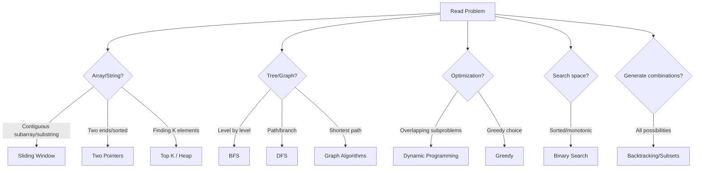

# 🎯 FAANG Interview Coding Patterns - Complete Study Course

> **A comprehensive guide to mastering coding patterns for FAANG interviews**  
> Covers Python, JavaScript, and Go implementations with visual explanations

---

## 📚 Table of Contents

### Core Patterns
1. [**Sliding Window**](./01-sliding-window/README.md) - Process arrays/strings in windows
2. [**Two Pointers**](./02-two-pointers/README.md) - Efficient array/list traversal
3. [**Fast & Slow Pointers**](./03-fast-slow-pointers/README.md) - Cycle detection & middle finding
4. [**Merge Intervals**](./04-merge-intervals/README.md) - Overlapping ranges
5. [**Cyclic Sort**](./05-cyclic-sort/README.md) - Finding missing/duplicate numbers
6. [**In-place Linked List Reversal**](./06-in-place-reversal/README.md) - Reversing linked lists

### Tree & Graph Patterns
7. [**Tree Breadth-First Search (BFS)**](./07-tree-bfs/README.md) - Level-order traversal
8. [**Tree Depth-First Search (DFS)**](./08-tree-dfs/README.md) - Pre/In/Post-order traversal
9. [**Graph Algorithms**](./16-graphs/README.md) - BFS, DFS, Dijkstra, Union-Find

### Advanced Patterns
10. [**Two Heaps**](./09-two-heaps/README.md) - Finding medians & streaming data
11. [**Subsets**](./10-subsets/README.md) - Combinations & permutations
12. [**Modified Binary Search**](./11-modified-binary-search/README.md) - Rotated arrays, ranges
13. [**Top K Elements**](./12-top-k-elements/README.md) - Finding K largest/smallest
14. [**K-way Merge**](./13-k-way-merge/README.md) - Merging sorted lists

### Problem-Solving Paradigms
15. [**Dynamic Programming**](./14-dynamic-programming/README.md) - Optimization problems
16. [**Backtracking**](./15-backtracking/README.md) - Constraint satisfaction
17. [**Greedy Algorithms**](./17-greedy/README.md) - Local optimal choices
18. [**Bit Manipulation**](./18-bit-manipulation/README.md) - Low-level operations

---

## 🎓 How to Use This Course

### For Beginners
1. Start with **Sliding Window** and **Two Pointers** - easiest patterns
2. Move to **Tree BFS/DFS** - fundamental for many problems
3. Practice **Binary Search** variations
4. Then tackle **Dynamic Programming** with the foundation you've built

### For Interview Prep
1. Read the pattern explanation in **layman's terms**
2. Study the **mermaid diagrams** to visualize the approach
3. Understand the **step-by-step approach**
4. Implement the **template code** in your preferred language
5. Solve **famous FAANG problems** provided
6. Practice additional problems until the pattern becomes second nature

### Pattern Recognition Strategy

---

## 📊 Pattern Comparison Table

| Pattern | Time Complexity | Space Complexity | Best For | Difficulty |
|---------|----------------|------------------|----------|------------|
| Sliding Window | O(n) | O(1) to O(k) | Subarrays, substrings | ⭐⭐ Easy |
| Two Pointers | O(n) | O(1) | Sorted arrays, pairs | ⭐⭐ Easy |
| Fast & Slow Pointers | O(n) | O(1) | Linked lists, cycles | ⭐⭐⭐ Medium |
| Merge Intervals | O(n log n) | O(n) | Scheduling, ranges | ⭐⭐⭐ Medium |
| Cyclic Sort | O(n) | O(1) | Missing numbers | ⭐⭐ Easy |
| In-place Reversal | O(n) | O(1) | Linked list manipulation | ⭐⭐⭐ Medium |
| Tree BFS | O(n) | O(n) | Level order, shortest path | ⭐⭐⭐ Medium |
| Tree DFS | O(n) | O(h) | Paths, recursion | ⭐⭐⭐ Medium |
| Two Heaps | O(n log n) | O(n) | Medians, streaming | ⭐⭐⭐⭐ Hard |
| Subsets | O(2^n) | O(2^n) | Combinations | ⭐⭐⭐ Medium |
| Modified Binary Search | O(log n) | O(1) | Rotated, ranges | ⭐⭐⭐⭐ Hard |
| Top K Elements | O(n log k) | O(k) | K largest/smallest | ⭐⭐⭐ Medium |
| K-way Merge | O(n log k) | O(k) | Merging sorted | ⭐⭐⭐⭐ Hard |
| Dynamic Programming | O(n²) to O(2^n) | O(n) to O(n²) | Optimization | ⭐⭐⭐⭐⭐ Hard |
| Backtracking | O(2^n) to O(n!) | O(n) | Constraint problems | ⭐⭐⭐⭐ Hard |
| Graph Algorithms | O(V+E) to O(V²) | O(V) | Networks, paths | ⭐⭐⭐⭐ Hard |
| Greedy | O(n log n) | O(1) to O(n) | Optimization | ⭐⭐⭐⭐ Hard |
| Bit Manipulation | O(1) to O(n) | O(1) | Binary operations | ⭐⭐⭐ Medium |

---

## 🏢 FAANG Companies Coverage

| Company | Most Common Patterns |
|---------|---------------------|
| 🍎 **Apple** | Tree DFS, Dynamic Programming, Binary Search |
| 📘 **Meta (Facebook)** | BFS/DFS, Arrays (Sliding Window, Two Pointers), Graphs |
| 🌐 **Amazon** | Tree BFS/DFS, Arrays, Two Pointers, Sliding Window |
| 📺 **Netflix** | Dynamic Programming, Greedy, Heaps |
| 🔍 **Google** | Dynamic Programming, Graphs, Binary Search, Math |
| 💼 **Microsoft** | Tree DFS, Dynamic Programming, Backtracking |

---

## 🎯 Learning Path by Timeline

### Week 1-2: Fundamentals
- ✅ Sliding Window
- ✅ Two Pointers
- ✅ Binary Search basics

### Week 3-4: Trees & Linked Lists
- ✅ Tree BFS
- ✅ Tree DFS
- ✅ Fast & Slow Pointers
- ✅ In-place Reversal

### Week 5-6: Advanced Arrays
- ✅ Merge Intervals
- ✅ Cyclic Sort
- ✅ Top K Elements

### Week 7-8: Complex Patterns
- ✅ Subsets & Backtracking
- ✅ Two Heaps
- ✅ K-way Merge

### Week 9-12: Expert Level
- ✅ Dynamic Programming
- ✅ Graph Algorithms
- ✅ Greedy Algorithms
- ✅ Advanced Binary Search

---

## 💡 Pro Tips for FAANG Interviews

1. **Pattern Recognition is Key**: 70% of problems follow these patterns
2. **Start Simple**: Write brute force first, then optimize
3. **Think Out Loud**: Explain your approach before coding
4. **Ask Clarifying Questions**: Edge cases, constraints, input size
5. **Test with Examples**: Walk through your code with sample inputs
6. **Analyze Complexity**: Always discuss time and space complexity
7. **Practice Coding by Hand**: Get comfortable with pseudocode

---

## 📈 Progress Tracking

Use this checklist to track your progress:

- [ ] Pattern 1: Sliding Window (5 problems solved)
- [ ] Pattern 2: Two Pointers (5 problems solved)
- [ ] Pattern 3: Fast & Slow Pointers (5 problems solved)
- [ ] Pattern 4: Merge Intervals (5 problems solved)
- [ ] Pattern 5: Cyclic Sort (5 problems solved)
- [ ] Pattern 6: In-place Reversal (5 problems solved)
- [ ] Pattern 7: Tree BFS (5 problems solved)
- [ ] Pattern 8: Tree DFS (5 problems solved)
- [ ] Pattern 9: Two Heaps (5 problems solved)
- [ ] Pattern 10: Subsets (5 problems solved)
- [ ] Pattern 11: Modified Binary Search (5 problems solved)
- [ ] Pattern 12: Top K Elements (5 problems solved)
- [ ] Pattern 13: K-way Merge (5 problems solved)
- [ ] Pattern 14: Dynamic Programming (10 problems solved)
- [ ] Pattern 15: Backtracking (5 problems solved)
- [ ] Pattern 16: Graph Algorithms (5 problems solved)
- [ ] Pattern 17: Greedy (5 problems solved)
- [ ] Pattern 18: Bit Manipulation (5 problems solved)

---

## 🌟 Study Resources

### Online Judges
- [LeetCode](https://leetcode.com) - Most FAANG-representative
- [HackerRank](https://hackerrank.com) - Good for basics
- [CodeSignal](https://codesignal.com) - Interview practice

### Books
- "Cracking the Coding Interview" by Gayle Laakmann McDowell
- "Elements of Programming Interviews" (Python/Java/C++)
- "Algorithm Design Manual" by Steven Skiena

---

## 📝 Course Structure

Each pattern folder contains:
- `README.md` - Complete pattern guide with:
  - 📖 Concept explanation in layman's terms
  - 🎨 Visual diagrams (mermaid)
  - 📐 Template code in Python, JS, Go
  - 🏆 Famous FAANG problems with solutions
  - 📊 Complexity analysis tables
  - 🎯 Practice problem list

---

## 🚀 Getting Started

1. Clone or download this repository
2. Start with the [Sliding Window pattern](./01-sliding-window/README.md)
3. Read → Understand → Code → Practice
4. Track your progress using the checklist above
5. Review patterns regularly (spaced repetition)

---

## 🤝 Contributing

Found a bug or want to add more problems? Feel free to contribute!

---

## 📜 License

This educational resource is free to use for personal learning.

---

**Remember**: Consistency beats intensity. 30 minutes daily is better than 5 hours once a week!

Good luck with your FAANG interviews! 🎉
